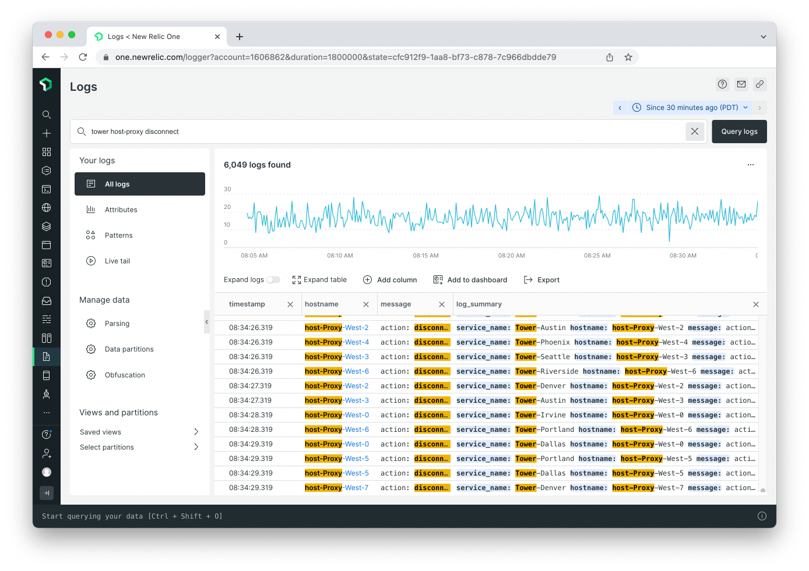

Previously, when you ran a plain text query for logs, the search would be confined to the "message" attribute. But what if the text you're searching for is in another attribute? Or what if you want to see results where your query is in **_any_** attribute? With the latest update to the Logs UI, searching across all attributes is the default mode for plain text queries. Now you can find the logs you're looking for faster and easier than ever.

