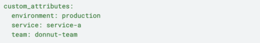
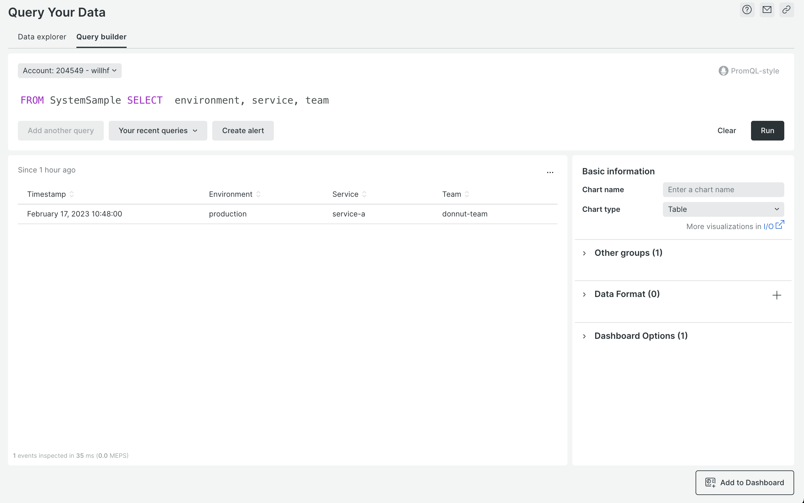
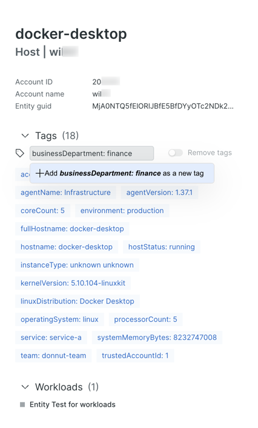
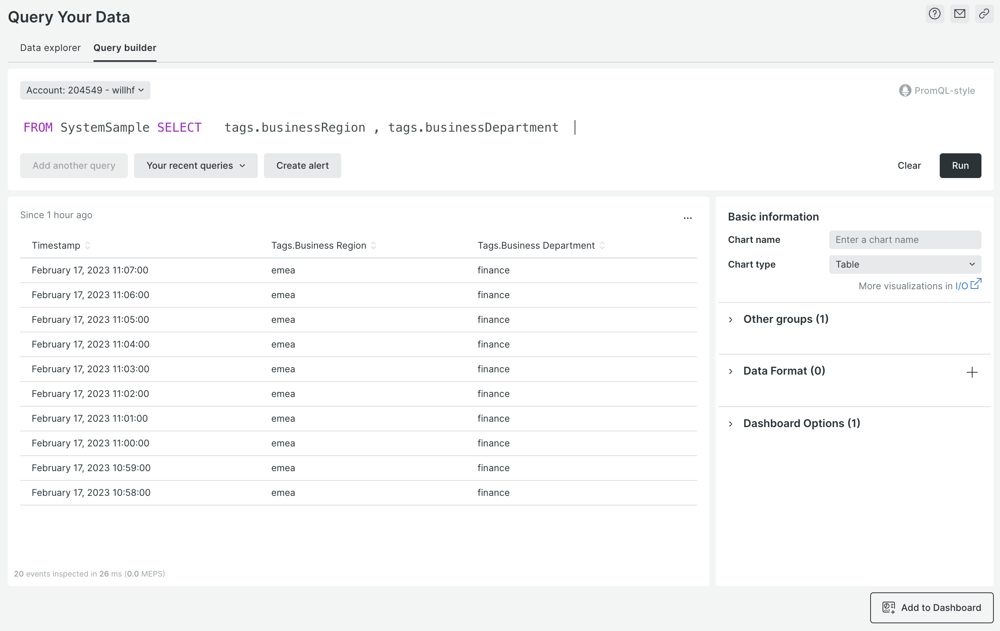
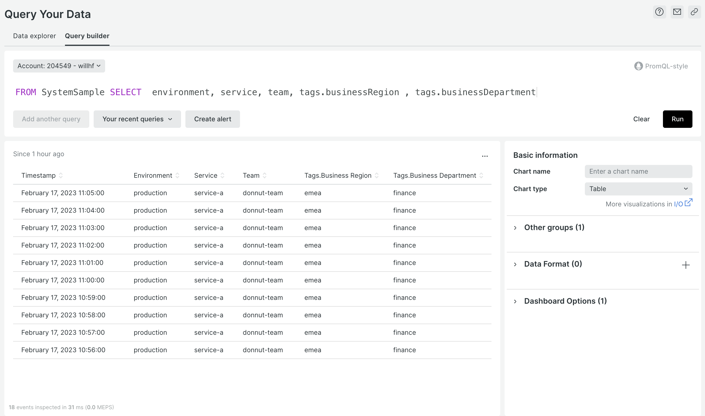

Query & alert on your custom infrastructure attributes and tags

Infrastructure is complicated. Thousands of components spread all over the cloud and the world, ephemeral in nature, all with different purposes–how do you keep track of them? New Relic infrastructure monitoring offers users the ability to create custom attributes in the agent configuration file and custom tags in the New Relic UI to make the organization of your mission-critical systems as flexible as you need it to be. The New Relic infrastructure team is excited to announce new enhancements to how our users can interact with their tags:

* Query your custom infrastructure tags: In your NRQL queries, use `where` and `facet` to isolate entities how you want them to be isolated.
* Alert on the tag’s values: React to important events sooner, with your chosen context in mind.
* Create dashboards to track those values: Customize your dashboards to provide more value by including telemetry data based on your custom attributes and tags.

Whether you use your infrastructure tags to designate responsible teams, reflect cost centers, or you just like naming things, you’ll have a more comprehensive snapshot of your systems.

## How to create & query custom attributes and tags

By adding the following code snippet containing custom attributes to your newrelic-infra.yml file...

Adding custom attributes to the YML file.

...you’ll be able to query them using their names.

Querying for custom attributes using SystemSample.

## Create tags in the UI

Here's an example of how to create and query tags in the UI:

1. Add a `businessRegion: emea` tag to the docker-desktop host.
    
2. Add a `businessDepartment: finance` tag to the docker-desktop host.
    
3. Query them with a `tags.` prefix:
    
4. Query these newly created custom attributes and UI tags all together like this:
    

To get started, use the documentation link [here](https://docs.newrelic.com/docs/new-relic-solutions/new-relic-one/core-concepts/use-tags-help-organize-find-your-data/#query-infra-tags).