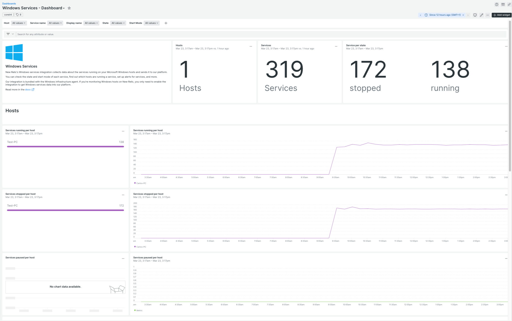

## The New Relic Windows Services integration is now GA

We’re excited to announce the general availability of New Relic infrastructure’s Windows Services integration. Customers with a subscription to New Relic can now pull data from their Windows services directly into New Relic without installing any third-party software.

Windows Services is a core component of the Microsoft Windows operating system and enable the creation and management of long-running processes

This on-host integration allows you to track key metrics and gain critical insights into how your services in Windows are performing.

Windows Services dashboard showing service count and status state

## Key benefits
* Check all your Windows services, their state (running, stopped, etc.), start mode (auto, manual, etc.), and other service metadata thanks to the New Relic Explorer or our NRQL engine.
* See which hosts are running specific Windows services.
* Set alerts based on any Windows services that you are monitoring using New Relic.

## Next Steps
Install the new [quickstart](https://newrelic.com/instant-observability/winservices) or create your own [dashboards](https://docs.newrelic.com/docs/query-your-data/explore-query-data/dashboards/introduction-dashboards/) to track your Windows services. Check out the [Windows Services documentation](https://docs.newrelic.com/docs/infrastructure/host-integrations/host-integrations-list/windows-services-integration/) for more information about this integration.
