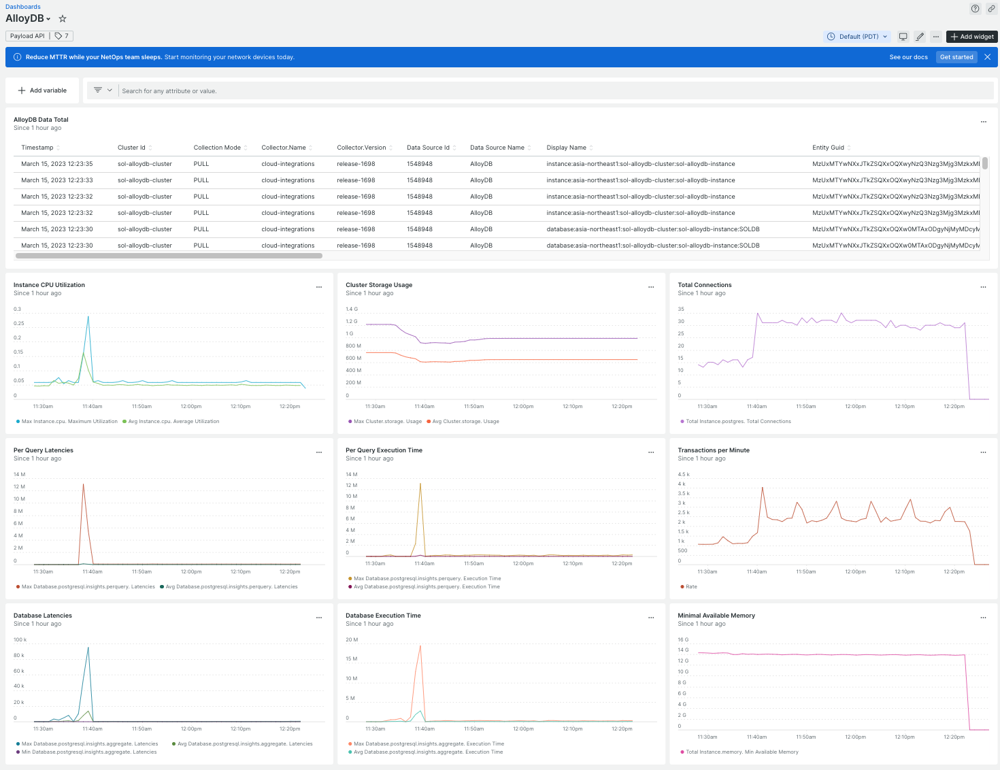

New Relic has integrated with Google Cloud’s AlloyDB to provide continuous insights on the health and performance of AlloyDB services. Today we are further announcing that we successfully achieved Google Cloud Ready - AlloyDB designation.  

AlloyDB is a fully managed PostgreSQL-compatible database service that is 4x faster than standard postres SQL for transactional workloads. It offers high availability and fast real time business insights without impacting performance. New Relic provides a unified view of your database and server activities and state based on actual data. It allows you to pinpoint issues at a glance and get critical visibility into what’s happening with your instance, database and applications that depend on it. You can baseline your CPU and memory consumption, disk space consumption, database connections, and IOPS metrics to create automated alerts based on predefined thresholds.

<figcaption>Metrics for Google AlloyDB displayed in New Relic</figcaption>
