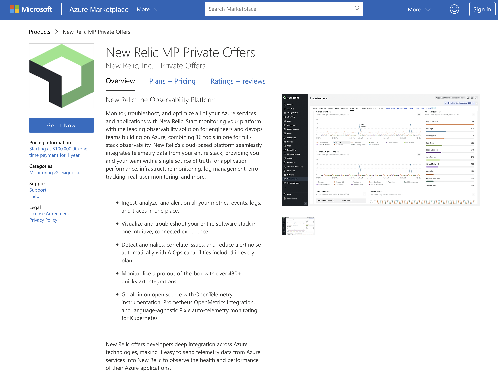

## Azure private offers are now available

Private offers in the Azure Marketplace are now available, providing custom pricing, terms, and conditions to our customers.

New and existing New Relic customers can now subscribe to private offers in the Azure Marketplace. Telemetry data will be stored in Azure, and 100% of your New Relic spend decrements your Microsoft Azure Consumption Commitment (MACC).

If you switch to private offers, you can still monitor all of your on-premises and cloud-based workloads to debug, measure, and improve your entire stack. Your New Relic experience will remain the same.

## Additional Benefits include
* Longer queries
* Extended retention
* Data export
* Logs obfuscation
* Vulnerability management

<figcaption>New Relic private offers listing in the Azure Marketplace</figcaption>

## Store your telemetry in Azure
Your cloud choice matters. With New Relic built on Azure, store telemetry data on your preferred cloud.
We designed a cell-based platform on Azure that leverages the New Relic service, also based on Azure, to meet our customers' highest demands for scalable, cloud-based performance.

## Pay with Azure MACC Credits
MACC is a commitment to spend a certain amount on Microsoft Azure services within a specific timeframe. By subscribing to **private offers** through the Azure Marketplace, you can apply 100% of your New Relic spend to retire your MACC.

Your New Relic billing will be consolidated with your Microsoft Azure spending and available through your Microsoft Azure account. By consolidating both bills, you can easily track and manage your Microsoft Azure and New Relic spend in one place, making it easier to budget and plan for future expenses.

## Next steps
If you are interested in private offers, contact your New Relic account team. You can view the New Relic Azure private offers in the [Azure Marketplace](https://azuremarketplace.microsoft.com/en-us/marketplace/apps/newrelicinc-privateoffers.nr-privateoffers1?tab=Overview).

See the [Data Plus documentation](https://docs.newrelic.com/docs/accounts/accounts-billing/new-relic-one-pricing-billing/data-ingest-billing/#data-plus) page for more information about what’s included with Data Plus for subscribers of private offers. Note: Not all Data Plus features are available for Azure subscriptions.
