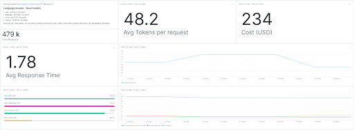

If you're already using, or plan to use, OpenAI's GPT-3, GPT-3.5, or GPT-4 at scale, it's important to monitor metrics like average request time, total requests, and total cost. Doing so can help you ensure that OpenAI services like ChatGPT are working as expected, especially when those services are required for important functions like customer service and support.

Companies around the world are embracing GPT to power help desk tickets and live chat logs, develop content and images, and accelerate semantic searches. New Relic monitoring for OpenAI is fast, easy to use, and unlocks real-time metrics that can help engineering teams optimize usage, reduce costs, and achieve better results.

## New Relic integrates with OpenAI, GPT-3, and beyond to provide the following benefits:

* __Get started for free:__ Our out-of-the-box GPT monitoring solution is the first of its kind, and included at no additional cost to all New Relic full platform users.
* __Easy installation:__ With just two lines of code, users can import the monitor module from the `nr_openai_monitor` library and automatically generate a dashboard that displays a variety of key GPT performance metrics.
* __Monitor cost:__ Usage of OpenAI’s Davinci model costs $0.12 per 1000 tokens, which can add up quickly and make it difficult to operate at scale. New Relic provides engineering teams with real-time cost tracking of their GPT usage.
* __Optimize performance:__ New Relic gives engineering teams insight into the average response time and other key performance metrics around GPT requests, allowing engineers to optimize usage and ensure the best possible response times.
* __Analyze prompts and responses:__ New Relic provides valuable information about the usage, speed, and effectiveness of GPT to help engineering teams achieve better results from their ML models.

## How to get started

With just two lines of code, simply import the monitor module from the `nr_openai_monitor` library and automatically generate a dashboard that displays a variety of key GPT-3 and GPT-3.5 performance metrics, such as cost, requests, average response time, and average tokens per request.

To get started, simply install the [OpenAI Observability quickstart](https://newrelic.com/instant-observability/openai) from New Relic I/O or visit our [library repo](https://github.com/newrelic/nr-openai-observability) for further instructions on how to integrate New Relic with your OpenAI apps and deploy the custom dashboard.

If you don’t have a New Relic account already, [sign up for a free New Relic account](https://newrelic.com/signup) today. Your free account includes 100 GB/month of free data ingest, one free full-access user, and unlimited free basic users.
