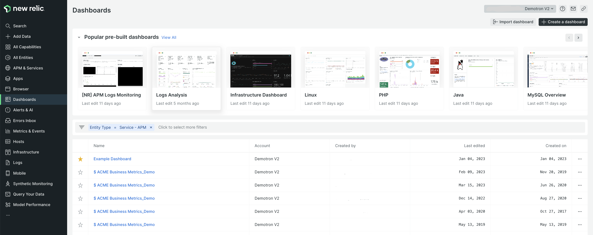
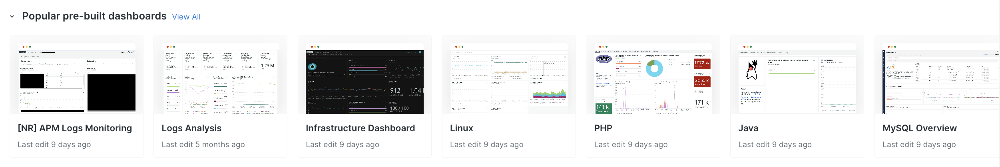
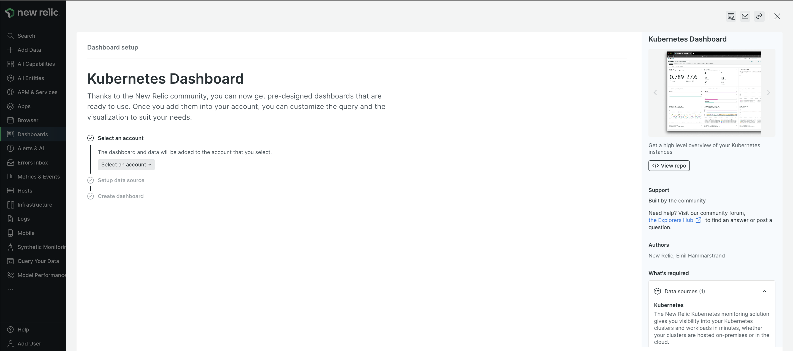
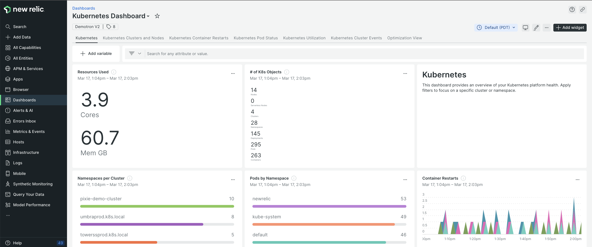
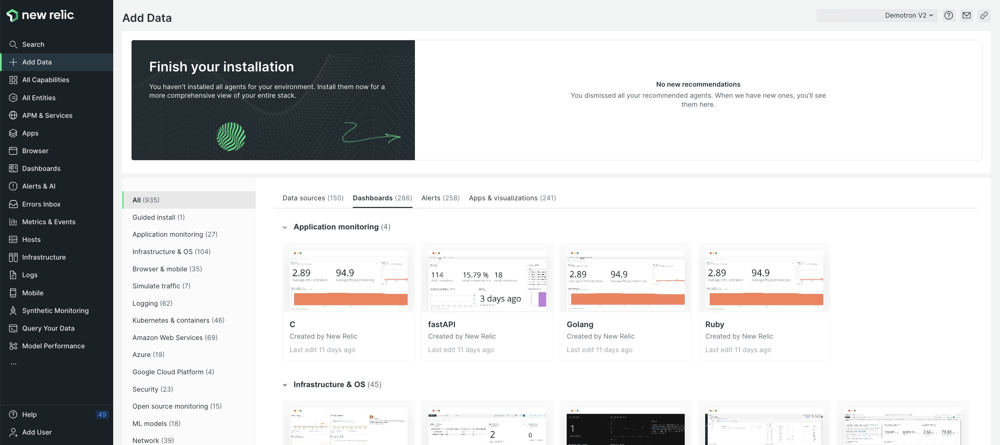

Getting instant observability with our quickstart dashboards has never been easier. With the new **Popular pre-built dashboards** section, you can now easily discover and conveniently install any of our pre-built dashboards directly from our platform’s [dashboards UI](https://one.newrelic.com/dashboards). All in all, this creates a more cohesive dashboard experience where you can find your custom and pre-built dashboards all in one place.

Whether it’s for a single component or your entire stack, you can start visualizing your telemetry data without needing a custom dashboard. This lets you reallocate the time and resources that would have been spent on defining the audience and objectives, selecting the appropriate chart types, and building the custom dashboard.

## How it works

The **Popular pre-built dashboards** section features dashboards that were chosen based on high user interest and activity.

Clicking on a dashboard brings you to a guided installation process with the requirement details and a link to the code repository on the right side. 

After completing the necessary steps, simply click **View dashboard** at the bottom right to start visualizing your data.

To access the rest of our quickstarts library, click on **View all** from the **Popular pre-built dashboards** section.

If you don’t have a New Relic account already, [**sign up for a free New Relic account**](https://newrelic.com/signup) and start using quickstart dashboards today. Your free account includes 100 GB/month of free data ingest, one free full-access user, and unlimited free basic users.
