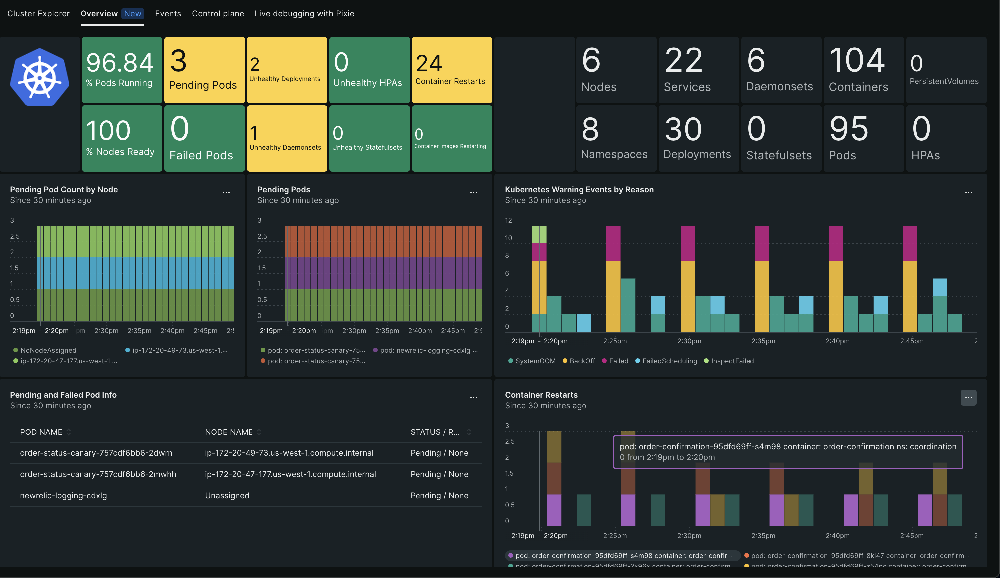

We’ve made it easier to understand the performance of your Kubernetes clusters and workloads with the **new Overview dashboard** (and an updated **Events dashboard** too!), so you can understand how the health of your cluster resources impact your workloads. And there’s nothing for you to do: Both dashboards are already available to you directly in the Kubernetes UI.

The **Overview dashboard** and **Events dashboard** provide the following:
1. **Quickly see** Kubernetes cluster resource utilization, such as CPU and memory, and drill into specific nodes to correlate application state with the underlying infrastructure.
2. **Assess** cluster health, analyze container restarts and warning events, and identify issues easily in a single, customizable dashboard.
3. **Debug faster** by correlating infrastructure metrics, events, logs, and application performance monitoring information in one place.

# Questions you can ask
- Are there any pods that are pending or failed?
- Which Daemonsets, Deployments, Statefulsets, HPAs, or other Kubernetes resources are unhealthy?
- Are all nodes ready and able to host pods?
- How many pods, containers, nodes, or other Kubernetes resources are in the cluster?
- When did a spike in Kubernetes warning events occur?
- When did one or more pods enter a pending state?
- Are there any pods unable to be scheduled to a node?
- Can my nodes host additional pods?

# Get started today
1. Log into New Relic, and on the left nav select **Kubernetes**.
2. Choose the cluster you’d like to analyze.
3. By default, you’ll arrive in the Kubernetes cluster explorer ‘view.’ Towards the top of the page, select either the **Overview NEW** or **Events** links.

<figcaption>A screenshot showing the Kubernetes Overview dashboard.</figcaption>