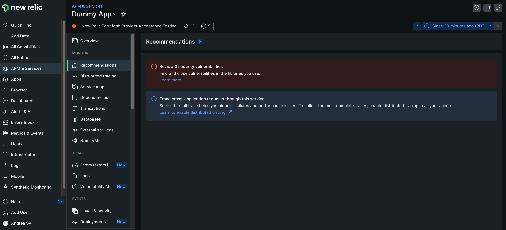

The APM recommendations center pinpoints key monitoring and capability gaps so you can achieve end-to-end visibility of your entire stack and proactively address issues. With the APM recommendations center you can : 

* **Quickly identify monitoring gaps** and get insights into your instrumentation, configuration, coverage, and maintenance areas to ensure the right visibility across your stack.
* **Discover the right tools for your environment** by getting recommendations for comprehensive monitoring capabilities like alerting, change tracking, and more tailored for your environment. Ensure everything is up-to-date with automatic notifications when a new agent is available to ensure that their stack is fully covered.

**How to get started**
* Check out our [documentation](https://docs.newrelic.com/docs/apm/apm-ui-pages/monitoring/apm-recommendations-center/)

