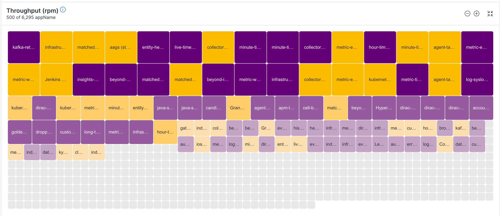

We’ve built a new visualization for Lookout to help you identify anomalous system behavior faster. The main interface has been simplified and expanded by offering you more options to filter, sort, and focus on entities that matter. We’ve added seven new features to improve Lookout’s usability and have made backend changes to improve overall performance. The following features can be used together for more control of your environment and the visualization best suited for you:

* **Slider filtering:** You can filter out anomalies of a certain deviation rate with a simple slider bar.
* **Non-reporting toggle:** You can remove all entities from the view that are not currently deviant with a one-click toggle.
* **Square view:** An aesthetic change for people that like square entity visualizations over circular bubble ones.
* **Signal expansion:** You can zoom in on a signal to consume the full width of available browser space for a more focused view when troubleshooting.
* **Entity size control:** You can decrease or increase the size of entities based on their own visibility preferences.
* **Entity count:** You can see the total count of currently viewed entities against the total amount of entities in the view.
* **Visualization explanation:** You can hover the info icon next to the signal title to understand how this visualization works.

Adding more flexibility and a simplified visualization gives you more autonomy and helps you quickly identify problems and fix issues. Alongside these enhancements, the new visualization options include a list view toggle.

# Get started with the new Lookout experience

1. Read the [**docs**](https://docs.newrelic.com/docs/new-relic-solutions/new-relic-one/core-concepts/new-relic-lookout-monitor-your-estate-glance/) to get acquainted with Lookout.
2. Log in to [New Relic](https://newrelic.com/)
3. Select *All Entities* in the left-hand nav menu. In the upper right corner of the subsequent page, select the *Lookout* view to access the interface.
4. From here, explore the new visualization and filtration options, making it easier to detect anomalous behavior across your entire stack.

