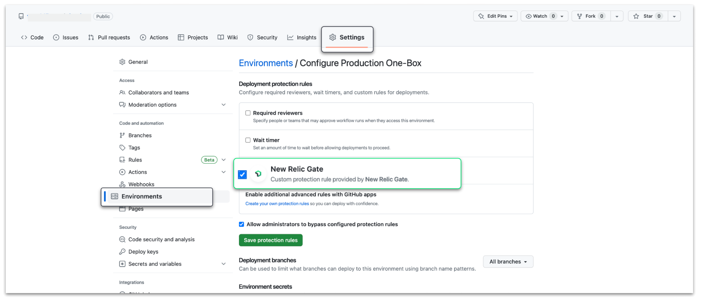
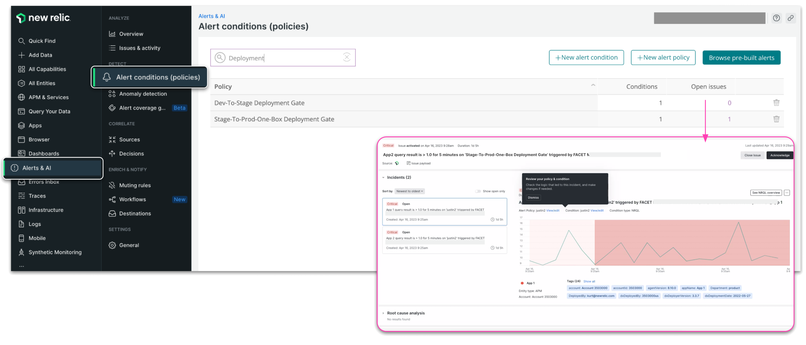
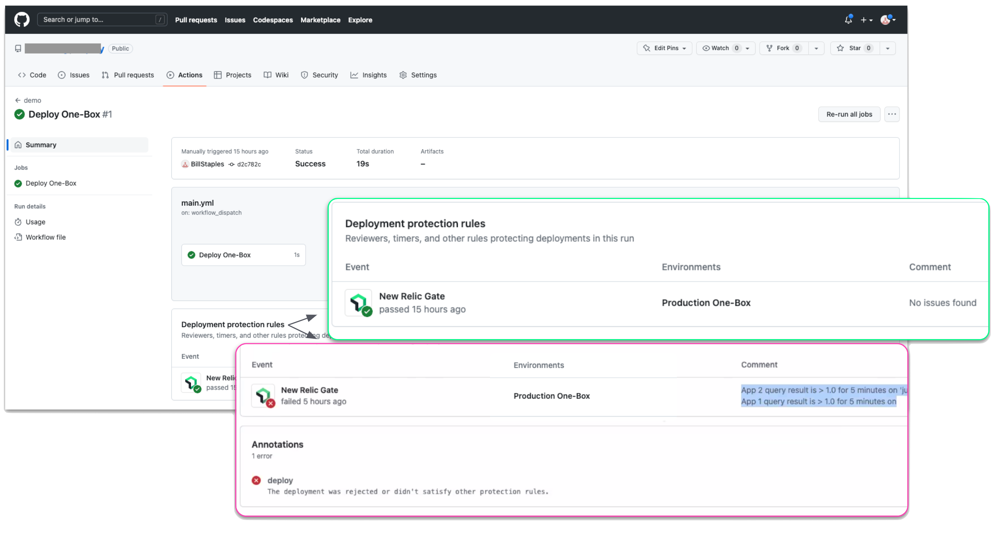

We've [partnered with GitHub](https://github.blog/2023-04-20-announcing-github-actions-deployment-protection-rules-now-in-public-beta) to make it easier to set up rigorous control mechanisms that ensure only high-quality thoroughly tested code reaches production. With the [New Relic Gate App](https://github.com/apps/new-relic-gate) for GitHub Actions Deployment Protection Rules, you can now use New Relic's anomaly detection to automatically intercept and validate deployment requests. This lets you prevent issues earlier in the release cycle so you can reduce alarming on higher level environments and build better software.

## Boost your release cycles with the power of observability
Previously, developers using GitHub for change management could only use the built-in environment protection rules to require a manual approval, delay a job, or restrict the environment to certain branches. 

Now, you can create and implement custom protection rules configured within deployment workflows to safely promote deployments to your downstream environments. Thanks to the power of New Relic AIOps and applied intelligence, that means anything you can query can be used as criteria for deployment protection rules. 

## Benefits
With this integration, you can connect software performance and environment health analysis to actual deployment criteria, allowing you to:

- **Protect downstream environments from potential issues.** Connect New Relic signals with your deployment gates to prevent hazards and issues from being deployed downstream.
- **Gain flexible control with New Relic AIOps.** Whether it's errors, performance changes, or anomalies, anything you monitor can become a deployment gate. 
- **Catch issues earlier in the release cycle.** Shift left and prevent issues before they make it to production.

## Example policies you can create
New Relic lets you [create alert conditions](https://docs.newrelic.com/docs/alerts-applied-intelligence/new-relic-alerts/get-started/your-first-nrql-condition/) on just about anything you collect data on. Some examples of policies you may want to leverage as gates deployment gates include:

- Error count (5xx, 4xx)
- Latency
- Downstream dependencies failing
- [Anomalies detected](https://docs.newrelic.com/docs/alerts-applied-intelligence/applied-intelligence/anomaly-detection/anomaly-detection-applied-intelligence/)
- Missing data points
- Change in throughput over time

## Getting started:
1. Install the New Relic Gates app in GitHub
    * Go to https://github.com/apps/new-relic-gate and click **install**
2. Define gate criteria 
    * [Create an issue](https://docs.newrelic.com/docs/alerts-applied-intelligence/new-relic-alerts/alert-policies/specify-when-alerts-create-incidents/) in New Relic, which will act as the desired deployment gate
    * Copy Policy ID
3. Connect New Relic policies and issues to GitHub
    * Create an API key with access to query New Relic Policies & Issues. 
4. Configure your repository’s environment to use the gate
    * Specify the Region, Policy ID, and Account ID
    * Update environment to use the New Relic Gate.
5. Run the gate
    * The first run of the gate will fail, and it will ask you to insert your New Relic API Key.
    * Run the CURL command in the response and insert your API keys.
    * The next deployment should succeed.

<figcaption>To use the New Relic Gate, you need to enable it in your GitHub repository environment. Select your repository  <b>settings</b>, select <b>environment</b>, then check the box next to <b>New Relic Gate</b>.</figcaption>

<figcaption>Create an alert policy in New Relic, which will act as the desired deployment gate.</figcaption>

<figcaption>View the results of the New Relic gate on the GitHub Actions page, under <b>Deployment protection rules</b>.</figcaption>