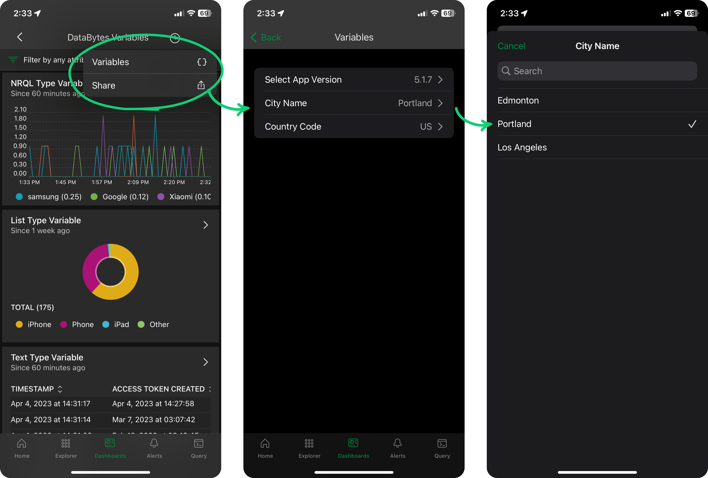

Gain faster access to vital data insights on-the-go with support for dashboard template variables in the New Relic mobile app. This update allows you to filter and analyze critical information, enabling you to quickly triage problems, improve mean time to resolution (MTTR), and minimize downtime – directly from your mobile device.

With template variables on mobile, you can:
* **Quickly identify and resolve incidents on-the-go** with pinpoint accuracy, drilling down to specific regions, app versions, and other granular details.
* **Share important insights with ease** by generating links from your mobile device that carry over your custom filters.
* **Focus on what matters most** by quickly filtering and visualizing the most relevant and impactful data.

**Next steps**

* Check out our [documentation](https://docs.newrelic.com/docs/mobile-apps/dashboards-new-relic-mobile-apps/) and [databyte video](https://www.youtube.com/watch?v=t2x20sW0HqM).