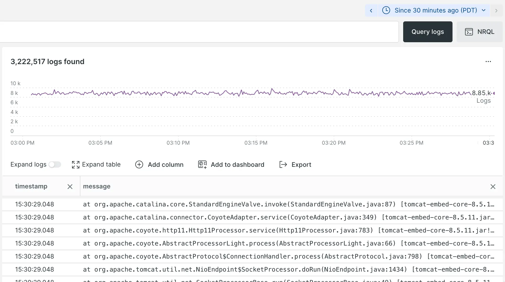

You know the power of New Relic when it comes to making sense of the logs generated by your systems. But sometimes, you need to filter, facet, and aggregate your log data in a specific way to get exactly what you want.

The NRQL query builder provides a rich set of functionalities — including autocompletion, syntax highlighting, and query validation — that make it faster and easier to get the precise answers you need with log data filtering and aggregation.

Go directly from your logs to the query builder with a single click:

* Save time by starting a search with one of your most recent queries. 
* Make complex searches readable with multi-line queries. 
* Choose from any of New Relic's chart visualizations to tell a clear story with your log data.

Try it today and take your log data analysis to the next level with NRQL!
