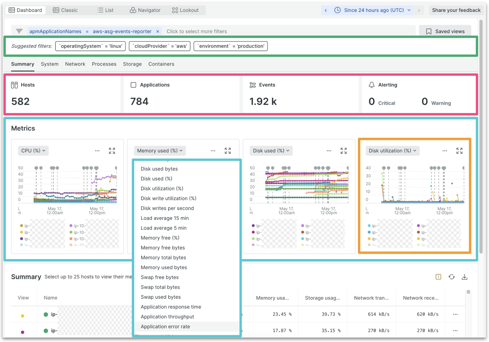

The connected infrastructure and APM solution allows you to correlate your performance across infrastructure, APM, and the rest of your stack to remediate problems faster than ever, without swiveling between tools.

## Solution overview

- **Integrated infrastructure experiences inside APM**: View CPU and memory for hosts, containers, and VMs within APM to instantly identify under-provisioned resources that are impacting applications.
- **At-a-glance estate view**: See the status and count of hosts, applications, and events (dynamically adjusted as data is filtered), along with an alerts activity stream to understand overall system health.
- **In-context application health**: Dynamic charts provide host- and APM-specific metrics to correlate drops in performance across infrastructure and the applications running on them.
- **Embedded change tracking**: Analyze how application deployments impact host performance.

## Get started

1. Install the [**infrastructure monitoring agent**](https://docs.newrelic.com/docs/infrastructure/install-infrastructure-agent/get-started/install-infrastructure-agent/)
2. Opt into the [**new experience**](https://docs.newrelic.com/docs/infrastructure/infrastructure-ui-pages/hosts-new-view/).

Learn more:

- [**Documentation**](https://docs.newrelic.com/docs/infrastructure/infrastructure-monitoring/get-started/get-started-infrastructure-monitoring/)
- [**Best practices guide**](https://docs.newrelic.com/docs/new-relic-solutions/best-practices-guides/full-stack-observability/infrastructure-monitoring-best-practices-guide/)
- [**Databyte video**](https://www.youtube.com/watch?v=X1MjJ_k6LNs)