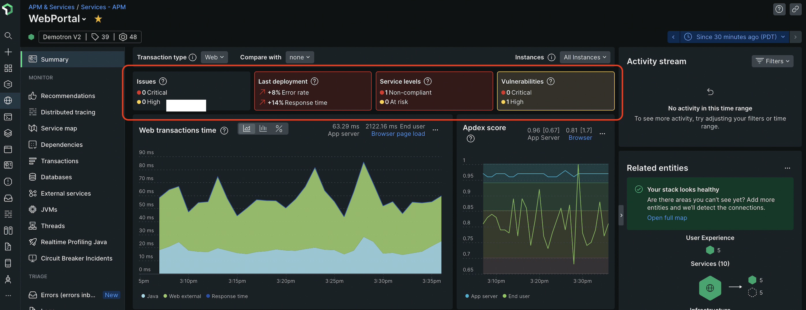

APM summary tiles provide insights across the stack, ranging from key transactions to security, all at a glance, with no screen swivels. With APM summary tiles you can:
* **Identify emerging issues:** Stay on top of your service's health by using interconnected insights from critical indicators like alerts, vulnerabilities, SLOs, and change tracking indicators.
* **Troubleshoot faster:** Identify and resolve issues faster by viewing critical service information in one location.
* **Improve reliability:** Close monitoring gaps and get a more complete picture of the health of your applications with guided onboarding workflows that makes it easy to set up the key health indicators for your services.
 

