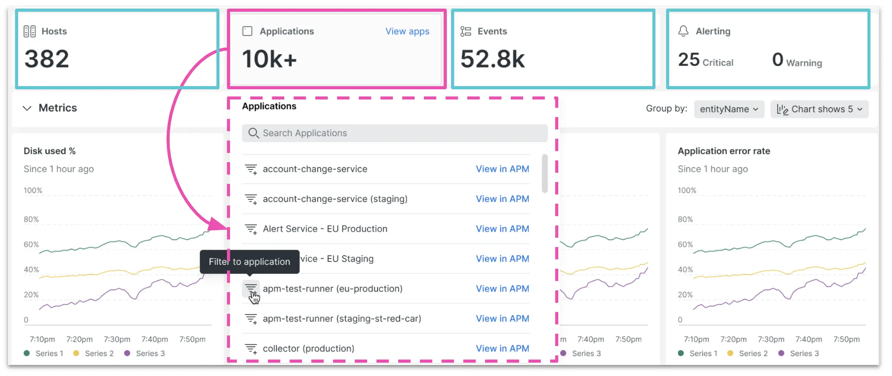

Adding to the [new infrastructure UI](https://newrelic.com/blog/how-to-relic/connected-infrastructure-and-apm) that we launched in May, we've made the "scorecard" element (at the top of the page) **interactive**! But as a reminder, the original static scorecard gave you an at-a-glance estate view, so you could see the status and count of **Hosts**, **Applications**, and **Events** (dynamically adjusted as data is filtered), along with an **Alerts activity stream** to understand overall system health.

So what's new? The new interactive scorecards are, well, _interactive_. Here's what you get now:
- **Hosts**: Filter by host and see host metadata.
- **Applications**: Filter by application, and click to go directly to the APM page.
- **Events**: Click to go directly to the events page.
- **Alerting**: See the activity stream of alerts for the top 25 hosts.

Read the [Documentation](https://docs.newrelic.com/docs/infrastructure/infrastructure-ui-pages/hosts-new-view/#summary) to learn more.

<figcaption>A screenshot showing interactive scorecards.</figcaption>