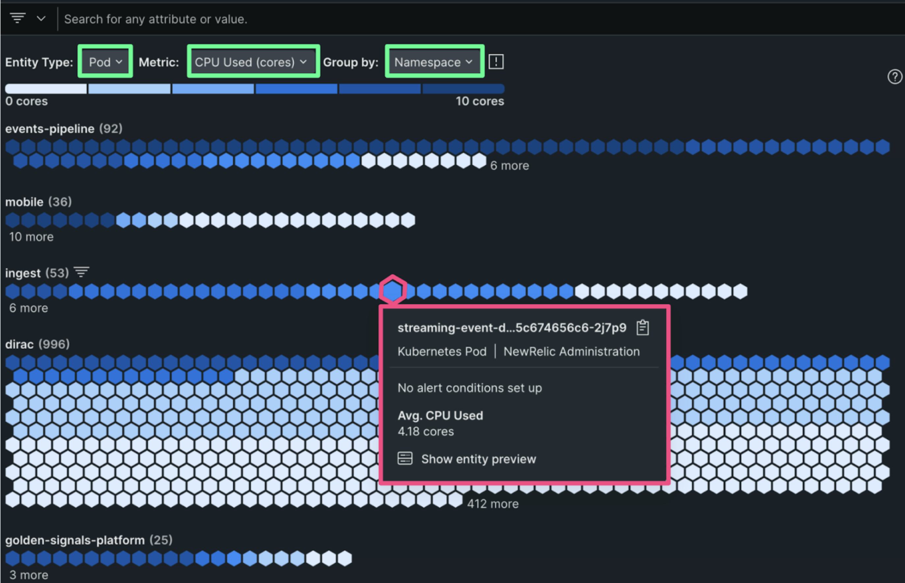

We've completely rebuilt our Kubernetes experience to give you a new UI that scales with large clusters. And with user-selectable drop-downs, you can now slice and dice your data in powerful new ways to dynamically analyze your performance.

#Key features
1. **See everything at-a-glance**: Quickly understand overall cluster health with a completely redesigned visual experience that scales with large clusters.
2. **Explore performance dynamically**: See performance in a gradient view of user-selectable Entity Types and Metrics, Grouped by Namespace, Deployment, Pod, and Node (more coming!).
3. **Go beyond nodes and pods**: Analyze your cluster's performance broken down by Deployments, Statefulsets, and Daemonsets.
4. **Support for new entities**: Understand the status and performance of Jobs, CronJobs, PersistentVolumes, and PersistentVolumeClaims (more coming!).
5. **K8s operator**: Get a standardized and easy way to install, manage, and upgrade New Relic's K8s solution.

# How to get started
1. Log into New Relic and select **Kubernetes**
2. Select the toggle next to **Preview the new Kubernetes experience (New)**
3. Read the [**documentation**](https://docs.newrelic.com/docs/kubernetes-pixie/kubernetes-integration/understand-use-data/kubernetes-cluster-explorer/#navigator-preview) to learn more.

<figcaption>A screenshot showing CPU usage by Pod grouped by Namespace.</figcaption>