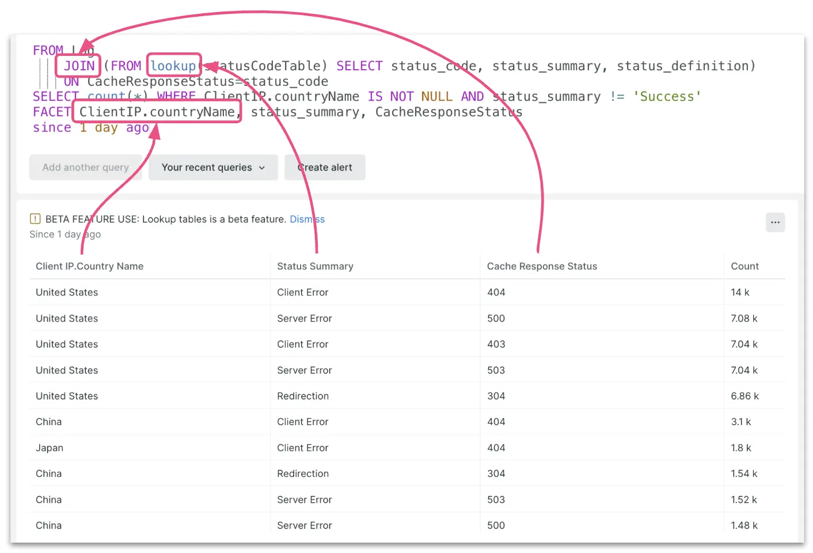

With these powerful new query capabilities, not only will you be able to get answers from your data much faster, but we've unlocked entirely _new use cases_ for you, including understanding how your technology stack impacts your business.

By correlating any telemetry data and any business data in one place, you can connect the dots between the performance of your applications and infrastructure, business operations, and customer experiences, all without using additional tools or importing and exporting data between other systems.

Check out this [Data Bytes video](https://youtu.be/2EQ8uqkl-zk) to see all three capabilities in action.

# Subquery JOINs
Subquery JOINs allow you to combine data from _different tables_ in the New Relic database. You might use this to correlate APM event data with logs data, or infrastructure metrics with synthetics, to understand how the performance of different systems impact each other. 

Learn more:
- Read the [JOINs technical deep-dive blog](https://newrelic.com/blog/how-to-relic/subquery-joins)
- Read the [JOINs documentation](https://docs.newrelic.com/docs/query-your-data/nrql-new-relic-query-language/nrql-query-tutorials/subquery-joins/)

# Lookups
Lookups allow you to combine data that's _not in New Relic_ with the rest of your telemetry, so you can understand how the performance of your systems impacts other business-related metrics. You might use this to understand _at which locations are my point-of-sale terminals having more errors?_

To learn more, read the [Lookups documentation](https://docs.newrelic.com/docs/query-your-data/nrql-new-relic-query-language/nrql-query-tutorials/lookups)

# GeoIP
GeoIP translates IP addresses into geographical data, allowing you to understand the origin of your traffic. You could use this to ask _which locations have the most cache response code errors?_

To learn more, read the [GeoIP documentation](https://docs.newrelic.com/docs/logs/ui-data/parsing/#geo).

<figcaption>A screenshot showing a query with JOINs, Lookups, and GeoIP.</figcaption>