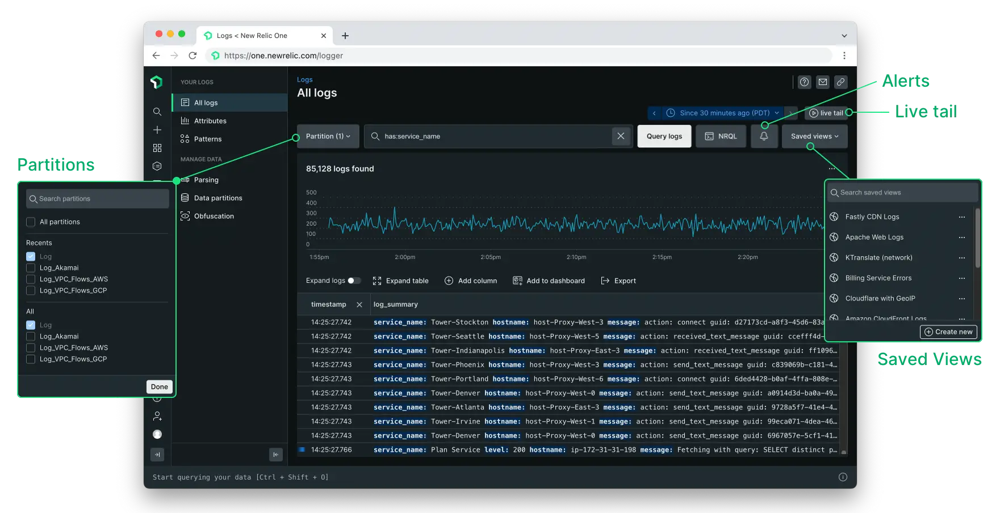

In response to customer feedback, we've streamlined the Logs UI to simplify the sidebar while making key features easier to find.

- Simplified the sidebar to remove collapsible sections that made things hard to find
- Made key features such as partitions, alerts and saved views more visible by moving them up alongside the search bar
- The partitions menu now has options to select all partitions and to view recently selected partitions
- Overall performance optimizations to make the Logs UI faster and more responsive

