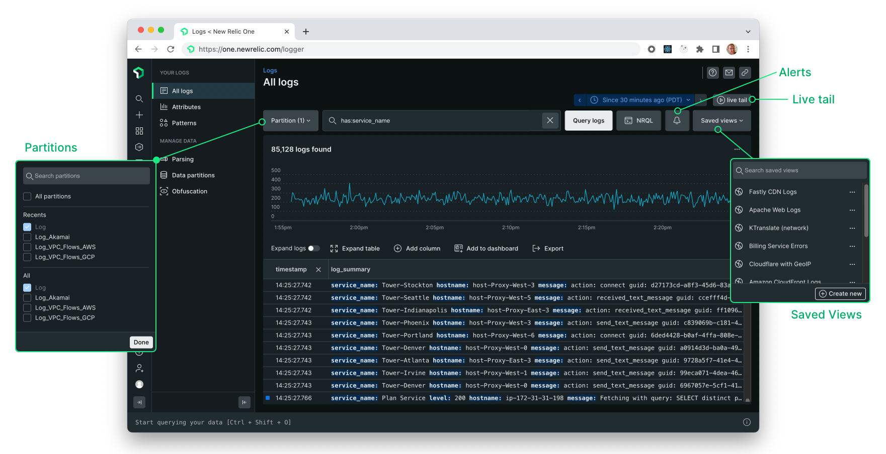

In response to customer feedback, we've streamlined the logs UI to simplify the sidebar and make key features easier to find. Updates include:

* Simplified the sidebar by removing collapsible sections.
* Increased visibility of key features including partitions, alerts, and saved views by placing them next to the search bar at the top of the page.
* Added new options to the partitions menu to more easily view all partitions, and recently viewed partitions.
* Improved overall performance with new optimizations for a faster and more responsive logs UI.

