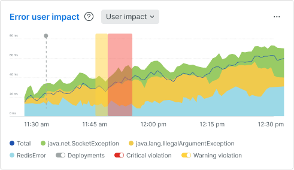
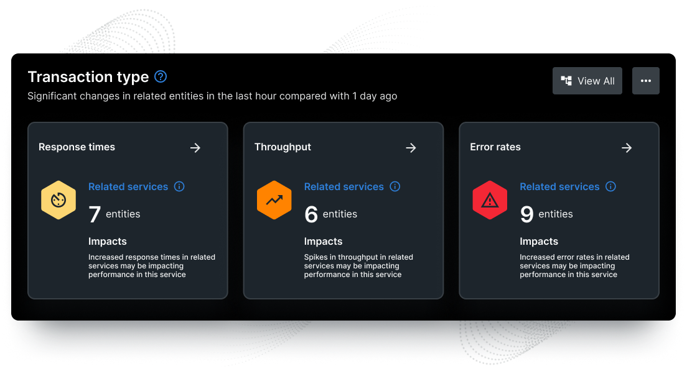

The APM summary page now integrates essential health indicators like golden signals with error user impact, log patterns, and distributed traces into a unified view. This comprehensive view eliminates guesswork in application monitoring and provides a holistic understanding of your entire stack, including critical user and business context. 

* **Error user impact view:** Quickly identify errors that have the biggest impact on your users to prioritize bug fixes effectively for improved user experiences and enhanced customer satisfaction.
  

* **Contextual log pattern:** Easily discover the log data you need to root-cause issues directly on the APM summary.
  

* **Distributed traces:** Understand the origin of problems affecting your service and jump directly to the notable trace to troubleshoot faster.
  

