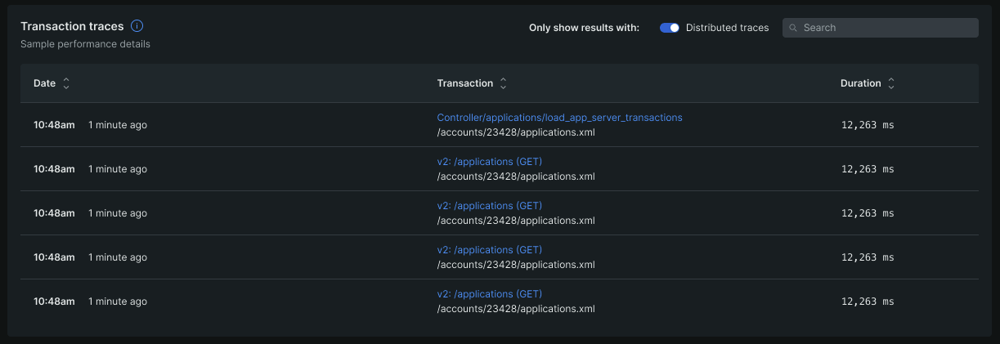
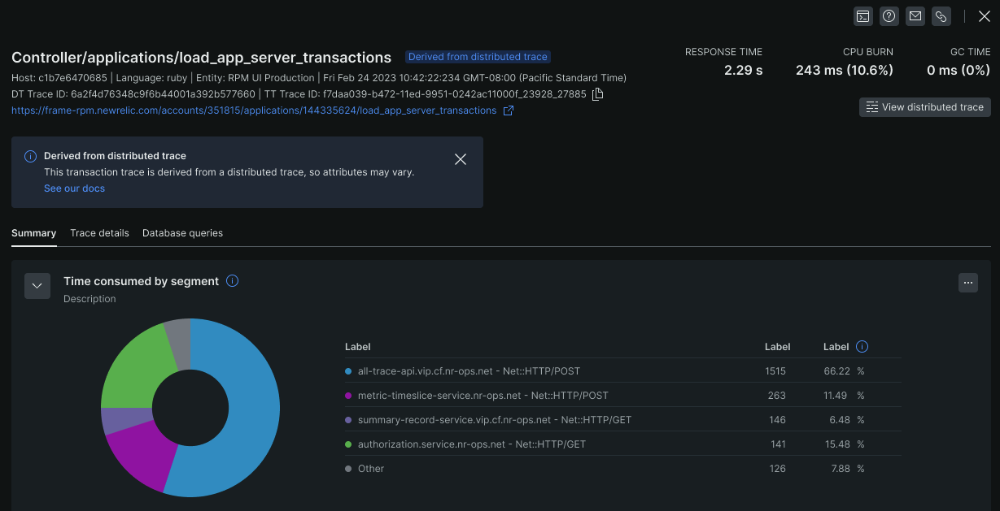

We’re rolling out critical enhancements to our transactions and distributed traces workflow. With Distributed Tracing in Transactions, you can quickly and effectively understand how your app and services are doing with the contextual data you need to conduct root-cause analysis faster and optimize your application’s performance.

**Key capabilities include:**

* **Connected traces and transactions toggle:** Get to the root cause faster by viewing only transactions that surface the associated distributed traces in a single view.
* 

* **Simplified workflow to surface the contextual data:** Analyze application performance with insights into the associated trace of a transaction with a single click.
  

**How to get started**

* Check out our documentation on [Distributed Tracing](/docs/apm/transactions/transaction-traces/transaction-traces-trace-details-page/#distributed-traces)
* Read our documentation on [Transaction Traces](/docs/apm/transactions/transaction-traces/introduction-transaction-traces)

