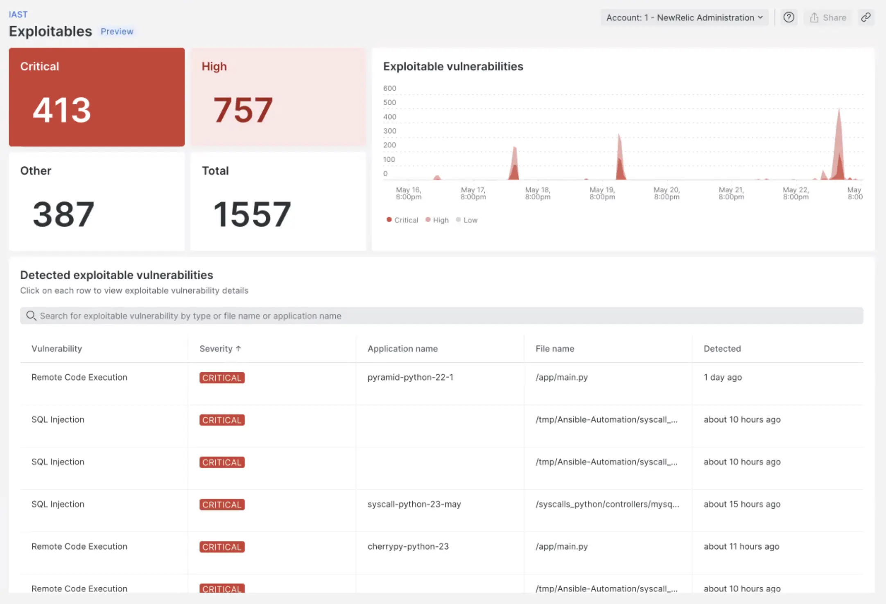

Applications are the lifeblood of every organization and in today's digital business developers need to move fast and ensure every application is secure. Now you can with New Relic interactive application security testing (IAST).

New Relic IAST provides instant visibility and context to security findings via continuous monitoring, unmatched detection accuracy and proof-of-exploit via dynamic assessment capabilities that pinpoint the source of vulnerabilities by simulating real-world attacks, and faster resolution via guided remediation so you can ship code faster. 

To access these new capabilities simply [log into New Relic](https://one.newrelic.com) and select [IAST](https://one.newrelic.com/iast) from the left hand side nav to start testing each and every application.

With New Relic IAST you can:
- See all protected and unprotected applications and eliminate blind spots for more comprehensive application security testing.
- Pinpoint exactly where vulnerabilities exist in real-time with near zero false positives.
- Find, fix and verify vulnerabilities with proof of exploit.
- Leverage guided remediation from New Relic experts to resolve security issues faster. 

<iframe width="560" height="315" src="https://www.youtube.com/embed/qQ7U-dZj82Y" frameborder="0" allow="accelerometer; autoplay; clipboard-write; encrypted-media; gyroscope; picture-in-picture" allowfullscreen></iframe>

Try it today and start building more secure code with speed and confidence!
