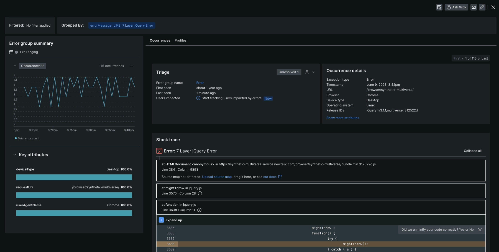

We’ve given the browser experience a whole new look and feel that connects your error analysis and triage workflow and accelerate error resolution before it severely affects your customers. With this new experience, you’ll get:
* **Deeper insights into your errors with stack traces & event trails:** You can now upload source maps and access event trails to gain a clearer  understanding of the error and what actions led to the error. 
* **Data filtering and discovery capabilities for comprehensive data analysis:** You can now slice and dice your data to conduct a more thorough analysis of errors that occur. Updates include:
  
  - Ability to filter by attributes
  - Error group summaries at the dynamic group level
  - Easily viewable and downloadable attributes via Error profiles
  
* **Seamless transition from analysis to triage to act on errors with confidence and speed**. Each individual error occurrence is now connected to the static error group it belongs for faster triaging. 

<figcaption>JS Errors.</figcaption>

**How to get started**
* Check out our documentation on [Browser: Group errors tab](https://docs.newrelic.com/docs/errors-inbox/browser-tab/)

