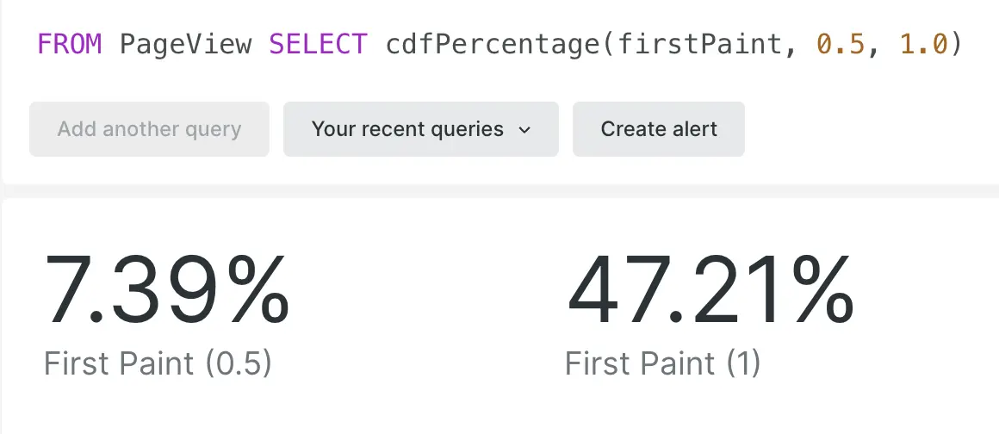

The **cumulative distribution function** ([cdf](https://en.wikipedia.org/wiki/Cumulative_distribution_function)) gives the probability that a value is less than or equal to a threshold.

In NRQL, you now can use the `cdfPercentage()` function to show what percentage of a numeric or distribution metric attribute's values are less than one or more thresholds. The `getCdfCount()` function returns how many of a numeric or distribution metric attribute's values are less than a threshold.

For example, this query returns the percentages of page views where first paint happens in 0.5 seconds or less, and in 1 second or less:

Take a look at our documentation on [cdfPercentage()](https://docs.newrelic.com/docs/query-your-data/nrql-new-relic-query-language/get-started/nrql-syntax-clauses-functions/#func-cdfPercentage) and [getCdfCount()](https://docs.newrelic.com/docs/query-your-data/nrql-new-relic-query-language/get-started/nrql-syntax-clauses-functions/#func-getCdfCount) to learn more!
