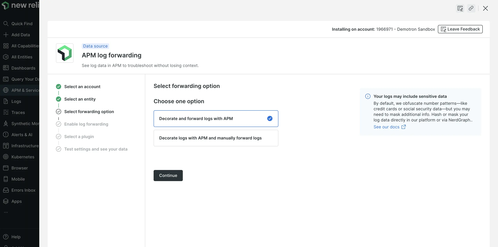

APM logs in context bring together log data and other relevant APM telemetry to provide a more comprehensive view of application's behavior and performance. This reduces context switching and enables faster troubleshooting. New Relic APM 360 now provides a guided workflow to effortlessly enable APM log forwarding. This step-by-step process covers everything from service selection to log forwarding setup and data testing.

* **Ease of integration and time savings:** With APM 360, setting up log forwarding becomes a breeze. The guided workflow simplifies the process, reducing complexity and saving time for developers and devOps teams to initiate application log monitoring.
* **Improved troubleshooting and issue resolution:** Accurate log collection and forwarding are ensured through the guided process. This leads to faster issue resolution as teams can quickly access the right logs, correlate them with other telemetry, and pinpoint the root cause of problems reducing application downtime.

By leveraging APM logs in context with New Relic APM 360, organizations can achieve more efficient monitoring, streamlined troubleshooting, and proactive issue resolution, resulting in better overall application performance and user experiences.

