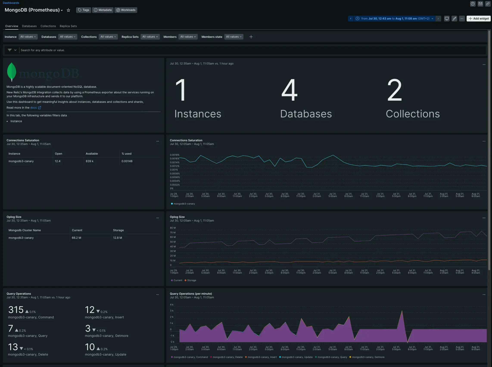

We’ve released a significant upgrade to our MongoDB integration, giving you an improved monitoring experience without installing any third-party software. 
This on-host integration allows you to track key metrics and gain critical insights into how your MongoDB instances are performing. 
The new MongoDB integration, which is based on Prometheus, replaces the legacy MongoDB integration, which will be deprecated in the near future.

## Get started today

**New installations:** Read our [documentation](https://docs.newrelic.com/docs/infrastructure/host-integrations/host-integrations-list/mongodb/mongodb-monitoring-integration-new/) to learn how to install and configure the new integration.
**Migrate from our legacy integration:** Read our [migration doc](https://docs.newrelic.com/docs/infrastructure/host-integrations/host-integrations-list/mongodb/mongodb-migration-guide/) to upgrade to the new integration.

## Benefits of the new integration

* Compatible with MongoDB 4.0 or higher, [Percona Server](https://www.percona.com/software/mongodb/percona-server-for-mongodb), and MongoDB Atlas M10 or higher.
* Available in Linux, Windows and Containerized environments.
* Compatible with New Relic’s entity-driven experience, with support for three entity types:
    * MongoDB instances
    * Databases 
    * Collections 
* Easier installation with our [new data onboarding UI](https://docs.newrelic.com/whats-new/2022/07/whats-new-07-14-add-data/).
* Monitor the health of your entire MongoDB infrastructure, including instances, databases, collections, replica sets, and members.
* With MongoDB instance logs, get deeper visibility, near-instant search, and full contextual log information for any volume of queries.
* Set [alerts](https://docs.newrelic.com/docs/alerts-applied-intelligence/overview/) based on any metric you monitor.

## Why you should upgrade to the new MongoDB integration

* New Relic’s legacy MongoDB integration will be deprecated shortly.
* The new integration supports more versions of MongoDB (MongoDB v5-v6, Percona servers, Atlas M10 or higher).
* Support for SCRAM authentication.
* Better [data governance](https://docs.newrelic.com/docs/infrastructure/host-integrations/host-integrations-list/mongodb/mongodb-monitoring-integration-new/#instance-settings) capabilities to ensure you only ingest the metrics you need.
* Improved [MongoDB quickstart](https://newrelic.com/instant-observability/mongodb-prometheus).