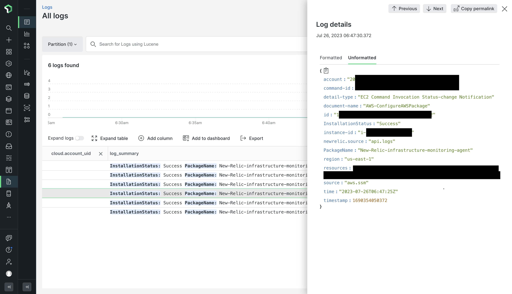
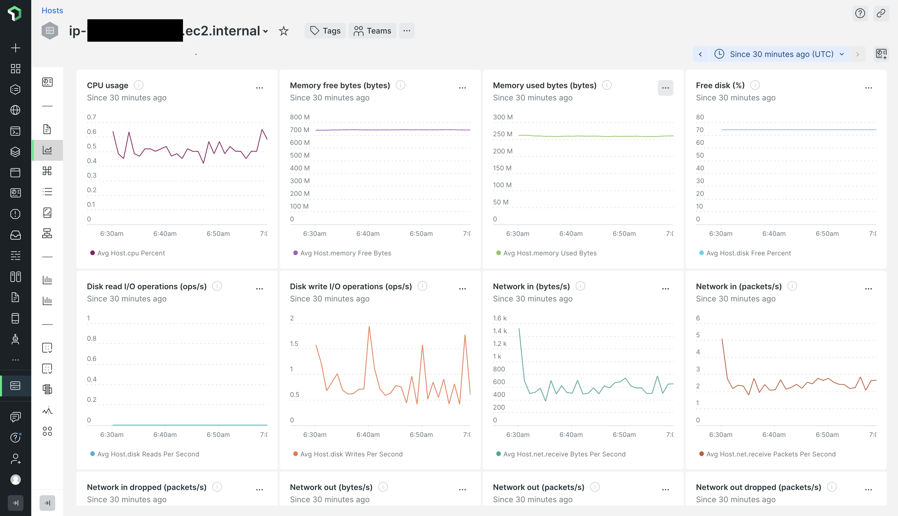

The EC2 Quickstart solution provided here is designed for individuals seeking to enhance observability on AWS EC2 instances within their AWS account by monitoring host metrics.

After successfully deploying the [cloudformation template](https://github.com/aws-quickstart/quickstart-ct-newrelic-one/blob/main/templates/EC2_Quickstart.yml), you can monitor EC2 instances present across multiple regions and AWS Accounts in New Relic. It automates the installation of the [New Relic Infrastructure agent](https://docs.newrelic.com/docs/infrastructure/install-infrastructure-agent/get-started/install-infrastructure-agent/) in existing (before installation of this solution) and new EC2 instances (any instance spinned post installation of this solution). This agent is responsible for sending host metrics to New Relic.

**Observability in New Relic after successful deployment**
 
***NewRelic infrastructure agent installation logs***

The EC2 CloudFormation template has undergone testing to ensure successful deployment. It not only installs the New Relic infrastructure agent but also sends installation status of agent to New Relic logs.

***EC2 Metrics Dashboard in NewRelic***

