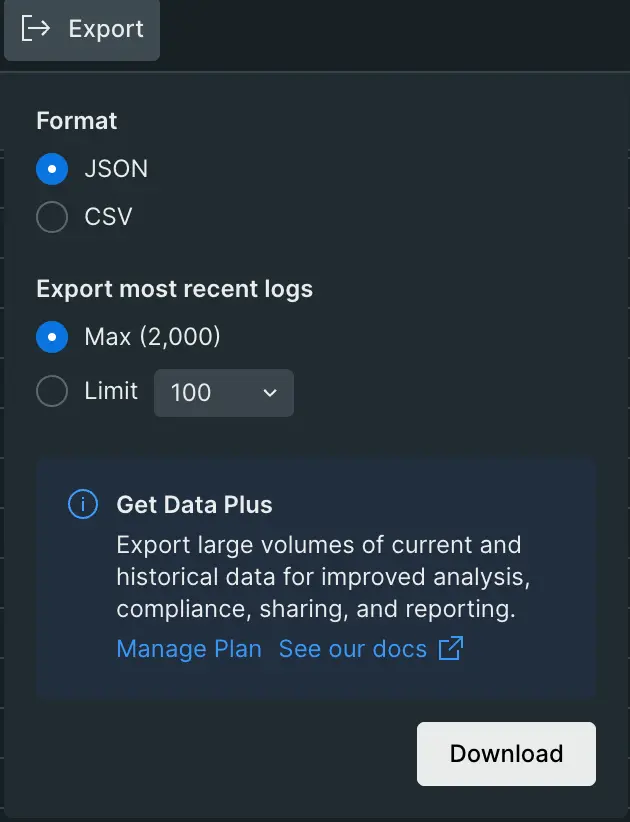

Download your logs easily in the Logs UI by using the new Export feature! This allows you to download logs in either the JSON or CSV format, up to the export limit. 

To get started, go to the **Logs UI** and select the **Export** button at the top of the log table. Choose a format, and a limit and hit "Download" to start your logs export.

Want to export more than the export limit permits? Take advantage of our **Data Plus** offering to use either [Streaming Export](https://docs.newrelic.com/docs/apis/nerdgraph/examples/nerdgraph-streaming-export/) or [Historical export](https://docs.newrelic.com/docs/apis/nerdgraph/examples/nerdgraph-historical-data-export/) . [**Learn more**](https://docs.newrelic.com/docs/accounts/accounts-billing/new-relic-one-pricing-billing/data-ingest-billing/#upgrade-data-plus)
