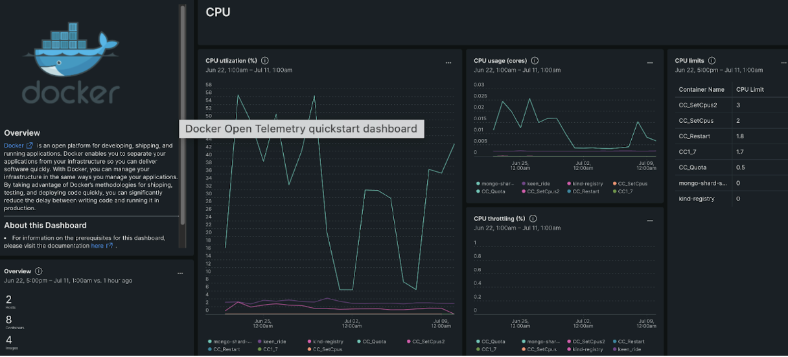

OpenTelemetry Collector simplifies instrumentation efforts by providing a centralized and vendor-neutral solution for gathering, processing, and exporting Docker container and StatsD metrics directly to New Relic, without the need for additional integrations. Now you can get better performance and easy data export to New Relic: 

* **Docker containers:** Instantly visualize docker metrics streamed through the OpenTelemetry collector in New Relic using pre-built dashboards, create alert policies, and create custom queries and charts. This makes it easy to analyze the performance of Docker containers, facilitating swift troubleshooting and optimization of your applications.

* **StatsD:** Using the OpenTelemetry Collector you can now independently harvest StatsD metrics without the requirement to have Docker for scraping. This allows for streamlined and simplified acquisition of StatsD metrics which you can then visualize with New Relic to get 360° insights.

