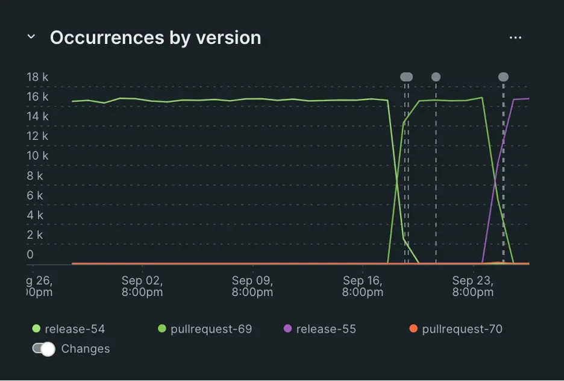

With the frequency of software releases increasing, sometimes to many times a day, identifying if a particular version introduced an error becomes challenging. New Relic errors inbox now supports version tracking & filtering so you can easily identify which version introduced the error, making detection and root cause identification even easier. With version tracking in New Relic errors inbox, you get:
* Faster root cause identification: Identify the version of the code release where errors first occurred so you can focus on fixing the code rather than finding the error. 
* Accelerated issue resolution: Reduce the steps and screens required to detect, identify, and resolve issues with less toil. 
* Real-time error visibility: Get an up-to-date summary of any new errors introduced by recent software releases and stay ahead of issues before they impact customers.

