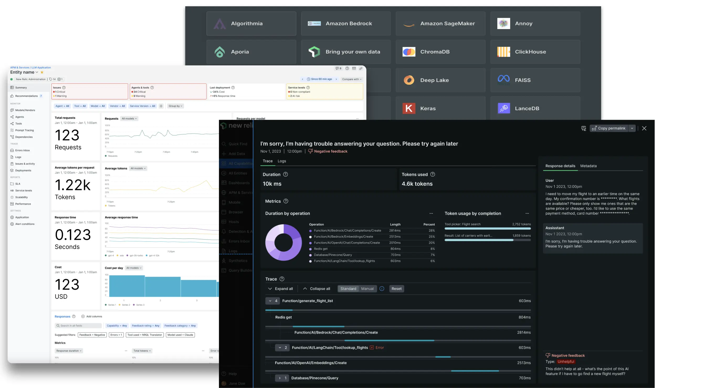

New Relic AI Monitoring (AIM) provides unprecedented visibility and insights across the entire AI application stack, enabling engineers to troubleshoot and optimize their AI apps for performance, quality, and cost.

With New Relic AIM you can:

* **Debug faster with complete AI stack visibility:** End-to-end visibility of your entire AI app stack. Spot and fix problems easily from application to infrastructure to the AI layer.

* **Ensure AI app performance, quality, and cost:** Follow the end-to-end lifecycle of LLM prompts and responses to optimize for speed, quality, and cost of AI apps.

* **Choose the right model for your app:** Track usage, performance, quality and cost across all models in a single view. When you're ready, choose the right model for your needs and to optimize costs.

* **Instantly monitor any AI ecosystem:** 50+ integrations and counting for popular LLMs, vector data stores and more. AIM is the most comprehensive solution for monitoring any AI ecosystem.

