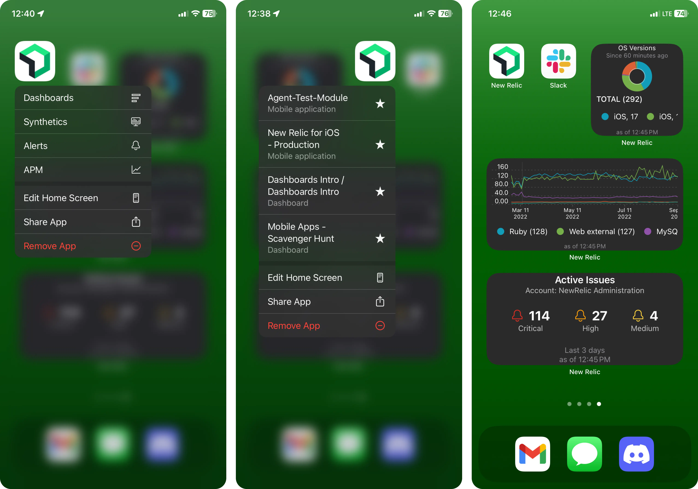

Gain on-the-go access to vital data insights with quick actions and updated widgets in the New Relic mobile app. Reduce the time needed to find and analyze critical information no matter where you are. Triage problems quickly and improve mean time to resolution (MTTR), directly from your mobile device.

With quick actions and widgets on mobile, you get:

* **Instant access to the most critical data:** Reduce the time spent sifting through menus. Access your most vital entities for troubleshooting and issue resolution. When you long-press the New Relic app icon, see your customized favorites list.
* **Customizable widgets and shortcuts:** Customize your shortcuts and widgets to fit your unique workflow and priorities. Whether you're interested in Issue Counts, service levels, or any other custom chart, these features let you take control of your data access and management.
* **All the data you need at your fingertips:** Add widgets directly to your device's lock screen (_Android only, iOS coming soon!_). Keep a close eye on system health, performance metrics, and alerts without unlocking your device, so that you can stay informed and responsive.

**Next steps**

* Check out our documentation for [quick actions](https://docs.newrelic.com/docs/mobile-apps/quick-actions/) and widgetes for [Android](https://docs.newrelic.com/docs/mobile-apps/android-widgets/) and [iOS](https://docs.newrelic.com/docs/mobile-apps/ios-widgets/)
* Watch the [databyte video](https://youtu.be/qSprakQpUTM).
