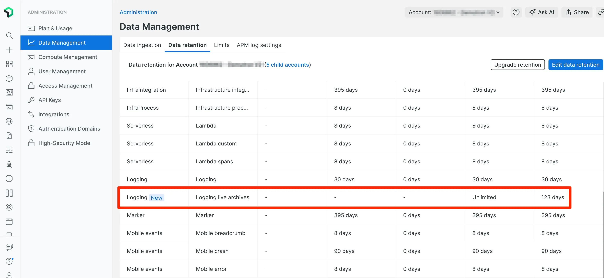

Live archives is our long-term logs storage solution that lets you meet compliance requirements by storing log data for up to seven years. Using an active, hydrated, and enriched state, live archives helps you analyze historical logs faster and easier than before.

## Solution benefits and capabilities

- **Instant access**: Access archived logs instantly, because they never leave the New Relic Database (NRDB). Analyze your archived logs alongside your other logs, using the same UI and workflows with no extra work.
- **Eliminate toil**: Live archives removes processes that stand between you and your logs. Worry less about rehydrating, reloading, and re-indexing logs, or moving data across multiple locations and tiers. When you need to respond to compliance or audit requests, live archives ensures your logs are right where you expect them to be, without any additional steps.
- **Reduce costs**: Live archives eliminates the need to pay for ingress and egress, indexing, reformatting data, or the need for additional tools to manage compliance risks. 

## How to get started

New Relic live archives simplifies the way you approach long-term logs storage and analysis. Ready to streamline your logs process? Follow these steps:  

1. **Send logs**: Send your logs to New Relic.
1. **Set retention periods**: Choose a retention period from 120 days up to seven years. This depends on your compliance needs.
1. **Choose a partition to archive**: You don't need to archive every log for compliance. Your New Relic administrator can select specific log partitions for archiving.
1. **Query data in the logs UI**: Live archives logs are queryable alongside your other logs and telemetry data.
2. **Manage user permissions**: To query your live archives, have a New Relic administrator assign you a custom role with query capability.
