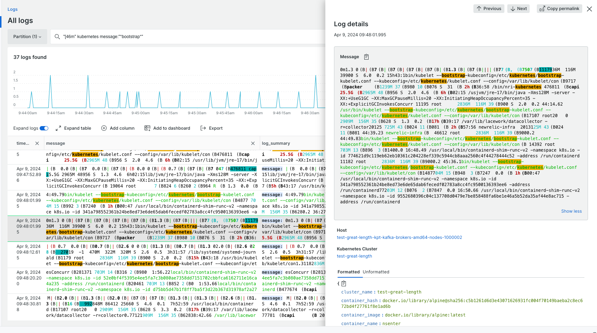

View your logs with ANSI respected colors in its text with this new change to the Logs UI!

To get started, ingest logs with ANSI color codes attached to a log attribute. Ensure that proper unicode escape characters are used when sending in ANSI color codes.

Example log: 
```
{ 
  message: "\u001b[36m Sample ANSI message \u001b[0m",
  logType: "sample"
}
``` 

Once ingested, go to the **Logs UI** and you will see your log lines with their respective ANSI colors. Note: this update supports the extended 256 ANSI color set. 

For more information on ingesting logs, read the [Forwarding logs documentation](https://docs.newrelic.com/docs/logs/forward-logs/enable-log-management-new-relic/).


<figcaption>
  A screenshot of an example log with ANSI color coding.  
</figcaption>
