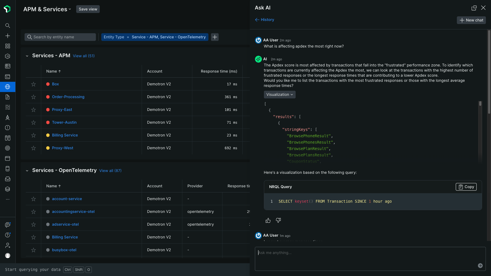

Now generally available, [New Relic AI](https://docs.newrelic.com/docs/new-relic-solutions/new-relic-one/core-concepts/new-relic-ai/) lets you turn complex telemetry data into actionable insights using everyday language and integrated platform experiences.

You can interact with New Relic AI via the “Ask AI” chat interface, [Query Your Data](https://docs.newrelic.com/docs/new-relic-solutions/new-relic-one/core-concepts/new-relic-ai/#NRQL-console), [CodeStream](https://docs.newrelic.com/docs/codestream/start-here/what-is-codestream/), as well as a growing number of one-click embedded platform experiences, such as [logs](https://docs.newrelic.com/docs/new-relic-solutions/new-relic-one/core-concepts/new-relic-ai/#errors) and [errors inbox integrations](https://docs.newrelic.com/docs/new-relic-solutions/new-relic-one/core-concepts/new-relic-ai/#stack-traces) to help you:
* Accelerate onboarding and identify monitoring coverage gaps.
* Surface deep insights without leaving your workflow.
* Automatically find and fix code-level errors in your IDE.
* Understand and improve system performance with help analyzing dashboards and building system health reports.

**Important details**
* Beginning on May 31, 2024, New Relic AI usage will be billed as [compute capacity units (CCUs)](https://docs.newrelic.com/docs/licenses/license-information/product-definitions/new-relic-one-pricing-definitions/#compute-capacity-unit) on the [New Relic Compute](https://docs-preview.newrelic.com/docs/compute-pricing) pricing model. As such, a New Relic Compute [Add On pricing SKU](https://docs.newrelic.com/docs/licenses/license-information/usage-plans/new-relic-usage-plan/#list-price) or [plan](https://newrelic.com/pricing/compute) will be required in order to access to New Relic AI capabilities. 
* If you are not already utilizing a New Relic Compute pricing option, you are eligible to participate in a no-cost, “try before you buy” period of 30 days to use New Relic AI before losing access. To initiate your trial period, click the “Ask AI” button in the upper right hand corner of the New Relic platform navigation, and select “Start Trial” when prompted.
* New Relic AI is not available to FedRAMP-enabled and HIPAA-enabled customers at this time.