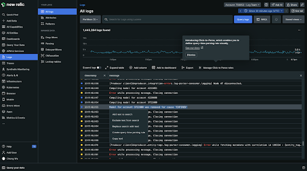

title: 'Click-to-parse for streamlined querying'
summary: 'parse any variables from string attributes without writing any additional script'
releaseDate: '2024-06-11'
learnMoreLink: 'https://newrelic.com/blog/how-to-relic/click-to-parse'

---
While the majority of valuable parsing information is automatically gathered during the ingestion of logs into the New Relic platform, building additional queries can be a very manual and labor-intensive exercise. The new click-to-parse productivity hack allows you to easily select any string from your log file, then parse out repeatable values for alpha-numeric input, reducing manual entry and time to create queries. With a single click you can parse any variables from string attributes without writing any additional script.

<figcaption>A screenshot showing how to extract a value from a string.</figcaption>
 
 
At New Relic the productivity and efficiency of our users is always first of mind which is why we continue to deliver functionality like click-to-parse. As a further proof-point of our customer dedication and innovation, we've expanded early access for New Relic AI, the industry's first generative AI observability assistant. This preview offers capabilities that allow you to:

*Translate plain language into New Relic Query Language (NRQL) queries, run NRQL queries, and render the results in plain language or visualize them as a chart or graph.
*Synthesize how-to guides based on our extensive documentation.
*Surface New Relic Lookout insights/anomaly data in response to root cause analysis (RCA)-style prompts.
*Summarize and get recommendations for open dashboards.
*Understand and fix errors in CodeStream.

<figcaption>A screenshot showing how to extract a value from a string.</figcaption>
 
 
To participate in our Early Access program, simply “Opt In” to the NRAI preview 

To enable NRAI in the NRQL console:
1. Go to the user menu at the bottom left of the New Relic UI.
2. Click the **Features** tab.
3. Scroll down to the **New Relic** AI section and click **Enable**.
