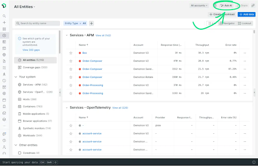

New Relic has released two tools to help streamline querying your logs: query time parsing and NRAI parsing assistance. 

## Query time parsing 

New Relic automatically ingests valuable data and metrics, but parsing that data with additional queries can be manual and labor-intensive. New Relic's query time parsing allows you to easily select any string from your log file and then parse out repeatable values for alpha-numeric input, reducing manual entry and time to create queries. You can parse variables from string attributes with a single click without writing any additional script.

To get started:
1. [Read our blog post](https://newrelic.com/blog/how-to-relic/click-to-parse)
2. [Review our docs page](https://docs.newrelic.com/docs/logs/ui-data/query-time-parsing/)
3. [Watch a step-by-step video](https://www.youtube.com/watch?v=tvK6MlkvD6Y)

<figcaption>Use click-to-parse to extract the value from a string for easy querying.</figcaption>

## Ingest parsing with AI assistance

We are expanding New Relic AI to help you create and troubleshoot parsing rules. This preview offers capabilities that can help:

* **Suggest parsing rules**: When you create a parsing rule in the UI, as NRAI to create the parsing rule for you. 
* **Explain parsing rules**: If you don't understand the parsing rule our AI suggests, you can ask AI to explain the rule and suggest an even more efficient one if available. 

<figcaption>Ask AI to help you run NRQL queries to perform root cause analysis.</figcaption>

To try the new AI-powered log parsing capability, join our public preview:

1. Go to the user menu at the bottom left of the New Relic UI.
2. Click the **Features** tab.
3. Scroll down to the **New Relic** AI section and click **Enable**.
4. Let us know how we're doing! Select **Give Us Feedback** under the **Help** dropdown.