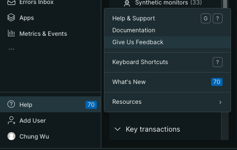

title: 'Click-to-parse (GA) and AI-powered parsing (Preview) for streamlined querying'
summary: 'parse any variables from string attributes without writing any additional script'
releaseDate: '2024-06-11'
learnMoreLink: 'https://newrelic.com/blog/how-to-relic/click-to-parse'
getStartedLink: 'https://youtu.be/tvK6MlkvD6Y?si=5klygPBzQyY5qsI8
---
# Query time parsing with click-to-parse
While the majority of valuable parsing information is automatically gathered during the ingestion of logs into the New Relic platform, building additional queries can be a very manual and labor-intensive exercise. The new click-to-parse productivity hack allows you to easily select any string from your log file, then parse out repeatable values for alpha-numeric input, reducing manual entry and time to create queries. With a single click you can parse any variables from string attributes without writing any additional script.

To get started:
1. [Read our blog post](https://newrelic.com/blog/how-to-relic/click-to-parse)
2. [Review our docs page](https://docs.newrelic.com/docs/logs/ui-data/query-time-parsing/)
3. [Watch a step-by-step video](https://www.youtube.com/watch?v=tvK6MlkvD6Y)

<figcaption>A screenshot showing how to extract a value from a string.</figcaption>
 

# Ingest parsing with AI assistance
To increase the efficiency of capturing parsing rules upon ingest, we are expanding our public preview for our AI-powered ingest. This preview offers capabilities that allow you to:
* Translate plain language within logs into New Relic Query Language (NRQL) queries, run NRQL queries, and render the results in plain language or visualize them as a chart or graph.
* Surface New Relic Lookout insights/anomaly data from logs in response to root cause analysis (RCA)-style prompts.

<figcaption>A screenshot showing NRAI enabled.</figcaption>
 
 

To try the new AI-powered log parsing capability upon ingest, join our public preview by doing the following:

1. Go to the user menu at the bottom left of the New Relic UI.
2. Click the **Features** tab.
3. Scroll down to the **New Relic** AI section and click **Enable**.
4. **Give Us Feedback** by following option under the Help pulldown.
   

<figcaption>A screenshot showing the Give Us Feedback option.</figcaption>
