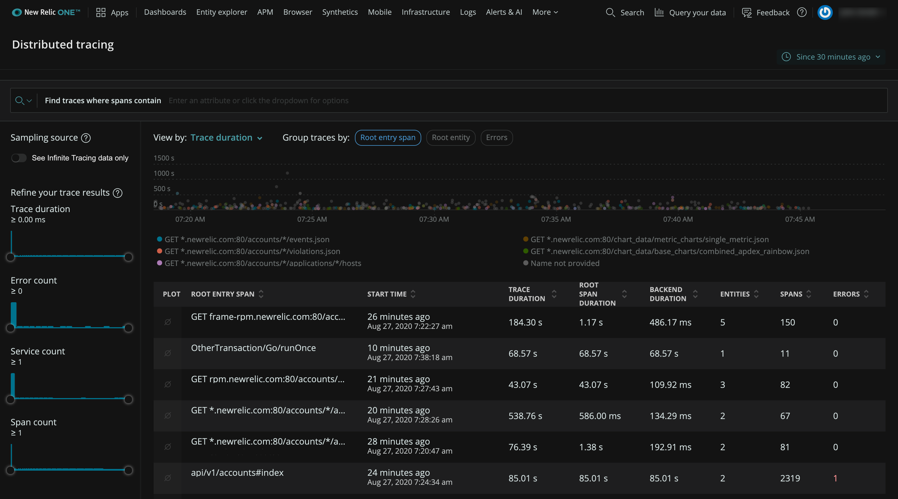

夜にインシデントをチェックしている、または目に負担をかけたくない場合、UIをダークモードで表示できます。

<figcaption>
  New RelicのUIでライトモードとダークモードを切り替えるには、アカウントドロップダウンをクリックし、**テーマ**を選択します。
</figcaption>

## ライトモードとダークモードを切り替える [#dark-mode]

現在、ダークモードはFirefoxブラウザではサポートされていません。それ以外の場合、ダークモードでUIを表示するには：

1. **[one.newrelic.com](https://one.newrelic.com)**から、[アカウントドロップダウン](/docs/using-new-relic/welcome-new-relic/get-started/glossary#account-dropdown)をクリックします。

2. **テーマ**をクリックして、次のオプションのいずれかを選択します。

   * **テーマ：オート**（デフォルト）：UIを、OSですでに有効にしているものと一致させます。
   * **テーマ：ダーク**：UIをダークモードに維持します。
   * **テーマ：ライト**：UIをライトモードに維持します。

