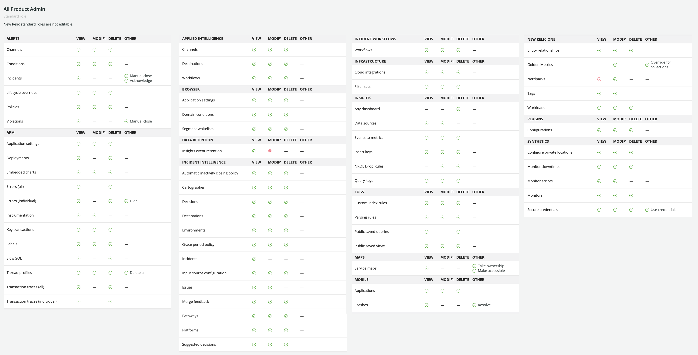

New Relicのユーザーは、次の2つの[ユーザーモデル](/docs/accounts/original-accounts-billing/original-product-based-pricing/overview-changes-pricing-user-model/#user-models)のいずれかになります。このドキュメントでは、New Relic Oneのユーザーモデルについて説明します。

<Callout variant="important">
  New Relic組織を2020年7月30日以前に作成し、ユーザー移行プロセスを経ていない場合、ユーザーは[元のユーザーモデル](/docs/accounts/original-accounts-billing/original-users-roles)である可能性があります。詳細については、[ユーザーモデルの変更](/docs/accounts/original-accounts-billing/original-product-based-pricing/overview-changes-pricing-user-model/#user-models)を参照してください。
</Callout>

## 概要

このドキュメントでは、次のような[New Relic Oneユーザーモデル](/docs/accounts/original-accounts-billing/original-product-based-pricing/overview-changes-pricing-user-model/#user-models)の構造について説明します。

* [ユーザータイプ](#user-type)（基本ユーザー対フルプラットフォームユーザー）
* **管理者**と**ユーザー**を含む[デフォルトのユーザーグループ](#groups)
* [ロールと機能](#roles)

UIにユーザーを追加する、およびUIでユーザーを管理する方法については、[ユーザー管理](/docs/accounts/accounts-billing/new-relic-one-pricing-users/manage-user-groups-roles-access-grants)を参照してください。

## ユーザータイプ：基本ユーザーとフルプラットフォームユーザー [#user-type]

<Callout variant="important">
  本セクションは、[New Relic Oneのユーザーモデル](/docs/accounts/original-accounts-billing/original-product-based-pricing/overview-changes-pricing-user-model/#user-models)のユーザー用です。

  2021年11月、ユーザータイプ「フルユーザー」を「フルプラットフォームユーザー」に変更しました。
</Callout>

ユーザーの**ユーザータイプ**によって、基本機能（基本ユーザー）にアクセスできるか、またはキュレートされたすべてのオブザーバビリティUI機能（フルプラットフォームユーザー）にアクセスできるかが決まります。ユーザータイプとは、ユーザーが期待するNew Relic責任に基づき長期に設定されることを意図したものです。

以下は、2つのユーザータイプの詳細です。[New Relic Oneの価格設定](/docs/accounts/original-accounts-billing/original-product-based-pricing/overview-changes-pricing-user-model#pricing-plans)を使用している場合にのみ、フルプラットフォームユーザーに請求が可能です。

* **基本ユーザー**。詳細:

  * これらのユーザーは無料で、New Relicデータレポートツールの設定と構成、データのクエリ実行、ログUIの使用、カスタムチャートやダッシュボードの作成、アラート設定など、幅広い機能にアクセスできます。フルプラットフォームユーザーとは異なり、キュレートされたオブザーバビリティUI体験または一部の応用インテリジェンス機能にはアクセス**できません**（詳細な比較については、[機能](#user-capabilities)を参照）。
  * 基本ユーザーが使用できない機能にアクセスを試みると、フルプラットフォームユーザーになるように促すプロンプトが表示されます。詳細については、[アップグレード](/docs/accounts/accounts-billing/new-relic-one-user-management/authentication-domains-saml-sso-scim-more/#session-mgmt)を参照してください。

* **フルプラットフォームユーザー**、または**フルユーザー**とも呼ばれます。詳細

  * フルプラットフォームユーザーは、APM、Infrastructureモニタリング、ブラウザモニタリング、モバイルモニタリング、合成モニター、New Relic Oneアプリへのアクセスなど、すべてのオブザーバビリティUI体験を含む、すべてにアクセスできます（役割の制限による）。詳細については、[機能](#user-capabilities)を参照してください。
  * [Standardエディション](https://newrelic.com/pricing)には、1人の無料フルプラットフォームユーザーと最大5人のフルプラットフォームユーザーが含まれます。
  * フルプラットフォームユーザーは、[12か月の期間に2回](/docs/accounts/accounts-billing/new-relic-one-pricing-billing/new-relic-one-pricing-billing/#user-count)、基本ユーザーにダウングレードできます。

ユーザーのユーザータイプを表示および編集するには、[ユーザー管理UI](/docs/accounts/accounts-billing/new-relic-one-user-management/add-manage-users-groups-roles#edit-user-type)を使用します。

基本ユーザー対フルプラットフォームユーザーの違いに関する詳細：

<CollapserGroup>
  <Collapser
    className="freq-link"
    id="user-capabilities"
    title="フル機能と基本機能の比較"
  >
    以下は、基本ユーザーとフルプラットフォームユーザーができることを比較した表です。簡単に考えると、フルプラットフォームユーザーは（選択した役割の制限に応じて）すべてのキュレートされたUI体験に理論的にアクセスでき、基本ユーザーはかなり基本的な機能に制限されます。

    <table>
      <thead>
        <tr>
          <th style={{ width: "350px" }}>
            機能
          </th>

          <th className="fcenter">
            フルプラットフォームユーザー
          </th>

          <th className="fcenter">
            基本ユーザー
          </th>
        </tr>
      </thead>

      <tbody>
        <tr>
          <td
            className="fcenter"
            style={{ backgroundColor: "#e9f3f3" }}
          >
            **オブザーバビリティUI体験**
          </td>

          <td style={{ backgroundColor: "#e9f3f3" }}/>

          <td style={{ backgroundColor: "#e9f3f3" }}/>
        </tr>

        <tr>
          <td>
            アプリケーションモニタリング（APM）UI
          </td>

          <td className="fcenter">
            <Icon
              style={{color: '#328787'}}
              name="fe-check"
            />
          </td>

          <td/>
        </tr>

        <tr>
          <td>
            インフラストラクチャモニタリングUI
          </td>

          <td className="fcenter">
            <Icon
              style={{color: '#328787'}}
              name="fe-check"
            />
          </td>

          <td/>
        </tr>

        <tr>
          <td>
            デジタルエクスペリエンスのモニタリングUIには、以下が含まれます。

            * ブラウザのモニタリングUI
            * モバイル監視UI
            * 合成のモニタリングUI
          </td>

          <td className="fcenter">
            <Icon
              style={{color: '#328787'}}
              name="fe-check"
            />
          </td>

          <td/>
        </tr>

        <tr>
          <td>
            合成チェック
          </td>

          <td className="fcenter">
            <Icon
              style={{color: '#328787'}}
              name="fe-check"
            />
          </td>

          <td/>
        </tr>

        <tr>
          <td>
            サーバーレスモニタリングUI
          </td>

          <td className="fcenter">
            <Icon
              style={{color: '#328787'}}
              name="fe-check"
            />
          </td>

          <td/>
        </tr>

        <tr>
          <td>
            Logs in Context
          </td>

          <td className="fcenter">
            <Icon
              style={{color: '#328787'}}
              name="fe-check"
            />
          </td>

          <td/>
        </tr>

        <tr>
          <td>
            ディストリビューティッド（分散）トレーシングUI
          </td>

          <td className="fcenter">
            <Icon
              style={{color: '#328787'}}
              name="fe-check"
            />
          </td>

          <td/>
        </tr>

        <tr>
          <td>
            無限トレーシング
          </td>

          <td className="fcenter">
            <Icon
              style={{color: '#328787'}}
              name="fe-check"
            />

            （[ProまたはEnterpriseエディション](https://newrelic.com/pricing)）
          </td>

          <td/>
        </tr>

        <tr>
          <td>
            以下のようなさまざまなUIエクスペリエンス：

            * KubernetesクラスタエクスプローラーUI
            * エラーインボックス
            * キートランザクションUI
            * ワークロードUI
          </td>

          <td className="fcenter">
            <Icon
              style={{color: '#328787'}}
              name="fe-check"
            />
          </td>

          <td/>
        </tr>

        <tr>
          <td>
            [CodeStreamインテグレーション](/docs/codestream/start-here/codestream-new-relic)
          </td>

          <td className="fcenter">
            <Icon
              style={{color: '#328787'}}
              name="fe-check"
            />
          </td>

          <td>
            （一時プレビューアクセス）
          </td>
        </tr>

        <tr>
          <td>
            [New Relic Oneアプリへのアクセス](https://developer.newrelic.com/build-apps/permission-manage-apps)
          </td>

          <td className="fcenter">
            <Icon
              style={{color: '#328787'}}
              name="fe-check"
            />
          </td>

          <td className="fcenter">
            アプリは構築できますが、他のアプリにはアクセスできません。
          </td>
        </tr>

        <tr>
          <td
            className="fcenter"
            style={{ backgroundColor: "#e9f3f3" }}
          >
            **New Relic Oneプラットフォームの機能**
          </td>

          <td
            className="fcenter"
            style={{ backgroundColor: "#e9f3f3" }}
          >
            **フルプラットフォームユーザー**
          </td>

          <td
            className="fcenter"
            style={{ backgroundColor: "#e9f3f3" }}
          >
            **基本ユーザー**
          </td>
        </tr>

        <tr>
          <td>
            任意のソースからのデータ投入（エージェント、インテグレーション、API）
          </td>

          <td className="fcenter">
            <Icon
              style={{color: '#328787'}}
              name="fe-check"
            />
          </td>

          <td className="fcenter">
            <Icon
              style={{color: '#328787'}}
              name="fe-check"
            />
          </td>
        </tr>

        <tr>
          <td>
            クエリデータ
          </td>

          <td className="fcenter">
            <Icon
              style={{color: '#328787'}}
              name="fe-check"
            />
          </td>

          <td className="fcenter">
            <Icon
              style={{color: '#328787'}}
              name="fe-check"
            />
          </td>
        </tr>

        <tr>
          <td>
            カスタムチャートとダッシュボードの作成
          </td>

          <td className="fcenter">
            <Icon
              style={{color: '#328787'}}
              name="fe-check"
            />
          </td>

          <td className="fcenter">
            <Icon
              style={{color: '#328787'}}
              name="fe-check"
            />
          </td>
        </tr>

        <tr>
          <td>
            アラートと通知
          </td>

          <td className="fcenter">
            <Icon
              style={{color: '#328787'}}
              name="fe-check"
            />
          </td>

          <td className="fcenter">
            <Icon
              style={{color: '#328787'}}
              name="fe-check"
            />
          </td>
        </tr>

        <tr>
          <td>
            [NerdGraph](/docs/apis/nerdgraph/get-started/introduction-new-relic-nerdgraph)を含むAPI
          </td>

          <td className="fcenter">
            <Icon
              style={{color: '#328787'}}
              name="fe-check"
            />
          </td>

          <td className="fcenter">
            <Icon
              style={{color: '#328787'}}
              name="fe-check"
            />

            （基本ユーザーの権限）
          </td>
        </tr>

        <tr>
          <td>
            データのクエリおよびチャートログ作成
          </td>

          <td className="fcenter">
            <Icon
              style={{color: '#328787'}}
              name="fe-check"
            />
          </td>

          <td className="fcenter">
            <Icon
              style={{color: '#328787'}}
              name="fe-check"
            />
          </td>
        </tr>

        <tr>
          <td>
            [New Relic Oneアプリ](https://developer.newrelic.com/build-apps/permission-manage-apps)の構築
          </td>

          <td className="fcenter">
            <Icon
              style={{color: '#328787'}}
              name="fe-check"
            />
          </td>

          <td className="fcenter">
            <Icon
              style={{color: '#328787'}}
              name="fe-check"
            />

            （他のアプリへはアクセスできない）
          </td>
        </tr>

        <tr>
          <td>
            New Relicデータの管理
          </td>

          <td className="fcenter">
            <Icon
              style={{color: '#328787'}}
              name="fe-check"
            />
          </td>

          <td className="fcenter"/>
        </tr>

        <tr>
          <td>
            他のNew Relicユーザーの管理
          </td>

          <td className="fcenter">
            <Icon
              style={{color: '#328787'}}
              name="fe-check"
            />
          </td>

          <td/>
        </tr>

        <tr>
          <td
            className="fcenter"
            style={{ backgroundColor: "#e9f3f3" }}
          >
            **応用インテリジェンス**
          </td>

          <td
            className="fcenter"
            style={{ backgroundColor: "#e9f3f3" }}
          >
            **フルプラットフォームユーザー**
          </td>

          <td
            className="fcenter"
            style={{ backgroundColor: "#e9f3f3" }}
          >
            **基本ユーザー**
          </td>
        </tr>

        <tr>
          <td>
            問題の認識と解決
          </td>

          <td className="fcenter">
            <Icon
              style={{color: '#328787'}}
              name="fe-check"
            />
          </td>

          <td className="fcenter">
            <Icon
              style={{color: '#328787'}}
              name="fe-check"
            />
          </td>
        </tr>

        <tr>
          <td>
            根本原因の分析
          </td>

          <td className="fcenter">
            <Icon
              style={{color: '#328787'}}
              name="fe-check"
            />
          </td>

          <td className="fcenter"/>
        </tr>

        <tr>
          <td>
            インシデント/異常分析
          </td>

          <td className="fcenter">
            <Icon
              style={{color: '#328787'}}
              name="fe-check"
            />
          </td>

          <td className="fcenter"/>
        </tr>

        <tr>
          <td>
            相関アシスタント
          </td>

          <td className="fcenter">
            <Icon
              style={{color: '#328787'}}
              name="fe-check"
            />
          </td>

          <td className="fcenter"/>
        </tr>

        <tr>
          <td>
            問題マップ
          </td>

          <td className="fcenter">
            <Icon
              style={{color: '#328787'}}
              name="fe-check"
            />
          </td>

          <td className="fcenter"/>
        </tr>

        <tr>
          <td>
            機械学習の分類
          </td>

          <td className="fcenter">
            <Icon
              style={{color: '#328787'}}
              name="fe-check"
            />
          </td>

          <td className="fcenter"/>
        </tr>
      </tbody>
    </table>

    [価格設定エディション](https://www.newrelic.com/pricing)（Standard、Pro、Enterprise）は、アクセスできる機能にも影響します。

    New Relic Oneの価格設定を利用している組織の場合、[フルプラットフォームユーザーがどのように請求に影響する](/docs/accounts/accounts-billing/new-relic-one-pricing-users/pricing-billing#user-count)かの詳細をご覧ください。
  </Collapser>

  <Collapser
    className="freq-link"
    id="decide-user-type"
    title="ユーザータイプ選択のヒント"
  >
    ユーザーの[ユーザータイプ](#user-type)（基本ユーザー対フルプラットフォームユーザー）は、ユーザーが実行を期待するNew Relic責任に基づく長期任務を意図しています。フルプラットフォームユーザーは[1年に2回のみ](/docs/accounts/accounts-billing/new-relic-one-pricing-billing/new-relic-one-pricing-billing/#user-count)基本ユーザーにダウングレードできます。以下は、フルプラットフォームユーザー対基本ユーザーを選択する理由のヒントです。

    あるユーザーをフルプラットフォームユーザーにする理由：

    * アプリケーション開発ライフサイクルの開発、テスト、デプロイメント、メンテナンス段階で重要な役割を担っている。

    * コードを定期的に変更/修正しており、ワークフローのトリアージ、トラブルシューティングまたはチームのユーザーとロールの管理を担当している。

    * バージョン管理システムなどのDevOps慣行を有しており、CI/CDを実装している。

    * New Relicのキュレート済みのダッシュボードとUIを使用する必要がある（自身のカスタムクエリとチャートの作成だけでなく）。つまり、プラットフォームへのフルアクセスが必要である。

    * ユーザーおよび/または請求を管理できる必要がある。

      あるユーザーを基本ユーザーにする理由：

    * アプリケーション開発ライフサイクルの企画段階で重要な役割を担っている。

    * New Relicエージェント、API、インテグレーションを使用および設定してデータを送信、そのデータにアクセス、設定し、アラートを使用している（必ずしも、ワークフローのトリアージ、トラブルシューティング、またはチームのユーザーとロールの管理を担当している必要はない）。

    * 将来の企画（C-Suiteエグゼクティブなど）のために高いレベルの分析とビジネスメトリックスを望んでいる。

    * キュレート済みのエクスペリエンスやダッシュボードを使用する必要はないが、データについて自身のカスタムクエリとチャートの作成を行えればメリットがある。つまり、プラットフォームへのフルアクセスは不要である。　

    * ユーザーを管理していない。

    New Relic Oneの価格設定に関するアカウントの詳細は、 [ユーザー関連請求計算](/docs/accounts/accounts-billing/new-relic-one-pricing-users/pricing-billing#user-count)を参照してください。
  </Collapser>

  <Collapser
    className="freq-link"
    id="billing-calculation"
    title="ユーザー関連請求の理解"
  >
    [New Relic One価格設定モデル](/docs/accounts/accounts-billing/new-relic-one-pricing-billing/new-relic-one-pricing-billing)を利用している場合は、フルプラットフォームユーザーが請求対象で、フルプラットフォームユーザーが基本ユーザーにダウングレードする頻度には制限があります。詳細については、[ユーザー数請求の詳細](/docs/accounts/accounts-billing/new-relic-one-pricing-users/pricing-billing#user-count)を参照してください。

    使用データのクエリとアラートの方法については、[使用データのクエリ](/docs/accounts/accounts-billing/new-relic-one-pricing-users/queries-alerts)を参照してください。
  </Collapser>
</CollapserGroup>

## アクセスできない理由についてご質問がありますか？ [#access]

[アクセスに影響する要因](/docs/accounts/accounts-billing/general-account-settings/factors-affecting-access-features-data/#account-access)を参照してください。

## デフォルトグループ: 管理者およびユーザー [#groups]

当社のNew Relic Oneユーザーモデルのユーザーの場合、「グループ」とは、複数のユーザーをグループ化して、複数のユーザーを同時に管理できるようにするものです。New Relicユーザーはグループに割り当てられ、そのグループには特定のアカウントの特定のロールへのアクセスが許可されます。

2つのデフォルトグループがあります。

* **ユーザー**：このグループでは、ユーザーがモニタリング/分析機能の使用と構成を許可されますが、請求またはユーザーの管理などのアカウント関連タスクの実行は許可**されません**。**すべての製品管理者**ロールにアクセスできます。このロールは、弊社のオブザーバビリティプラットフォームツールへのアクセスを提供しますが、**組織マネージャー**および**認証マネージャー**ロールによって管理される組織およびユーザー管理機能にはアクセスできません。
* **管理者**：組織レベルの管理者機能など、完全なアクセス権と機能を持っています。これは、**すべての製品管理者**、**請求ユーザー**、**組織マネージャー**、および**認証ドメインマネージャー**の[ロール](#standard-roles)を持つことと同じです。

これらのグループは、デフォルトの[認証ドメイン](/docs/accounts/accounts-billing/new-relic-one-user-management/authentication-domains-saml-sso-scim-more/)内に追加されます。これには、a) New Relic経由で管理されているユーザー、b) 標準的な電子メールとパスワードでログインしているユーザーのデフォルト設定が含まれます。その他の認証ドメイン（SAML SSOまたはユーザーのSCIMプロビジョニング）を追加すると、それらのユーザーを管理する新しいドメインにカスタムグループが新規作成されます。

デフォルトかカスタムかにかかわらず、グループはユーザーの機能を制限するものではありません。そのグループに割り当てられるロールで制限します（それに加えて、基本的なユーザー制限があります）。組織がProまたはEnterpriseエディションで、ユーザーが特定のロールおよびアカウントへのアクセスをどのように付与されるかを理解するには、[アクセス権限](/docs/accounts/accounts-billing/new-relic-one-user-management/add-manage-users-groups-roles/#understand-concepts)を参照してください。

ユーザーがいるグループを編集するには、[**ユーザー管理**UI](/docs/accounts/accounts-billing/new-relic-one-user-management/add-manage-users-groups-roles#where)を使用します。

## ユーザータイプ、ロール、グループは、互いにどのように関連していますか？ [#type-role-group]

[New Relic Oneユーザーモデル](/docs/accounts/original-accounts-billing/original-product-based-pricing/transition-guide-new-pricing-user-changes#user-models)のユーザーの場合、以下は、[ユーザータイプ](#user-type)（基本ユーザー対フルプラットフォームユーザー）、ロールおよびグループがどのように関連しているかを説明する表です。

<table>
  <thead>
    <tr>
      <th style={{ width: "100px" }}/>

      <th style={{ width: "250px" }}>
        フルプラットフォームユーザー
      </th>

      <th style={{ width: "250px" }}>
        基本ユーザー
      </th>
    </tr>
  </thead>

  <tbody>
    <tr>
      <td>
        **グループ**
      </td>

      <td>
        フルプラットフォームユーザーは、[デフォルトグループ](#groups)（**ユーザー**および**アドミン**）またはカスタムグループに割り当てできます。
      </td>

      <td>
        基本ユーザーがグループに追加されると、そのグループのロール関連の制限が適用されます。基本ユーザーの機能はそのように制限できますが、基本ユーザーには、最初に使用する以上の機能を付与することはできません。Standardエディションでは、基本ユーザーをグループに割り当てることはできません。ProおよびEnterpriseエディションでは可能です。
      </td>
    </tr>

    <tr>
      <td>
        **ロール**
      </td>

      <td>
        当社のデフォルトグループのロールの説明については、[デフォルトグループ](#groups)を参照してください。

        カスタムグループには、デフォルト標準ロールまたはカスタムロールのいずれかを含めることができます。
      </td>

      <td>
        基本ユーザーの能力は、特定のロールによって直接定義されません。基本ユーザーは、[**すべての製品管理者**のロール](#standard-roles)を持っているが、キュレートされたUI体験にはアクセスできないと表現するとうまく説明できます（[ユーザータイプについての詳細](#user-type)）。

        基本ユーザーをグループに追加すると、そのグループのロールに関連する制限が適用されますが、基本ユーザーには、最初に使用する以上の機能を付与することはできません。  

      </td>
    </tr>
  </tbody>
</table>

## ロールと機能 [#roles]

[New Relic Oneユーザーモデル](/docs/accounts/original-accounts-billing/original-product-based-pricing/transition-guide-new-pricing-user-changes#user-models)を使用しているユーザーでは、「ロール」を「機能のセット」として定義できます。機能は、「アラート条件の削除」（[機能についての詳細](#capabilities)）など、特定のNew Relicタスクを実行する能力として定義されます。

ロールはユーザーグループに割り当てられます。当社のデフォルトのグループである[**管理者**と**ユーザー**](#groups)には、すでに標準ロール（以下に定義）が割り当てられています。ProまたはEnterprise[エディション](https://newrelic.com/pricing)に関する組織も[カスタムロール](/docs/accounts/accounts-billing/new-relic-one-user-management/add-manage-users-groups-roles/#understand-concepts)を作成できます。

### 標準（デフォルト）ロール [#standard-roles]

ロールとは、[機能](#capabilities)のセットです。当社にはいくつかの「標準ロール」があり、これは一般的に必要とされるいくつかの使用事例を満たすロールです。ロールおよび関連する機能を表示するには、[**組織を使用してUI**にアクセスします](/docs/accounts/accounts-billing/new-relic-one-user-management/add-manage-users-groups-roles/#where)。

<Callout variant="important">
  一部の[標準ロール](#standard-roles)では、カスタムロールを作成するときに選択できない機能は非表示になっています。カスタムロールで複製できる唯一の標準ロールは**標準ユーザー**および**読み取り専用**で、その他のすべてには一部の非表示機能があります。
</Callout>

標準ロールに含まれるもの：

<table>
  <thead>
    <tr>
      <th style={{ width: "180px" }}>
        標準ロール
      </th>

      <th style={{ width: "120px" }}>
        範囲
      </th>

      <th>
        説明
      </th>
    </tr>
  </thead>

  <tbody>
    <tr>
      <td>
        **全製品アドミン**
      </td>

      <td>
        アカウント
      </td>

      <td>
        オブザーバビリティプラットフォーム機能への管理者レベルのアクセスを提供しますが、組織レベルおよびユーザー管理機能は提供しません。つまり、このロールにはユーザーの管理（**認証ドメインマネージャー**ロール）および組織/アカウント構造設定の管理（**組織マネージャー**ロール）、および請求の管理（**請求ユーザー**ロール）を除くすべてのNew Relic機能が含まれます。

        注：**標準ユーザー**ロールは、基本的には、**すべての製品管理者**ロールからオブザーバビリティ機能の設定機能を差し引いたものです。
      </td>
    </tr>

    <tr>
      <td>
        **標準ユーザー**
      </td>

      <td>
        アカウント
      </td>

      <td>
        オブザーバビリティプラットフォーム機能へのアクセスを提供するが、これらの機能を設定するための権限（たとえば、[Syntheticモニターの安全な認証情報](/docs/synthetics/synthetic-monitoring/using-monitors/store-secure-credentials-scripted-browsers-api-tests)を設定する機能）がなく、組織レベルおよびユーザー管理の権限がありません。

        注：**標準ユーザー**ロールは、基本的には**すべての製品管理者**ロールであり、プラットフォーム機能を設定するロール機能はありません。  

      </td>
    </tr>

    <tr>
      <td>
        **請求ユーザー**
      </td>

      <td>
        アカウント
      </td>

      <td>
        サブスクリプションと請求設定を管理する機能、およびプラットフォームの他の部分への読み取り専用アクセスを提供します。複数のアカウントを持つ組織の場合、請求はプライマリ（最初に作成された）アカウントで集計されます。そのため、このロールをそのプライマリアカウントに割り当てると、組織全体の請求権限が付与されます。
      </td>
    </tr>

    <tr>
      <td>
        **組織マネージャー**
      </td>

      <td>
        組織
      </td>

      <td>
        組織構造、名前、優先傾向など、[組織](/docs/accounts/accounts-billing/new-relic-one-pricing-users/new-relic-account-structure/-level)設定を管理する機能が提供されます。最近の[New Relic Oneユーザーモデル](/docs/accounts/original-accounts-billing/original-product-based-pricing/overview-changes-pricing-user-model/#user-models)への切り替えにより、このロールには現在、数機能しかありませんが、時間の経過とともにさらに追加されることになります。

        このロールを付与する方法については、[ユーザー管理機能の追加](/docs/accounts/accounts-billing/new-relic-one-pricing-users/manage-user-groups-roles-access-grants#add-user-managers)を参照してください。
      </td>
    </tr>

    <tr>
      <td>
        **組織の読み取り専用**
      </td>

      <td>
        組織
      </td>

      <td>
        組織レベルの設定を表示する機能が提供されます。このロールを付与する方法については、[ユーザー管理機能の追加](/docs/accounts/accounts-billing/new-relic-one-pricing-users/manage-user-groups-roles-access-grants#add-user-managers)を参照してください。
      </td>
    </tr>

    <tr>
      <td>
        **認証ドメインマネージャー**
      </td>

      <td>
        組織
      </td>

      <td>
        [New Relic Oneユーザーモデル](/docs/accounts/original-accounts-billing/original-product-based-pricing/overview-changes-pricing-user-model#user-models)のユーザーに、ユーザーを追加して管理し、[認証ドメイン](/docs/accounts/accounts-billing/new-relic-one-user-management/configure-authentication-domains-sso)を設定する機能を提供します。このロールを付与する方法については、[ユーザー管理機能の追加](/docs/accounts/accounts-billing/new-relic-one-pricing-users/manage-user-groups-roles-access-grants/#add-user-managers)を参照してください。
      </td>
    </tr>

    <tr>
      <td>
        **認証ドメインの読み取り専用**
      </td>

      <td>
        組織
      </td>

      <td>
        組織のユーザーを表示し、[認証ドメイン](/docs/accounts/accounts-billing/new-relic-one-user-management/configure-authentication-domains-sso)の設定を表示する機能を提供します。このロールを付与する方法については、[ユーザー管理機能の追加](/docs/accounts/accounts-billing/new-relic-one-pricing-users/manage-user-groups-roles-access-grants/#add-user-managers)を参照してください。
      </td>
    </tr>

    <tr>
      <td>
        **読み取り専用**
      </td>

      <td>
        アカウント
      </td>

      <td>
        New Relicプラットフォームへの読み取り専用アクセスを提供します（[合成モニターのセキュア資格情報](/docs/synthetics/synthetic-monitoring/using-monitors/store-secure-credentials-scripted-browsers-api-tests)を除く）。
      </td>
    </tr>

    <tr>
      <td>
        **v1ユーザーの管理**
      </td>

      <td>
        アカウント
      </td>

      <td>
        2020年7月30日以前に存在し、[元のユーザーモデル](/docs/accounts/original-accounts-billing/original-product-based-pricing/overview-changes-pricing-user-model#how-pricing-users-relate)にユーザーがいるNew Relic組織の場合、このロールを使用すると、これらの「v1」ユーザーを管理できます。
      </td>
    </tr>
  </tbody>
</table>

ロールをグループに割り当てる方法およびカスタムロールを作成する方法の詳細については、[ユーザー管理チュートリアル](/docs/accounts/accounts-billing/new-relic-one-user-management/tutorial-add-new-user-groups-roles-new-relic-one-user-model)を参照してください。

### 機能 [#capabilities]

ロールは、[標準ロール](#standard-roles)またはカスタムロールのいずれであるかを問わず、機能のセットとして定義されます。ロールおよび関連する機能を表示するには、[**組織を使用してUI**にアクセスします](/docs/accounts/accounts-billing/new-relic-one-user-management/add-manage-users-groups-roles/#where)。

<Callout variant="important">
  一部の標準ロールでは、カスタムロールを作成するときに選択できない機能は非表示になっています。詳細については、[標準ロール](#standard-roles)を参照してください。
</Callout>

 <figcaption>[**すべての製品管理者**ロール](#standard-roles)に関連付けられている機能の表示。カスタムロールを作成する場合は、カスタム機能のセットを選択します。表示する機能は時間の経過とともに変更される可能性があります：このスクリーンショットは2021年4月に撮影されたものです。</figcaption>

カスタム機能によるロールの設定方法については、 [ユーザー管理チュートリアル](/docs/accounts/accounts-billing/new-relic-one-user-management/tutorial-add-new-user-groups-roles-new-relic-one-user-model/#roles)を参照してください。

## ユーザーの管理

ユーザーを追加する方法、グループに割り当てる方法、カスタムグループおよびロールを作成する方法については、[ユーザーの管理](/docs/accounts/accounts-billing/new-relic-one-pricing-users/add-manage-users-groups-roles)を参照してください。

## 2020年のユーザーモデルの変更 [#limitations]

2020年のユーザーモデルの変更方法およびその変更による影響を理解するには、[ユーザーモデル変更](/docs/accounts/original-accounts-billing/original-product-based-pricing/overview-changes-pricing-user-model#impacts-user-model)を参照してください。