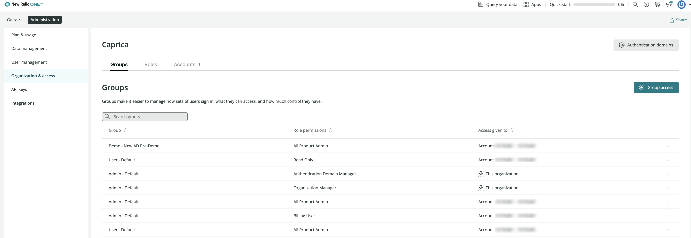

このチュートリアルでは、 **New Relic One のユーザーモデル** でユーザーを管理するための一般的な手順をご紹介します。ここでは、その手順を簡単にご紹介します（3分24秒）。

<Video
  id="dninMzr_zHc"
  type="youtube"
/>

## 要件 [#requirements]

要求事項に関するいくつかの注意事項

* このチュートリアルは、弊社の [New Relic One ユーザーモデル](/docs/accounts/original-accounts-billing/original-product-based-pricing/overview-changes-pricing-user-model#user-models) のユーザーを対象としています。

* アクセスグラントを作成するには、Pro または Enterprise エディションが必要です。詳細は、 [ユーザー管理の要件](/docs/accounts/accounts-billing/new-relic-one-user-management/add-manage-users-groups-roles#requirements) をご覧ください。

* [役割](/docs/accounts/accounts-billing/new-relic-one-user-management/new-relic-one-user-model#standard-roles) 要件

  * **Organization and access** UIを使ってグループのアクセスを管理するには、 **Authentication domain manager** と **Organization manager** のロールが必要です。
  * **ユーザー管理** UIを使用してユーザーを追加/編集するには、 **認証ドメインマネージャー** ロールが必要です。

## 概要 [#overview]

このチュートリアルを使用する前に、チェックアウトすることをお勧めします。

* [アクセスグラントとは何かを理解する](/docs/accounts/accounts-billing/new-relic-one-user-management/add-manage-users-groups-roles/#understand-concepts)
* [ユーザー管理UIの動作を確認できる動画](/docs/accounts/accounts-billing/new-relic-one-user-management/user-mgmt-videos)

このチュートリアルでは、以下の方法を説明します。

* [ユーザーの追加](#add-users)
* [利用可能なアカウントの表示](#accounts)
* [グループにロールやアカウントへのアクセスを許可する](#group-access)
* [カスタムロールの作成](#roles)
* [グループへのユーザー追加](#add-users)

## ユーザーの追加 [#add-users]

New Relic へのユーザーの追加は、アクセスグラントの作成とは別のプロセスです。つまり、どちらの手順を先に行っても構いません。重要なのは、ユーザーがまだ持っていないロールやアカウントへのアクセス権を与えようとする場合、a)グループに属していて、b)そのグループが正しいアクセスグラント（特定のアカウントに対する特定のロールへのアクセス）を持っていないと、そのユーザーはアクセス権を得られないということです。

ユーザーを追加するには2つの方法があります。

* 後述のユーザー管理UIで
* [自動ユーザー管理](/docs/accounts/accounts/automated-user-management/automated-user-provisioning-single-sign) （SCIM プロビジョニングとしても知られています）：この方法を使用すると、グループはアイデンティティプロバイダーで定義されるため、New Relic UI からユーザーのグループを編集することはできません。

UIからユーザーを追加するには

1. New Relic UI の右上から、 [アカウントのドロップダウン](/docs/using-new-relic/welcome-new-relic/get-started/glossary#account-dropdown) をクリックし、 **管理** をクリックし、 **ユーザー管理** をクリックします。
2. 複数の [認証ドメインがある場合](/docs/accounts/accounts-billing/new-relic-one-pricing-users/configure-authentication-domains) 、認証ドメインのドロップダウンから1つを選択します。
3. クリック **ユーザーの追加**.
4. [ユーザータイプ](/docs/accounts/accounts-billing/new-relic-one-pricing-users/users-roles#user-type) と [ユーザーグループ](/docs/accounts/accounts-billing/new-relic-one-pricing-users/users-roles#user-group) を選択するなど、プロセスを完了します。

関連するヒント

* ユーザーのユーザータイプを一括して編集する方法については、 [ユーザータイプの編集](/docs/accounts/accounts-billing/new-relic-one-user-management/add-manage-users-groups-roles#edit-user-type) を参照してください。
* [グループを選択する際には、当社のデフォルトグループ](/docs/accounts/accounts-billing/new-relic-one-user-management/new-relic-one-user-model-understand-user-structure/#groups) か、アクセス許可を定義したカスタムグループのいずれかを選択できます。

アクセスグラントの作成方法については、こちらをご覧ください。

## 利用可能なアカウントの表示 [#accounts]

異なるアカウントへのアクセスを許可するアクセスグラントの作成を考える際には、組織内にどのようなアカウントがあるかを理解することが役立ちます。

組織内のアカウントを表示するには、 [アカウントのドロップダウン](/docs/using-new-relic/welcome-new-relic/get-started/glossary#account-dropdown) をクリックし、 **管理** をクリックし、 **組織とアクセス** をクリックして、 **アカウント** をクリックします。

## アカウントやロールへのアクセス許可 [#group-access]

グループは、ユーザーをグループ化し、ユーザーがNew Relicでできることを管理するために使用します。アクセスグラントを作成することで、グループにa)特定のロール、b)特定のアカウントへのアクセスを割り当てます。

デフォルトでは、New Relic One ユーザーモデルの組織には、 [**Admin** と **User**](/docs/accounts/accounts-billing/new-relic-one-user-management/new-relic-one-user-model-understand-user-structure/#groups) の 2 つのグループが利用可能です。これらのデフォルトグループは、自動的に特定の標準ロールへのアクセス権を持ち、最初に追加されたアカウントに割り当てられます。

既存のアクセスグラントを表示するには、 [アカウントのドロップダウンから](/docs/using-new-relic/welcome-new-relic/get-started/glossary#account-dropdown) 、 **管理** をクリックし、 **組織とアクセス** をクリックします。カスタムのアクセスグラントを作成していなくても、デフォルトのグループにはデフォルトで作成されたグラントが表示されています。

 <figcaption>これは、 **Organization にアクセスし、** UI にアクセスしてグループを表示したときに表示されるものです。デフォルトで利用可能なグループである **Admin** と **User** には、アクセスグラントが自動的に作成されており、これらのグループのユーザーには、これらのグループに関連するロールと、これらのユーザーが追加された最初のアカウントへのアクセスが与えられます。</figcaption>

ユーザーグループにロールとアカウントへのアクセス権を与える新しいアクセスグラントを作成するには、以下の手順に従います。

1. **Organization and access** のUIから、 **Group access** をクリックします。このUIが表示されない場合は、 [オリジナルのユーザーモデル](/docs/accounts/original-accounts-billing/original-product-based-pricing/overview-changes-pricing-user-model/#user-models) レコードでログインしているか、ユーザーを管理する機能を持っていないことが考えられます。このような要因については、 [Factors affecting access](/docs/accounts/accounts-billing/account-structure/factors-affecting-access-features-data/) を参照してください。 
2. 以下のいずれかを選択してください。

* **Existing**: アクセス権を追加したいグループがすでに存在する場合、これを使用することができます。たとえば、デフォルトの [**Admin** または **User** グループ](/docs/accounts/accounts-billing/new-relic-one-user-management/new-relic-one-user-model-understand-user-structure/#groups) のユーザーに新しいアカウントへのアクセス権を与えたい場合、これを選択してから **Admin Default** または **Admin User** ロールを選択します。
* **New**: 新しいグループを作成する必要がある場合、これを選択します。また、そのグループが属する [認証ドメイン](/docs/accounts/accounts-billing/new-relic-one-user-management/authentication-domains-saml-sso-scim-more/#auth-domain-definition) を選択する必要があります（"Default" の意味については、 [Default groups](/docs/accounts/accounts-billing/new-relic-one-user-management/new-relic-one-user-model-understand-user-structure/#groups) を参照してください）。アカウントへのアクセスやロールへのアクセスを制限する必要がある場合は、大量のアクセスグラントを作成する必要があるでしょう。

3. 次に、 **アクセス許可** で、以下のいずれかを選択します。

* **アカウント**: これを選択すると、 [からアカウントを対象としたロールを選択することができます](/docs/accounts/accounts-billing/new-relic-one-user-management/new-relic-one-user-model-understand-user-structure/#standard-roles).これらのロールは、プラットフォーム機能の使用および設定に関係するロールです（組織やユーザー管理には関係しません）。
* **組織**: これを選択すると、 [から組織の範囲内にあるロールを選択することができます](/docs/accounts/accounts-billing/new-relic-one-user-management/new-relic-one-user-model-understand-user-structure/#standard-roles).組織やユーザーの管理を行うロールです。(これらのユーザーは、すでにアカウントスコープのロールに属している必要があります。これはほとんどのユーザーに当てはまりますが、そうでない場合は、そのユーザーが組織に属していないというメッセージが表示されることがあります)。

4. 割り当てたい **ロール** を選択します。ロールは組織全体に適用されるため、どの認証ドメインにいても、 [標準ロール](/docs/accounts/accounts-billing/new-relic-one-user-management/new-relic-one-user-model-understand-user-structure/#standard-roles) と、作成したカスタムロールにアクセスできます。ロールを選択する際のヒントは、この説明の後にあるヒントを参照してください。
5. ドロップダウンから、アクセスを追加したい **Account** を選択します。予想していたアカウントが表示されない場合は、いくつかの理由が考えられます。1つは、あなた自身がそのアカウントに対して適切なパーミッションを持っていないこと。もう1つは、そのアカウントが実際には組織内に存在しないことです。詳しくは、 [Factors affecting access](/docs/accounts/accounts-billing/account-structure/factors-affecting-access-features-data/) をご覧ください。それでも問題が解決しない場合は、アカウント担当者にご相談ください。
6. 同じグループのグラントを続けて追加したい場合は、下部の「 **Add another** 」を選択してから、「 **Add access** 」をクリックします。
7. 完了後、ユーザーが既にグラントを追加したグループに入っている場合は、数分以内にアクセスできるようになります（ただし、 [EU地域のNew Relicアカウント](/docs/using-new-relic/welcome-new-relic/get-started/our-eu-us-region-data-centers) の場合は、最大で20分ほどかかることがあります）。ユーザーがまだそのグループに入っていない場合 (新しいグループでアクセスグラントを作成したばかりの場合が該当します)、 [**ユーザー管理** UI](/docs/accounts/accounts-billing/new-relic-one-user-management/add-manage-users-groups-roles/#where) にアクセスして、1人または複数のユーザーをそのグループに追加する必要があります。

このUIを使うためのヒントがあります。

* ユーザーが [自動ユーザー管理](/docs/accounts/accounts/automated-user-management/automated-user-provisioning-single-sign/) で管理されている場合、グループが ID プロバイダーからインポートされているため、 [**ユーザー管理** UI](/docs/accounts/accounts-billing/new-relic-one-user-management/add-manage-users-groups-roles/#where) を使ってユーザーをグループに追加することはできません。しかし、これらのグループにアクセス権を与えるためには、New Relic に取り込まれた後に、そのグループに対してアクセス権を作成する必要があります。
* ユーザーが組織スコープの **Organization manager** および/または **Authentication domain manager** ロールを持っている場合（デフォルトの **Admin** グループのユーザーがそうです）、これらは組織スコープの能力なので、これらのユーザーは常にこれらの能力を持っていることに注意してください。つまり、これらのユーザーを別のアカウントに追加する際には、組織スコープのロールではなく、アカウントスコープのロールを追加するだけでよいのです。言い換えれば、グループ内のユーザーは、一度組織スコープのロールを持つと、削除されない限り、その組織で常にそのロールを持つことになります。
* 当社の [標準的な役割](/docs/accounts/accounts-billing/new-relic-one-user-management/new-relic-one-user-model-understand-user-structure/#standard-roles) の中から選択する際には、 **All product admin** と **Standard user** の違いを理解することが重要です。つまり、 **All product admin** は、プラットフォームの機能を設定することができるため、より一般的な選択肢となっています。ユーザーにプラットフォームの機能を使用させたいが、設定はさせたくない場合は、 **Standard user** を選択します。

## カスタムロールの作成 [#roles]

アクセス許可を作成する際には、 標準的なロール を使用することもできますし、独自の機能を持つロールを作成することもできます。

既存のロールを表示するには： [アカウントのドロップダウンから](/docs/using-new-relic/welcome-new-relic/get-started/glossary#account-dropdown) をクリックし、 **管理** をクリックし、次に **組織とアクセス** をクリックし、次に **ロール** をクリックします。

カスタムロールを作成するには、 **Add new custom role** をクリックします。利用可能な機能のリストを確認し、カスタムロールに必要な機能を決定します。

ロールとケイパビリティの仕組みについては、 [ケイパビリティ](/docs/accounts/accounts-billing/new-relic-one-user-management/new-relic-one-user-model-understand-user-structure#standard-roles) をご覧ください。また、NerdByteのビデオ（4分7秒）もご覧ください。

<Video
  id="CBa0jWINQiw"
  type="youtube"
/>

カスタムロールの作成が完了したら、おそらく新しい [アクセスグラント](#group-access) でそのロールを使用したいと思うでしょう。

## グループへのユーザー追加 [#add-users]

ユーザー管理UIでは、ユーザーとそのユーザーに割り当てられたグループが表示されます。ユーザーは、自分が追加されたグループに関連するアクセスグラントにのみアクセスできます。

ユーザーを表示し、そのグループを確認するには、 [アカウントのドロップダウン](/docs/using-new-relic/welcome-new-relic/get-started/glossary#account-dropdown) から、 **管理** をクリックし、 **ユーザー管理** をクリックします。このオプションが表示されていない場合は、 [要件](#requirements) を確認してください。

グループは、 [認証ドメイン](/docs/accounts/accounts-billing/new-relic-one-user-management/add-manage-users-groups-roles/#understand-concepts) の境界内に存在します。組織に複数の認証ドメインがある場合は、左上のドメインスイッチャーにどのドメインにいるのかが表示されます。

ユーザーを追加するには、 **Add user** をクリックします。 [ユーザータイプ](/docs/accounts/accounts-billing/new-relic-one-user-management/new-relic-one-user-model#user-type) とグループの選択など、UIのプロンプトを完了します。追加したカスタムグループは、グループのドロップダウンから利用できるはずです。選択したカスタムグループにロールとアカウントへのアクセスが許可されている場合は、そのグループにユーザーを追加すると、そのユーザーはアクセスできるようになります。

ユーザーのグループなどの詳細を編集するには：編集したいユーザーをクリックして変更する。