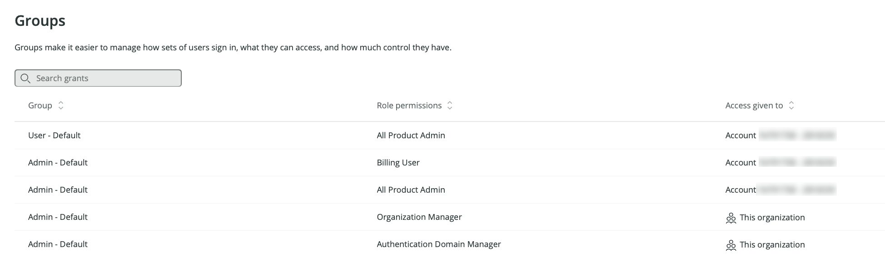

ここでは、New Relicユーザーが特定の機能や特定のアカウントにアクセスする方法について説明します。

## 権限の主な制御方法：ユーザータイプとロール [#user-type-groups-relation]

ユーザーがアクセスできるNew Relicの機能については、主に2つの設定があります。

* [ユーザータイプ](/docs/accounts/accounts-billing/new-relic-one-user-management/user-type)：[New Relic Oneの価格設定](/docs/accounts/accounts-billing/new-relic-one-pricing-billing/new-relic-one-pricing-billing)を使用している組織では、ユーザーのユーザータイプは請求要素です。ユーザータイプとは、ユーザーがアクセスできる最大許容機能を設定するものです。これは、New Relicの期待される職務に基づいたかなりの長期設定を意図しています。
* 割り当てられたロール：ユーザーのユーザータイプが決定されると、**ロール**を使用してユーザーのアクセスをより正確に制御できます。ロールとは機能のセットで、きめ細かなNew Relic**機能**（たとえば、New Relic APMの設定を変更する機能）です。ロールはアクセス権限を介して[ユーザーグループ](#groups)に割り当てられます。

ユーザーのユーザータイプと割り当てられたロールの関係について考える別の方法：ユーザーのユーザータイプがすべてのロール制限を上書きします。例：基本ユーザーには、広範なNew Relicアクセス権を持つロールが割り当てられますが、[ユーザータイプ](/docs/accounts/accounts-billing/new-relic-one-user-management/user-type)に関連する制限は、ロールが付与されたアクセスよりも優先されます。

このドキュメントは、ロール関連のアクセス権に重点を置いています。ユーザータイプについては、[ユーザータイプ](/docs/accounts/accounts-billing/new-relic-one-user-management/user-type)を参照してください。

## アクセス権限により、ユーザーグループのNew Relicへのアクセス権を与えます [#understand-concepts]

New RelicユーザーがNew Relicのアカウントまたは機能にアクセスできるようにするには、ユーザーは[グループ](#groups)に属し、そのグループに関連付けられた**アクセス権限**を持っている必要があります。アクセス権限は、ユーザーのグループに次のような権限を与えます。

* 特定の[ロール](#roles)（特定の[機能](#capabilities)のセットであるロール）へのアクセス。
* 特定のアカウント、または組織全体へのアクセス。

[ProまたはEnterpriseエディション](https://newrelic.com/pricing)を使用する組織は、組織内に複数のアカウントを持つことができ、アクセス権限を作成し設定することができます。Standardエディションの組織は、その組織で1つのアカウントのみ許可され、アクセス権限の作成や設定をすることができません。

最初にNew Relicにサインアップすると、組織にはデフォルトの[**ユーザー**または**管理者**グループ](/docs/accounts/accounts-billing/new-relic-one-user-management/user-management-concepts#groups)に関連付けられたアクセス権限が組み込まれます。たとえば、**管理者**グループには、組織関連およびユーザー管理関連の高度な管理者機能を含む、グループ内のすべてのユーザーに広範なNew Relicアクセス権限を付与するいくつかのアクセス権限があります。

 <figcaption>**組織を使用して**UIのビュー。デフォルトのグループ（**管理者**と**ユーザー**）が、a)特定のロール、b)特定のアカウント、または組織全体のいずれかとグループを関連付けるアクセス権限を持っていることを示しています。（このUIは、[New Relic Oneのユーザーモデル](/docs/accounts/original-accounts-billing/original-users-roles/overview-user-models)のユーザーのみが使用できることに注意してください。）</figcaption>

以下は、アクセス権限がどのように機能するか、また、より大規模な組織にどのように関連しているかを示す図です。

<figcaption>
  アクセス権限を使用して、ユーザーグループへの特定のロールと特定のアカウント（または組織全体）を付与する方法を示す図。
</figcaption>

アクセス権限を作成および管理する方法については、以下を参照してください。

* [アクセス権限を計画するためのヒント](#access-grant-tips)。
* [アクセス権限のチュートリアル](/docs/accounts/accounts-billing/new-relic-one-user-management/tutorial-add-new-user-groups-roles-new-relic-one-user-model/#group-access)。

## グループ [#groups]

[New Relic Oneのユーザーモデル](/docs/accounts/original-accounts-billing/original-product-based-pricing/overview-user-models)では、「グループ」はユーザーのグループを表します。ユーザーをグループに入れると、複数のユーザーを同時に管理できます。たとえば、[自動ユーザー管理](/docs/accounts/accounts/automated-user-management/automated-user-provisioning-single-sign)機能使用している場合は、IDプロバイダーサービスからユーザーのカスタムグループ（たとえば、**外部コンサルタント**）をインポートし、そのグループに[アクセス権](#understand-concepts)を割り当てて、それらのユーザーに特定のアカウントでの特定のロールを与えることができます。

New Relicユーザーは、機能やアカウントにアクセスするために、少なくとも1つのグループに割り当てる必要があります。また、そのグループには[アクセス権限](#understand-concepts)も必要です。

グループはユーザーのNew Relic権限を制限するものでは**ありません**。実際の機能を含むグループに割り当てられた**ロール**です。

2つのデフォルトグループがあります（以下を参照）。また、ProおよびEnterpriseの組織は、[カスタムグループを作成](/docs/accounts/accounts-billing/new-relic-one-user-management/tutorial-add-new-user-groups-roles-new-relic-one-user-model/#group-access)できます。

ユーザーとグループは、[認証ドメイン内](/docs/accounts/accounts-billing/new-relic-one-user-management/authentication-domains-saml-sso-scim-more/)にあります。ここで、ユーザーの追加と管理方法（SCIMプロビジョニングなど）と、ユーザーがNew Relicにログインする方法に関連する設定を制御します。

### デフォルトのユーザーグループ [#default-groups]

2つのデフォルトのユーザーグループがあります。

* **ユーザー**：このグループでは、ユーザーはオブザーバビリティおよびモニタリングの使用と設定ができますが、請求の管理や他のユーザーの管理などのアカウントレベルのタスクを実行することは**できません**。これは、[**すべての製品管理者**](#standard-roles)ロールにアクセスできます。このロールは、当社のオブザーバビリティプラットフォームツールへのアクセスを提供しますが、アカウントレベルの機能へのアクセスを提供する**組織マネージャー**および**認証マネージャー**ロールはありません。
* **管理者**：組織レベルの管理者機能など、すべての機能を持っています。これは、**すべての製品管理者**、**請求ユーザー**、**組織マネージャー**、および**認証ドメインマネージャー**の[標準ロール](#standard-roles)を持つことと同じです。

ユーザーのグループを変更するには、[**ユーザー管理**UI](/docs/accounts/accounts-billing/new-relic-one-user-management/user-management-ui-and-tasks#where)を使用します。

## ロール [#roles]

ロールとは、[機能](#capabilities)のセットです。当社には、以下に説明するデフォルトのロールがあります。ProまたはEnterpriseエディションの組織もカスタムロールを作成できます。

ロールおよび機能を表示するには、[**組織を使用して**UI](/docs/accounts/accounts-billing/new-relic-one-user-management/user-management-ui-and-tasks#where)に移動し、**ロール**をクリックします。ロールUIには、アカウントスコープのロールが表示されますが、組織スコープのロール（**組織マネージャー**および**認証ドメインマネージャー**は表示**されません**。

### 標準（デフォルト）ロール [#standard-roles]

当社にはいくつかの「標準ロール」が用意されています。このロールはデフォルトで利用でき、一般的に必要とされる機能セットを満たしています。

<Callout variant="important">
  一部の標準ロールでは、カスタムロールを作成するときに選択できない機能は非表示になっています。カスタムロールで複製できる唯一の標準ロールは**標準ユーザー**および**読み取り専用**で、その他のすべてには一部の非表示機能があります。
</Callout>

標準ロールに含まれるもの：

<table>
  <thead>
    <tr>
      <th style={{ width: "180px" }}>
        標準ロール
      </th>

      <th style={{ width: "120px" }}>
        範囲
      </th>

      <th>
        説明
      </th>
    </tr>
  </thead>

  <tbody>
    <tr>
      <td>
        **全製品アドミン**
      </td>

      <td>
        アカウント
      </td>

      <td>
        オブザーバビリティプラットフォーム機能への管理者レベルのアクセスを提供しますが、組織レベルおよびユーザー管理機能は提供しません。つまり、このロールにはユーザーの管理（**認証ドメインマネージャー**ロール）および組織/アカウント構造設定の管理（**組織マネージャー**ロール）、および請求の管理（**請求ユーザー**ロール）を除くすべてのNew Relic機能が含まれます。

        注：**標準ユーザー**ロールは、基本的には、**すべての製品管理者**ロールからオブザーバビリティ機能の設定機能を差し引いたものです。
      </td>
    </tr>

    <tr>
      <td>
        **標準ユーザー**
      </td>

      <td>
        アカウント
      </td>

      <td>
        オブザーバビリティプラットフォーム機能へのアクセスを提供するが、これらの機能を設定するための権限（たとえば、[Syntheticモニターの安全な認証情報](/docs/synthetics/synthetic-monitoring/using-monitors/store-secure-credentials-scripted-browsers-api-tests)を設定する機能）がなく、組織レベルおよびユーザー管理の権限がありません。

        注：**標準ユーザー**ロールは、基本的には**すべての製品管理者**ロールであり、プラットフォーム機能を設定するロール機能はありません。  

      </td>
    </tr>

    <tr>
      <td>
        **請求ユーザー**
      </td>

      <td>
        アカウント
      </td>

      <td>
        サブスクリプションと請求設定を管理する機能、およびプラットフォームの他の部分への読み取り専用アクセスを提供します。複数のアカウントを持つ組織の場合、請求はプライマリ（最初に作成された）アカウントで集計されます。そのため、このロールをそのプライマリアカウントに割り当てると、組織全体の請求権限が付与されます。
      </td>
    </tr>

    <tr>
      <td>
        **組織マネージャー**
      </td>

      <td>
        組織
      </td>

      <td>
        組織構造、名前、優先傾向など、[組織](/docs/accounts/accounts-billing/new-relic-one-pricing-users/new-relic-account-structure/-level)設定を管理する機能が提供されます。最近の[New Relic Oneのユーザーモデル](/docs/accounts/original-accounts-billing/original-product-based-pricing/overview-user-models)への切り替えにより、このロールには現在、数機能しかありませんが、時間の経過とともにさらに追加されることになります。

        このロールを付与する方法については、[ユーザー管理機能の追加](/docs/accounts/accounts-billing/new-relic-one-user-management/user-management-ui-and-tasks/#add-user-managers)を参照してください。
      </td>
    </tr>

    <tr>
      <td>
        **組織の読み取り専用**
      </td>

      <td>
        組織
      </td>

      <td>
        組織レベルの設定を表示する機能が提供されます。このロールを付与する方法については、[ユーザー管理機能の追加](/docs/accounts/accounts-billing/new-relic-one-user-management/user-management-ui-and-tasks/#add-user-managers)を参照してください。
      </td>
    </tr>

    <tr>
      <td>
        **認証ドメインマネージャー**
      </td>

      <td>
        組織
      </td>

      <td>
        [New Relic Oneのユーザーモデル](/docs/accounts/accounts-billing/new-relic-one-user-management/configure-authentication-domains-sso)のユーザーに、ユーザーを追加して管理し、[認証ドメイン](/docs/accounts/original-accounts-billing/original-product-based-pricing/overview-changes-pricing-user-model#user-models)を設定する機能を提供します。このロールを付与する方法については、[ユーザー管理機能の追加](/docs/accounts/accounts-billing/new-relic-one-user-management/user-management-ui-and-tasks/#add-user-managers)を参照してください。
      </td>
    </tr>

    <tr>
      <td>
        **認証ドメインの読み取り専用**
      </td>

      <td>
        組織
      </td>

      <td>
        組織のユーザーを表示し、[認証ドメイン](/docs/accounts/accounts-billing/new-relic-one-user-management/configure-authentication-domains-sso)の設定を表示する機能を提供します。このロールを付与する方法については、[ユーザー管理機能の追加](/docs/accounts/accounts-billing/new-relic-one-user-management/user-management-ui-and-tasks/#add-user-managers)を参照してください。
      </td>
    </tr>

    <tr>
      <td>
        **読み取り専用**
      </td>

      <td>
        アカウント
      </td>

      <td>
        New Relicプラットフォームへの読み取り専用アクセスを提供します（[合成モニターのセキュア資格情報](/docs/synthetics/synthetic-monitoring/using-monitors/store-secure-credentials-scripted-browsers-api-tests)を除く）。
      </td>
    </tr>

    <tr>
      <td>
        **v1ユーザーの管理**
      </td>

      <td>
        アカウント
      </td>

      <td>
        2020年7月30日以前に存在し、[元のユーザーモデル](/docs/accounts/original-accounts-billing/original-users-roles/overview-user-models)にユーザーがいるNew Relic組織の場合、このロールを使用すると、これらの「v1」ユーザーを管理できます。
      </td>
    </tr>
  </tbody>
</table>

ロールをグループに割り当てる方法およびカスタムロールを作成する方法の詳細については、[ユーザー管理チュートリアル](/docs/accounts/accounts-billing/new-relic-one-user-management/tutorial-add-new-user-groups-roles-new-relic-one-user-model)を参照してください。

## 機能 [#capabilities]

ロールは、[標準ロール](#standard-roles)またはカスタムロールのいずれであるかを問わず、機能のセットです。ロールおよび関連する機能を表示するには、[**組織を使用してUI**にアクセスします](/docs/accounts/accounts-billing/new-relic-one-user-management/user-management-ui-and-tasks#where)。

 <figcaption>[**すべての製品管理者**ロール](#standard-roles)に関連付けられている機能の表示。カスタムロールを作成する場合は、カスタム機能のセットを選択できます。UIで表示される機能は時間の経過とともに変更される可能性があります：このスクリーンショットは2021年4月に撮影されたものです。</figcaption>

一部の標準ロールでは、カスタムロールを構築するときに選択できない機能は非表示になっています。詳細については、[標準ロール](#standard-roles)を参照してください。また、ロールUIには、アカウントスコープのロールが表示されますが、組織スコープのロール（**組織マネージャー**および**認証ドメインマネージャー**は表示**されません**。

カスタム機能があるロールの設定方法については、 [ユーザー管理チュートリアル](/docs/accounts/accounts-billing/new-relic-one-user-management/tutorial-add-new-user-groups-roles-new-relic-one-user-model/#roles)を参照してください。

## ユーザーの管理

ユーザーを追加する方法、グループに割り当てる方法、カスタムグループおよびロールを作成する方法については、[ユーザーの管理](/docs/accounts/accounts-billing/new-relic-one-user-management/user-management-ui-and-tasks)を参照してください。

### アクセス権限の作成に関するヒント [#access-grant-tips]

ProおよびEnterpriseエディションの組織は、[アクセス権限](#understand-concepts)を作成および設定できます。（Standardエディションの組織は、アクセス権限についてあまり考慮する必要はありません。) アクセス権限を適切に実装するには、必要なグループ、それらのグループが持つべきロールおよびアカウントアクセスについて考慮する必要があります。

組織構造が比較的フラットで、ユーザーのすべてまたは多くが幅広い管理アクセス権とすべてのアカウントへのアクセス権を持っていても問題がない場合は、おそらく必要なアクセス権限は少数で済みます。たとえば、既存のデフォルトの**管理者**グループまたは**ユーザー**グループに新しいアクセス権を追加し、それらのロールに他のアカウントへのアクセス権を付与するとします。また、ロールや権限に対してより詳細な定義が必要な場合は、特定のロール（標準ロールまたはカスタム定義のロール）にアクセスできる新規グループを定義するアクセス権を作成します。

アクセス権限およびカスタムロールの作成方法に関するチュートリアルは、[ユーザー管理のチュートリアル](/docs/accounts/accounts-billing/new-relic-one-user-management/tutorial-add-new-user-groups-roles-new-relic-one-user-model/)を参照してください。一般的なユーザー管理タスクのその他の例は、[タスクの例](#workflow)を参照してください。UIの動作については、[ユーザー管理ビデオ](/docs/accounts/accounts-billing/new-relic-one-user-management/user-mgmt-videos)を参照してください。

アクセス権限の設定に関するヒント：

* まず、アクセス権限をどのように編成するか計画するとよいでしょう。アカウントをいくつお持ちですか？ どのユーザーグループがどのロールとアカウントにアクセスできるようになりますか？デフォルトのグループとロールを使用するか、または独自のカスタムグループとロールを作成しますか？
* [自動ユーザー管理](/docs/accounts/accounts/automated-user-management/automated-user-provisioning-single-sign)を使用してSCIMからユーザーをプロビジョニングした場合は、ユーザーにアクセス権を付与するためにアクセス権を作成する必要があります。
* 多数のアカウント（約20以上）を持つ組織でよく使用される設定は、プライマリアカウントでより多くの組織スコープのロール（**組織マネージャー**、**認証ドメインマネージャー**、**請求ユーザー**）を持つグループを設定し、その他のアカウントでは、より多くの製品スコープのロール（**すべての製品管理者**、**標準ユーザー**、カスタムロールなど）を持つグループを設定することです。

## ユーザー管理の用語と定義 [#definitions]

アカウントおよびロールへのユーザーアクセスの仕組みについては、[ユーザーアクセスの説明](#understand-concepts)を参照してください。ここでは、ユーザー管理用語の定義をいくつかご紹介します。

* New Relicの**組織**は、アカウント、ユーザー、データをすべて含む組織を表すものです。詳細については、[組織とアカウント構造](/docs/accounts/accounts-billing/account-structure/new-relic-account-structure)を参照してください。

* **機能**は、特定のきめ細かなNew Relic機能を使用または編集する機能です。機能の例：

  * APM設定を変更する機能
  * アラート条件を削除する機能

* **ロール**は機能のセットです。これはユーザーに権限を与えるものです。当社のデフォルトの[標準ロール](#standard-roles)にはさまざまな機能セットがあり、カスタム機能セットを持つカスタムロールも作成できます。特定の[New Relic機能](#capabilities)を参照してください。

* ユーザー**グループ**には、1つ以上のロールが関連付けられています。ユーザーをグループに割り当てます。デフォルトの[ユーザーグループ](#default-groups)（**管理者**と**ユーザー**）がありますが、独自のグループも作成できます。

* **アクセス許可**とは、ユーザーグループにロールと特定のNew Relicアカウントへのアクセス権を付与するものです。アクセス許可には基本的に、「このグループは、このNew Relicアカウントでこのロールを割り当てられます」と記述します。ユーザーをグループに追加しても、そのグループがアクセス許可に含まれていない限り、何も実行されません。

* [**認証ドメイン**](/docs/accounts/accounts-billing/new-relic-one-pricing-users/configure-authentication-domains)には、New Relicに追加され、同じ方法でNew Relicにログインする一連のユーザーが含まれます。たとえば、ユーザー名/パスワードでログインするユーザー用の認証ドメインと、SAMLでログインするユーザー用の認証ドメインが1つあるとします。

* ユーザーが[基本ユーザー](/docs/accounts/accounts-billing/new-relic-one-user-management/user-type)である場合、これはロール関連の制限よりも優先されます。この詳細については、[基本ユーザーおよびロール](/docs/accounts/accounts-billing/new-relic-one-user-management/user-management-concepts/#user-type-groups-relation)を参照してください。