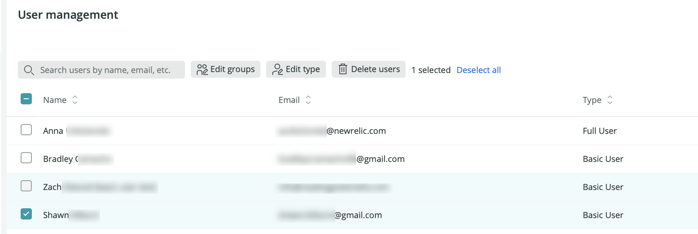

<Callout title="新規ユーザーモデル">
  このドキュメントは、[New Relic Oneのユーザーモデル](/docs/accounts/original-accounts-billing/original-product-based-pricing/overview-changes-pricing-user-model#user-models)でのユーザーの管理に関するものです。
</Callout>

このドキュメントでは、[ユーザー管理UIの検索と使用](#where)方法、および[一般的なユーザー管理タスク](#workflow)の実行方法について説明します。

## 要件 [#requirements]

ユーザー管理権限を確認する最も簡単な方法は、[ユーザー管理UI](#where)に移動して、アクセス権があるかどうかを確認することです。

ユーザー管理の要件と制限事項：

* このドキュメントは、[New Relic Oneのユーザーモデル](/docs/accounts/original-accounts-billing/original-product-based-pricing/overview-user-models)でのユーザーの管理に関するものです。
* ほとんどのユーザー管理機能には、[**認証ドメインマネージャー**のロール](/docs/accounts/accounts-billing/new-relic-one-pricing-users/users-roles#standard-roles)が必要で、一部のユーザー管理には、[**組織マネージャー**のロール](/docs/accounts/accounts-billing/new-relic-one-pricing-users/users-roles#standard-roles)が必要です。詳細については、[標準ロール](/docs/accounts/accounts-billing/new-relic-one-user-management/user-management-concepts#standard-roles)を参照してください。
* グループ、ロール、アクセス権限を管理するには、[ProまたはEnterprise](https://newrelic.com/pricing)エディションが必要です。
* New Relicユーザーは、他の人とログインを共有することはできません。New Relicユーザーは、最大で3つの並行するアクティブセッション、または3つの一意のIPアドレスを、所定の時間に使用できます。
* 設定の競合を避けるため、組織内の1人のユーザーのみが一度にユーザーを管理していることを確認してください。

## ユーザー管理UI [#where]

[New Relic Oneのユーザーモデル](/docs/accounts/original-accounts-billing/original-product-based-pricing/overview-user-models)のユーザーの場合、ユーザー管理オプションを見つけるには：[アカウントドロップダウン](/docs/using-new-relic/welcome-new-relic/get-started/glossary#account-dropdown)リストから、**管理** を選択します。ここには、2つのユーザー管理UIページがあります。

* **ユーザー管理**：ユーザーの追加、[ユーザータイプの更新](#edit-user-type)、ユーザーに割り当てられたグループの管理、[ユーザーアップグレードのリクエスト](/docs/accounts/accounts-billing/new-relic-one-user-management/authentication-domains-saml-sso-scim-more/#session-mgmt)の承認に使用します。
* **組織とアクセス**：このページを使用して、グループ、ロール、アクセス権限を作成および管理し、[SAML SSOとSCIMのプロビジョニング](/docs/accounts/accounts-billing/new-relic-one-user-management/authentication-domains-saml-sso-scim-more)を設定します。

ユーザー管理UI動作のビデオを視聴しますか？[ユーザー管理ビデオ](/docs/accounts/accounts-billing/new-relic-one-user-management/user-mgmt-videos)を参照してください。

<Callout variant="important">
  これらのUIページが表示されない場合、[元のユーザーモデル](/docs/accounts/original-accounts-billing/original-users-roles/users-roles-original-user-model)を使用しているか、または[必要なユーザー管理ロール](#requirements)を持っていない可能性があります。
</Callout>

## 一般的なユーザー管理タスク [#workflow]

 <figcaption>**組織を使用して**UIでは、アクセス権限、カスタムグループ、カスタムロールを作成し、認証ドメインを設定できます。</figcaption>

ここでは、ユーザー管理手順の例をいくつかご紹介します。

<CollapserGroup>
  <Collapser
    id="add-users"
    title="ユーザーの追加、編集、削除"
  >
    [ユーザー管理チュートリアル](/docs/accounts/accounts-billing/new-relic-one-user-management/tutorial-add-new-user-groups-roles-new-relic-one-user-model#add-users)を参照してください。
  </Collapser>

  <Collapser
    id="edit-user-type"
    title="ユーザータイプの編集（ベーシック、コア、フルプラットフォーム）"
  >
    ユーザーのユーザータイプを変更する前に、以下について理解しておいてください。

    * [ユーザーのユーザータイプを決定する方法](/docs/accounts/accounts-billing/new-relic-one-user-management/user-type#choose-user-type)
    * [請求対象ユーザーの計算方法](/docs/accounts/accounts-billing/new-relic-one-pricing-billing/user-count-billing)
    * [ユーザーダウングレードのルール](/docs/accounts/accounts-billing/new-relic-one-pricing-billing/user-count-billing#user-downgrade-rules)
    * [自動ユーザー管理](/docs/accounts/accounts/automated-user-management/automated-user-provisioning-single-sign)を使用している場合は、[ユーザータイプを管理するための他のオプションがあります](/docs/accounts/accounts-billing/new-relic-one-user-management/authentication-domains-saml-sso-scim-more/#user-upgrade)。

    複数のユーザーのユーザータイプを変更するには、次の手順に従います。

    1. [**ユーザー管理**ページ](#find)で、編集するユーザータイプのユーザーのチェックボックスをクリックします。
    2. ユーザーの選択を開始すると、**編集タイプ**のオプションが表示されます。

    また、そのユーザーをクリックして、特定のユーザーのユーザータイプとグループを編集することもできます。

    

    ユーザーがユーザータイプのアップグレード方法を管理するには、[認証ドメインの設定](/docs/accounts/accounts-billing/new-relic-one-user-management/authentication-domains-saml-sso-scim-more/#user-upgrade)を参照してください。
  </Collapser>

  <Collapser
    id="access-grants"
    title="ユーザーにアカウントとロールへのアクセス権を付与する（アクセス許可）"
  >
    [ユーザー管理チュートリアル](/docs/accounts/accounts-billing/new-relic-one-user-management/tutorial-add-new-user-groups-roles-new-relic-one-user-model)を参照してください。
  </Collapser>

  <Collapser
    id="new-group"
    title="新しいカスタムグループおよびロールの作成"
  >
    [ユーザー管理チュートリアル](/docs/accounts/accounts-billing/new-relic-one-user-management/tutorial-add-new-user-groups-roles-new-relic-one-user-model)を参照してください。
  </Collapser>

  <Collapser
    id="new-group"
    title="SAML SSOおよび/またはSCIMプロビジョニングの設定"
  >
    [SAML SSOまたはSCIMの使用の開始](/docs/accounts/accounts-billing/new-relic-one-user-management/introduction-saml-scim)を参照してください。
  </Collapser>

  <Collapser
    id="add-user-managers"
    title="ユーザーに他のユーザーを管理する権限を付与する"
  >
    他のユーザーを管理する権限をユーザーに付与するには、[**認証ドメインマネージャー**と**組織マネージャー**のロール](/docs/accounts/accounts-billing/new-relic-one-user-management/user-management-concepts#standard-roles)を持つグループにユーザーを追加する必要があります。

    2つのオプションがあります。

    * [ユーザー管理](#where)UI から、これらのロールの両方を含む、デフォルトの[**管理者**グループ](/docs/accounts/accounts-billing/new-relic-one-pricing-users/users-roles#groups)にユーザーを追加できます。

      または

    * カスタムグループを作成して、これらのロールを割り当てることもできます。新しいアクセス権、グループ、ロールの作成に関するチュートリアルについては、[ユーザー管理チュートリアル](/docs/accounts/accounts-billing/new-relic-one-user-management/tutorial-add-new-user-groups-roles-new-relic-one-user-model)を参照してください。
  </Collapser>

  <Collapser
    id="basic-full-upgrade"
    title="ユーザーによるユーザータイプのアップグレード方法の制御"
  >
    [認証ドメインの設定](/docs/accounts/accounts-billing/new-relic-one-user-management/authentication-domains-saml-sso-scim-more/#user-upgrade)を参照してください。
  </Collapser>
</CollapserGroup>

## 変更の追跡 [#track-changes]

ユーザー管理アクションを含む、アカウントへの変更の監査ログを確認するには、[`NrAuditEvent`](/docs/insights/insights-data-sources/default-data/nrauditevent-event-data-query-examples)をクエリできます。