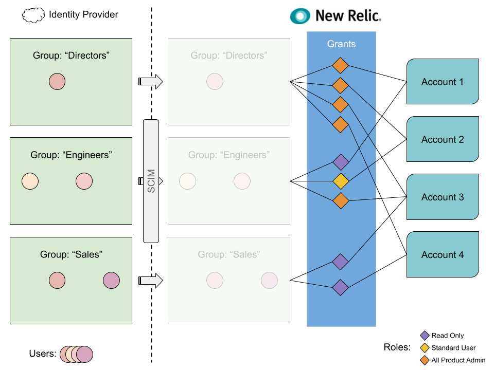

[自動化されたユーザー管理](/docs/accounts/accounts/automated-user-management/automated-user-provisioning-single-sign) 、IDプロバイダー（OneLoginやOktaなど）のユーザーやグループは、New Relicと同期されます。

## グループの仕組み [#group-example]

[自動ユーザー管理](/docs/accounts/accounts/automated-user-management/automated-user-provisioning-single-sign) を使用する際には、ID プロバイダーサービスでユーザーのグループを作成します。その後、New Relic 側で [アクセスグラント](/docs/accounts/accounts-billing/new-relic-one-user-management/user-management-concepts#understand-concepts) を作成しますが、これは基本的に"このグループに、この New Relic アカウントのこの New Relic ロールへのアクセスを与える、というものです。"

<figcaption>
  アイデンティティプロバイダーのユーザーグループが、New Relic の [アクセスグラント](/docs/accounts/accounts-billing/new-relic-one-user-management/user-management-concepts#understand-concepts) にどのようにマッピングされるかの例ですが、これは特定のアカウントの特定のロール（デフォルトまたはカスタマー）にグループのアクセスを割り当てるものです。
</figcaption>

上記の例では、Engineers グループに注目してみましょう。SCIMを介して、New Relicは2人のユーザーレコードと、彼らがEngineersグループに所属しているという情報を受け取ります。この例では、2人のEngineerユーザーは、Account 1に [**Read only** ロール](/docs/accounts/accounts-billing/new-relic-one-user-management/user-management-concepts#roles) 、Account 2に [**Standard user**](/docs/accounts/accounts-billing/new-relic-one-user-management/user-management-concepts#roles) ロール、Account 3に [**All product admin**](/docs/accounts/accounts-billing/new-relic-one-user-management/user-management-concepts#roles) ロールを持っているという構成になります。

このアクセスは、New Relic で3つの [アクセスグラント](/docs/accounts/accounts-billing/new-relic-one-user-management/user-management-concepts#understand-concepts) を作成することで与えられます。

* アカウント1にロール **Read only** をグループ **Engineers** に割り当てるアクセスグラントです。
* ロール **標準ユーザー** をグループ **エンジニア** をアカウント 2 に割り当てるアクセス許可
* ロール **All product admin** をグループ **Engineers** on Account 3 に割り当てるアクセスグラントです。

アクセスグラントの仕組みについては、 [ユーザー管理の概念](/docs/accounts/accounts-billing/new-relic-one-user-management/user-management-concepts#understand-concepts) を参照してください。

新しいグループやカスタムロールの作成についてのチュートリアルは、 [ユーザー管理のチュートリアル](/docs/accounts/accounts-billing/new-relic-one-user-management/tutorial-add-new-user-groups-roles-new-relic-one-user-model/) をご覧ください。