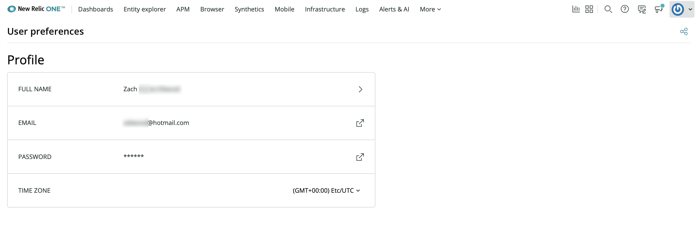

New Relicには、**元のユーザーモデル**と呼ばれる旧ユーザーモデルと、**New Relic Oneのユーザーモデル**（2020年7月にリリース）と呼ばれる新規ユーザーモデルの2つのユーザーモデルがあります。

## 必要なドキュメントの検索 [#docs]

使用しているユーザーモデルによって、ユーザーの管理方法やロールおよびアカウントへのアクセスが異なります（[ユーザーモデルの違いについてをお読みください](#differences)）。2つのユーザーモデルには異なるドキュメントがそれぞれあります。

* [元のユーザーモデルのドキュメント](/docs/accounts/original-accounts-billing/original-users-roles/users-roles-original-user-model)
* [New Relic Oneのユーザーモデルのドキュメント](/docs/accounts/accounts-billing/new-relic-one-user-management/introduction-managing-users)

使用しているユーザーモデルが分からない場合[ユーザーモデルの決定](#determine-user-model)を参照してください。

## ユーザー管理UI [#manage-users]

ユーザー管理UIの使用方法については、以下を参照してください。

* New Relic Oneのユーザーモデル：[ユーザーの管理](/docs/accounts/accounts-billing/new-relic-one-user-management/user-management-ui-and-tasks#where)を参照してください。
* 元のユーザーモデル：[one.newrelic.com](https://one.newrelic.com)から、右上の[アカウントドロップダウン](/docs/using-new-relic/welcome-new-relic/get-started/glossary#account-dropdown)リストで**アカウント設定**をクリックしてから、**ユーザーとロール**をクリックします。詳細については、[元のユーザー](/docs/accounts/original-accounts-billing/original-users-roles/users-roles-original-user-model/)を参照してください。

使用しているユーザーモデルが分からない場合[ユーザーモデルの決定](#determine-user-model)を参照してください。

## ユーザーモデルの決定 [#determine-user-model]

New Relicにログインすると、そのログインに関連付けられているユーザーレコードはどちらかのユーザーモデルになります。どのユーザーモデルが適用されているかを判断するには、[アカウントドロップダウン](/docs/using-new-relic/welcome-new-relic/get-started/glossary#account-dropdown)リストから**ユーザーの環境設定**を選択します。下のUIが表示される場合は、New Relic Oneのユーザーモデルが適用されています。より多くのコンテンツを含む別のUIが表示される場合は、元のユーザーモデルが適用されています（[元のユーザードキュメント](/docs/accounts/original-accounts-billing/original-users-roles)を参照）。

New Relic Oneのユーザーモデルでユーザーを管理できるかどうかを判断するには、[ユーザーの管理](/docs/accounts/accounts-billing/new-relic-one-pricing-users/add-manage-users-groups-roles#where)を参照してください。

ユーザーモデルは、お客様の価格設定モデルから独立しています。価格設定プランとユーザーモデルとの関連の詳細については、[価格設定とユーザーモデル表](#pricing-user-table)をご覧ください。

## ユーザーモデルの比較 [#differences]

New Relicにログインすると、ログインに関連付けられているユーザーレコードはどちらかのユーザーモデルになります。ここでは、ユーザーモデルの違いについて説明します。

* **New Relic Oneのユーザーモデル**（[ドキュメントを参照](/docs/accounts/accounts-billing/new-relic-one-user-management/introduction-managing-users)）：この新しく[改善された](https://www.newrelic.com/blog/how-to-relic/user-management-and-access-security)ユーザーモデルは2020年7月にリリースされました。これは、New Relicの新規サインアップ用のデフォルトユーザーモデルです。元のユーザーモデルとの主な違いは次のとおりです。

  * すべてのアカウントとユーザーは、トップレベルの[組織](/docs/new-relic-account-structure) に含まれます。これで、組織はユーザー管理とアクセスできる内容をより強力に管理できます。この影響の1つは、複数のNew Relic組織で作業しているユーザーが、[複数のログイン](/docs/accounts/accounts-billing/general-account-settings/factors-affecting-access-features-data/#account-access)に関連付けられたメールアドレスを持っている場合があることです。
  * このモデルのユーザーには、権限とアカウントアクセスを管理するための別のシステムがあります。[アクセス権限](/docs/accounts/accounts-billing/new-relic-one-user-management/user-management-concepts#understand-concepts)を使用して、特定のアカウント上の特定の役割へのユーザーアクセスを割り当てます。

* **元のユーザーモデル**（[ドキュメントを参照](/docs/accounts/original-accounts-billing/original-users-roles/users-roles-original-user-model/)）：この古いモデルの一部の側面は、新しいモデルとは異なります。

  * 組織レベルのユーザーに対する管理はありませんでした。たとえば、New Relicユーザーは、シングルログインでアクセスが認められていた複数のアカウントにアクセスできました。
  * 元のユーザーモデルのユーザーには、異なる[ユーザー管理システム](/docs/accounts/original-accounts-billing/original-users-roles/users-roles-original-user-model)があります。

新しいモデルのメリットの詳細については、[ユーザーモデルの変更](https://www.newrelic.com/blog/how-to-relic/user-management-and-access-security)と[新しいアカウント構造の説明に関するブログ記事](/docs/accounts/accounts-billing/account-structure/new-relic-account-structure)をご覧ください。影響と制限事項については、[機能の影響](#limitations)を参照してください。

## New Relic Oneのユーザーモデルの要件 [#requirements]

以下は、新しいモデルのユーザーがいる組織を決定する要因です。

* 2020年7月30日以降にサインアップしたすべてのNew Relic組織には、このモデルのユーザーがいます（[新しい価格設定モデル](#pricing-plans)もあります）。
* 古いNew Relic組織の中には、New Relicによって、または[ユーザー移行手順](/docs/accounts/original-accounts-billing/original-users-roles/user-migration/)を使用して、ユーザーを新しいモデルに移行した組織もあります。
* パートナーアカウント（リセラー、マネージドサービスプロバイダー）、および[パートナーシップアカウント構造](/docs/new-relic-partnerships/partner-integration-guide/partner-account-maintenance/partnership-accounts-users-subscriptions)を使用している組織は、ユーザーを新しいモデルに移行できません。

## ユーザーモデルの機能の影響 [#limitations]

新しいユーザーモデルには、[多くのメリット](https://newrelic.com/blog/how-to-relic/user-management-and-access-security)があります。以下は、New Relic Oneユーザーモデルを使用した場合の機能への影響です。以前のユーザーモデルに慣れ親しんだユーザーにはわかりにくい場合があります。

* 組織/アカウントのさらなる分離：複数のNew Relicアカウントに関連付けられたメールアドレスがある場合、ログアウトして再度ログインする必要がある場合があります。[アカウントへのアクセスの詳細をご覧ください。](/docs/accounts/accounts-billing/general-account-settings/factors-affecting-access-features-data/#account-access)

* アカウントの追加：[ProおよびEnterpriseエディション](https://newrelic.com/pricing)の組織には複数のアカウントを含めることができます。現在、これらの組織のユーザーは、自分でアカウントを追加することはできません。アカウントはNew Relicのアカウント担当者からサポートを得る必要があります。アカウントにユーザーを追加する方法については、[ユーザーの管理](/docs/accounts/accounts-billing/new-relic-one-user-management/user-management-concepts#understand-concepts)を参照してください。

* アラート関連の影響：

  * ポリシーアクション：アラートポリシーおよび条件の場合、一部のUIの場所には、最終変更を行ったユーザーが表示されます。新規モデルのユーザーの場合、ユーザー名ではなくユーザーIDが表示されます。たとえば、ポリシーには、`John Doe`ではなく`ユーザー1234567による最終変更日2020年9月7日、午後4時26分`と表示される場合があります。ユーザー管理権限を持っている場合は、[**ユーザー管理**UI](/docs/accounts/accounts-billing/new-relic-one-user-management/user-management-ui-and-tasks#where)に移動して、どのユーザーであるかを判別できます。
  * 通知：[アラート通知を受信するユーザーを選択](/docs/alerts-applied-intelligence/new-relic-alerts/alert-notifications/notification-channels-control-where-send-alerts/#user)した場合でも、新規モデルのユーザーにはオプションとして表示されません。この結果は、これらのユーザーは[New Relicモバイルアプリのプッシュ通知](/docs/mobile-apps/new-relic-mobile-apps/authentication-alerts/alerting-new-relic-mobile-apps/)は受け取らないということです。回避策として、代わりに通知チャネルとして[メールアドレス](/docs/alerts-applied-intelligence/new-relic-alerts/alert-notifications/notification-channels-control-where-send-alerts/#email)を使用できます。

* REST APIを使用して[ユーザーのリストを生成](/docs/apis/rest-api-v2/account-examples-v2/listing-users-your-account/)することはできません（元のモデルユーザーのみ）。代わりに、[ユーザー管理UI](/docs/accounts/accounts-billing/new-relic-one-user-management/user-management-ui-and-tasks#where)を使用します。

* アカウント名の変更: 作成後は、これらのユーザーは[組織名は変更](/docs/accounts/accounts/account-maintenance/change-your-new-relic-account-name/)できません。

## ユーザーモデルと価格設定モデルの関係 [#relation-to-pricing]

ユーザーモデルは、当社の2つの価格設定モデルには直接関連していません。これらがどのように関係しているかについては、[価格設定モデルおよびユーザーモデル](/docs/accounts/original-accounts-billing/original-product-based-pricing/overview-pricing-models/#pricing-user-table)を参照してください。