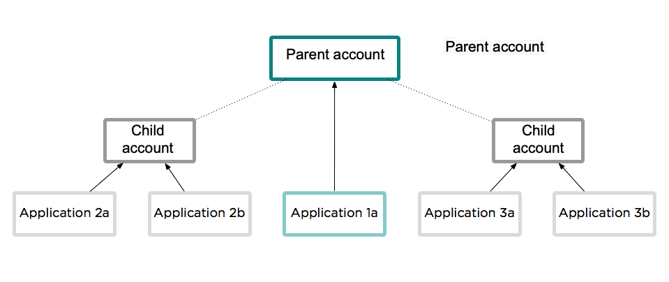

New Relicの組織は、親/子アカウント構造を持つことができます。この構造は主に、元のアカウント/ユーザーモデルを使用している組織に適用されます。

## 概要 [#requirements]

New Relicの組織は、親/子アカウント構造を持つことができます。これは、主に[元のアカウント/ユーザーモデル](/docs/accounts/original-accounts-billing/original-product-based-pricing/overview-changes-pricing-user-model/#user-models)を使用している組織に対して適用されますが、両方のモデルを使用している組織にも適用できます。親/子構造がどのように適用されるかの主な違いは次のとおりです。

* 元のアカウント/ユーザーモデル：元のモデルは親/子アカウント構造を使用しており、子アカウントはアカウントのユーザーアクセスに関連するルールなど、親アカウントから設定を継承します。また、当社の[パートナーシップアカウント](/docs/new-relic-partnerships/partner-integration-guide/partner-account-maintenance/partnership-accounts-users-subscriptions)もこのモデルを使用します。組織がこのモデルを使用している場合、[独自の子アカウントを作成](#creating)できます。このモデルをお使いの場合は、このアカウント構造がどのように機能するかについて、[以下をお読みください](#hierarchy)。
* New Relic Oneアカウント/ユーザーモデル：これは、新しく改善されたモデルです。このモデル上の組織は親/子アカウント構造を持つことができますが、アカウントへのユーザーアクセスの管理は対象外となり、一部の機能に対するアカウントの関係性の決定や組織レベルの請求の集計に広く使用されます。このモデルでアカウントがどのように機能するかについての詳細は、[アカウントの構造](/docs/accounts/accounts-billing/account-structure/new-relic-account-structure)を参照してください。

## 親および子アカウントの階層 [#hierarchy]

親/子アカウント構造を持つ[元のアカウント/ユーザーモデル](#requirements)を使用している組織の場合、各子アカウントは単一の親アカウントに関連付けられ、複数のアプリケーションから報告を受けます。親アカウントもそのアカウントに報告するアプリケーションに含めますが、子アカウントのアプリケーションから送信されたすべてのデータが親アカウントにロールアップされるわけではありません。

UIでアカウント間を切り替える方法については、[アカウントアクセス](/docs/accounts/accounts-billing/general-account-settings/factors-affecting-access-features-data#account-access)を参照してください。

親アカウントと子アカウントがEUリージョンのアカウントにどのように対応するかを理解するには、[EUリージョンのアカウント階層](/docs/using-new-relic/welcome-new-relic/getting-started/introduction-eu-region-data-center#global-account-hierarchy)を参照してください。

<Callout variant="tip">
  パートナーシップアカウントの構造がある場合は、[パートナーシップアカウント](/docs/new-relic-partnerships/partner-integration-guide/partner-account-maintenance/partnership-accounts-users-subscriptions)を参照してください。
</Callout>

<figcaption>
  親アカウントは独自のアプリレポートデータが含まれる場合があります。ただし、子アカウントに報告するアプリは、親アカウントにデータを報告しない場合があります。
</figcaption>

## 子アカウントのライセンスキー [#keys]

New Relicの組織では、メインのNew Relicアカウントは独自の[ライセンスキー](/docs/apis/intro-apis/new-relic-api-keys/#ingest-license-key)を持つ親アカウントとしての役割を果たします。各子アカウントにはそれぞれ独自のライセンスキーがあります。各アプリケーションは1つのライセンスキーのみを使用できるため、各アプリケーションは1つのアカウントのみにレポートできます。

## 子アカウントの作成 [#creating]

New Relic組織にアカウントを追加するには、 ProまたはEnterprise[エディション](https://newrelic.com/pricing)が必要です。

アカウントの追加方法は、以下のどの[ユーザーモデル](/docs/accounts/original-accounts-billing/original-product-based-pricing/overview-changes-pricing-user-model#user-models)であるかによって異なります。

* New Relic Oneユーザーモデル：New Relicアカウント担当者と連携します。

* オリジナルユーザーモデル：以下の指示に従います。

  1. 移動先：**[アカウントドロップダウン](/docs/accounts-partnerships/education/getting-started-new-relic/glossary#account-dropdown) > アカウント設定 > アカウント > サマリー**。
  2. **アカウントを追加**をクリックします。
  3. 子アカウント名を入力してから、**このアカウントを追加**を選択します。
  4. この手順を続行して、子アカウントにユーザーを追加します。

## アカウントにユーザーを追加する [#users]

複数のアカウントがあるNew Relic組織にするには、 ProまたはEnterprise[エディション](https://newrelic.com/pricing)が必要です。

組織の子アカウントへのユーザーの追加方法は、以下のどの[ユーザーモデル](/docs/accounts/original-accounts-billing/original-product-based-pricing/overview-changes-pricing-user-model#user-models)であるかによって異なります。

* New Relic Oneユーザーモデル：特定のアカウントにユーザーアクセスを付与するアクセス許可を作成する必要があります。詳細については、[ユーザー管理コンセプト](/docs/accounts/accounts-billing/new-relic-one-user-management/add-manage-users-groups-roles#understand-concepts)を参照してください。

* オリジナルユーザーモデル：一般的に、親アカウント上のユーザーに対する許可は、子アカウント上のそのユーザーに自動的に継承されます。ユーザーを追加するには、以下の手順に従います。

  1. 移動先：**[アカウントドロップダウン](/docs/accounts-partnerships/education/getting-started-new-relic/glossary#account-dropdown) > アカウント設定 > アカウント > サマリー**。
  2. 子アカウントのリストから、子アカウントを選択します。
  3. 子アカウントの**アクティブユーザー**セクションから**ユーザーを追加**を選択し、必要に応じてユーザーのメール、名前、ロール、タイトルを入力してから、**このユーザーを追加**を選択します。
  4. オプション：必要に応じて、子アカウントの[所有者（オーナー）または管理者のロールを変更します](/docs/accounts-partnerships/accounts/account-setup/adding-updating-users)。

## SAML SSOでアカウントを設定する [#saml]

SAML SSOの設定方法は、ユーザーが以下のどの[ユーザーモデル](/docs/accounts/original-accounts-billing/original-product-based-pricing/overview-changes-pricing-user-model#user-models)であるかによって異なります。

* オリジナルユーザーモデル：親アカウントレベルで[SAML SSOを設定](/docs/accounts-partnerships/accounts/saml-single-sign/setting-sso)すると、子アカウントユーザーもSSOを使用してサインインできるようになります。SAML SSOを親レベルで設定**しない**場合は、子アカウントレベルで設定できます。ただし、SAML SSOは両方のレベルで設定**しない**でください。詳細については、[複数のアカウントでSAMLを設定する](/docs/accounts-partnerships/accounts/saml-single-sign/configuring-saml-multiple-accounts)を参照してください。
* New Relic Oneユーザーモデル：[SAML SSO](/docs/accounts/accounts-billing/new-relic-one-user-management/authentication-domains-saml-sso-scim-more)を参照してください。

## 子アカウントアプリケーションの更新 [#subaccount_apps]

**要件：**

* ProまたはEnterprise[エディション](https://newrelic.com/pricing)。
* [元のユーザーモデル](/docs/accounts/original-accounts-billing/original-product-based-pricing/overview-changes-pricing-user-model#user-models)を使用している必要があります（[New Relic Oneユーザーモデル](/docs/accounts/original-accounts-billing/original-product-based-pricing/overview-changes-pricing-user-model#user-models)を使用している場合、アカウントを追加するには、アカウント担当者に相談してください）。
* 所有者 (オーナー)または管理者である必要があります。

アプリの設定ファイルを変更して、あるアカウントから別のアカウントに移動する場合、New Relicはそのアプリを新規子アカウントの新しいアプリとして処理します。New Relicは、アプリの履歴データは移動しません。

子アカウントに新しいアプリをインストールするには：

1. 親アカウントが選択されていることを確認します。左上のアカウントスイッチャーから、目的のアカウントを選択します。

2. 右上のアカウントドロップダウンから**アカウント設定**を選択します。

3. 新しいアプリケーションの標準インストレーション手順に従います。

   または

   既存のアプリケーションの設定ファイルのライセンスキーを変更して、別の子アカウントに移動します。