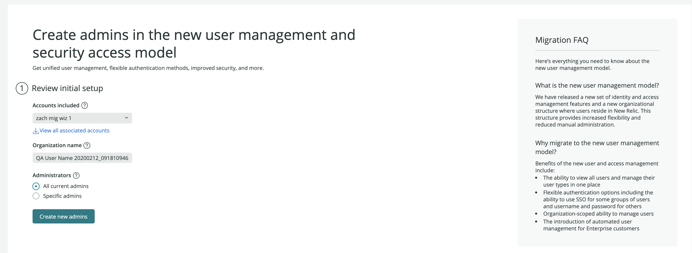
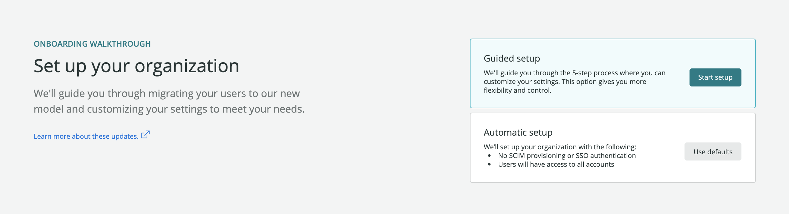
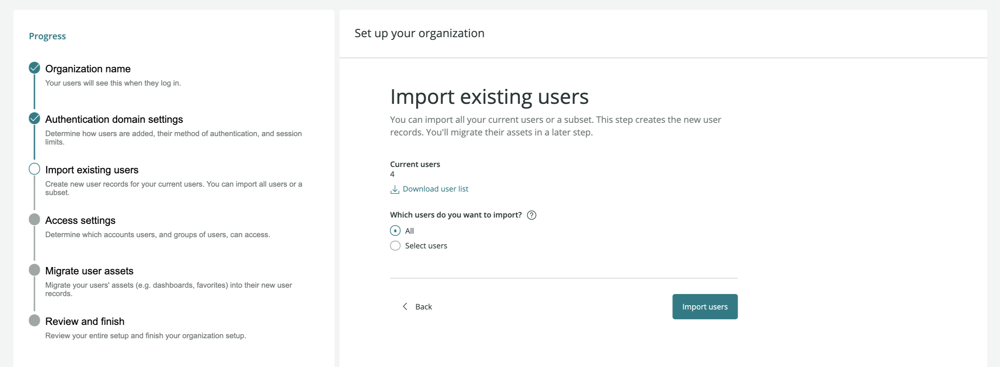
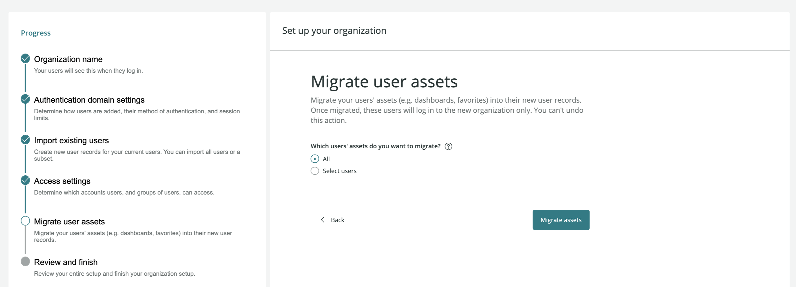

2021年4月12日より、オリジナルのユーザーモデルでユーザーをお持ちの一部のお客様に、セルフサービスでそのユーザーをNew Relic Oneのユーザーモデルに移行することを許可しています。

## 背景 [#background]

2020年7月30日に、New Relic One ユーザーモデルと呼ばれる新しく改良されたユーザーモデルをリリースしました。この新しいモデルは、ユーザーとそのロールやアカウントへのアクセスを管理するための、よりシンプルで効率的な方法を提供します。

当初、この新しいモデルは主に新規のお客様に提供され、既存のニューレリック組織のユーザーはオリジナルのユーザーモデルのままでした。しかし、現在では、いくつかの [要件](#requirements) を満たした元のユーザーモデルの組織では、移行ウィザードを使ってユーザーを新モデルに移行することができます。この移行プロセスが完了すると、ユーザーは New Relic One のユーザーモデルになり、 [ユーザーやアカウントへのアクセスを管理するための新しい手順が必要になります](/docs/accounts/accounts-billing/new-relic-one-user-management/introduction-managing-users/) 。

## 利点 [#benefits]

ユーザーをこのモデルに移行すると、以下のようなメリットがあります。

* 複数のアカウントのすべてのユーザーを一度に表示し、管理することができます。
* ユーザーを追加・管理するための手順が少ない。
* 柔軟な認証方法
* ユーザー管理のためのより詳細な役割
* 企業のお客様：アイデンティティ・プロバイダーによる自動化されたユーザー管理へのアクセス。

[新モデルのメリットについてはこちらをご覧ください。](https://blog.newrelic.com/product-news/user-management-and-access-security/)

## 要件 [#requirements]

要件は、以下のとおりです。

* あなたは、 [オリジナルのユーザーモデル](/docs/accounts/original-accounts-billing/original-product-based-pricing/overview-user-models) である必要があります。どちらかわからない場合は、 [決定版ユーザーモデル](/docs/accounts/original-accounts-billing/original-users-roles/overview-user-models/#determine-user-model) をご覧ください。
* ユーザー移行ウィザードを使用するには、 [オーナーロール](/docs/accounts/original-accounts-billing/original-users-roles/users-roles-original-user-model/#roles) が必要です。

## ユーザーを移行すべきかどうかの判断 [#recommendations]

**これらの注意事項は、New Relic の担当者がサポートしている場合には適用されません。** その場合には、お客様のアカウント担当者が指導します。

このような状況では、 **ユーザー移行ウィザードを使用しないことをお勧めします。**

*** お客様の組織に30以上のアカウントがある場合（New Relicの担当者からサポートを受けている場合を除く）。なお、これは30個以上の [アカウント](/docs/accounts/accounts-billing/account-structure/new-relic-account-structure), **not** ユーザーを持っていることを指します。
* 頻繁に [アカウントを追加する場合](/docs/accounts/accounts-billing/account-structure/mastersub-account-structure/#creating) 。現在、新ユーザーモデルのユーザーがアカウントを追加するには、New Relic のサポートが必要です。
* [新しいユーザーモデルの影響と制限](/docs/accounts/original-accounts-billing/original-product-based-pricing/overview-user-models/#differences) のいずれかが自分にマイナスの影響を与える可能性があると考える場合。
* ユーザー管理機能にアカウントレベルのロールを必要とする場合。ユーザー管理に関連するロール（ユーザーの追加と更新、ユーザータイプの変更、アクセス許可の作成）は、現在、組織全体に適用され、特定のアカウントに割り当てることはできません。ユーザー移行ウィザードを使用すべきかどうかについて質問がある場合は、New Relic のアカウント担当者にご相談ください。## オプション：ユーザーのユーザータイプを確認する [#user-type][New Relic One の料金モデル](/docs/accounts/accounts-billing/new-relic-one-pricing-billing/new-relic-one-pricing-billing) の組織では、ユーザーの [ユーザータイプ](/docs/accounts/accounts-billing/new-relic-one-user-management/user-type) が課金の要因となります。現在、New Relic One の価格モデルを利用している場合も、 [近いうちにこの価格モデルに切り替える予定の場合も](/docs/accounts/original-accounts-billing/original-product-based-pricing/switch-new-models) 、ユーザーの移行を行う前に、ユーザーのユーザータイプを編集することに意味があるかもしれません。その理由のひとつは、オリジナルの **ユーザーとロール** UI では、ユーザーが最後に New Relic を使用した時間を確認することができ（新しい UI ではまだこの機能はありません）、どのユーザータイプにするかを決定するのに役立つことがあります。この方法についてのヒントは、 [Edit user type](/docs/accounts/original-accounts-billing/original-users-roles/users-roles-original-user-model/#full-user-count) を参照してください。## オプションです。ユーザー管理の概念を理解する [#before-beginning]ユーザーの移行手順では、すべてのユーザーに組織のすべてのアカウントへのアクセスを許可するか、より詳細なアクセスを割り当てる（ユーザーグループがアクセスできるロールとアカウントを設定する）かを選択することになります。アカウントやロールへのアクセスを分割する必要があればあるほど、新しいユーザー管理の概念について基本的なことを理解しておく必要があります。以下、簡単にまとめてみました。* ユーザーは、"認証ドメイン" と呼ばれるコンテナに入っています。ドメインは、ユーザーがどのように New Relic に追加されるかを管理します (UI を使って手動で、または SCIM を使って自動的に)。また、ユーザーがどのようにログインするか (メール/パスワードを使って手動で行うか、SAML SSO を使って行うか)についても管理します。ほとんどの組織では、認証ドメインは1つまたは2つだけで、デフォルトの手動設定用と、より自動化された方法用があります。
* ユーザーは、1つまたは複数のグループに割り当てることができます（たとえば、当社のデフォルトの **Admin** グループや、 **Contractors** などのカスタムグループなど）。大規模な組織では、ユーザーが複数のグループに割り当てられることがよくあります。
* あるユーザーグループに特定のロールと特定のアカウントへのアクセス権を与えたい場合は、 **アクセスグラント** を作成する必要があります。たとえば、 **Contractors** グループに、1つまたは複数のアカウントで、当社のデフォルトの **All product admin** ロールへのアクセスを与えるか、そのグループにカスタムロールを与えるとします。詳細については、[ユーザー管理コンセプト](/docs/accounts/accounts-billing/new-relic-one-user-management/user-management-concepts#understand-concepts)を参照してください。アクセス権の編集や調整は、移行後に行うことができますが、先に計画を立てておきたいという方のために、そのヒントをご紹介します。* アカウント数が多い組織では、プライマリ（最初の）アカウントに、 [**Organization manager** role](/docs/accounts/accounts-billing/new-relic-one-user-management/user-management-concepts#standard-roles) （組織レベルの管理機能）を持つユーザーグループ、 [**Authentication domain manager**](/docs/accounts/accounts-billing/new-relic-one-user-management/user-management-concepts#standard-roles) （ユーザーの管理機能）を持つグループ、 [**Billing user**](/docs/accounts/accounts-billing/new-relic-one-user-management/user-management-concepts#standard-roles) （請求関連の機能）を持つグループを用意し、その他のアカウントには必要に応じてadmins、users、その他の役割を持つ様々なユーザーグループを構成するのが一般的な構成です。
* 組織の規模が小さかったり、平べったい組織で、すべてのチームがすべてのデータに対して透明性を確保することに問題がないお客様は、1つまたは2つのグループしか持たないこともあります。
* すべてのデータを1つのアカウントで管理している組織では、5つまたは6つのグループを持つのが一般的な構成です。## ユーザー移行プロセスの開始 [#find]始める前に、 [要件](#requirements) および上記のその他の推奨事項を確認してください。ウィザードの使用を開始するには1. [one.newrelic.com](https://one.newrelic.com) から、トップナビゲーションの **Apps** をクリックします。
2. アプリのテーブルで、 **User migration walkthrough** アプリをクリックします。
3. オプション：さらに詳しい情報が必要な場合は、以下のセクションで特定の移行ウィザードページに関するヒントや推奨事項をご覧ください。移行が正常に完了した場合は、 [ユーザーの管理方法を学ぶ](#manage-users) 。## ステップ1：アドミンの作成 [#page1]ヒント* a) アカウントの現在の管理者をすべてインポートするか、b) ユーザー管理機能へのアクセス権を持つべき管理者を指定することができます。なお、管理者ユーザーの追加や権限の編集は、移行プロセスが完了した後に行うことができます。

* すでにウィザードを使って新しいユーザーモデルに管理者を設定している場合は、管理者に新しいユーザーレコードを使ってサインインしてもらい、移行ツールにアクセスしてもらいます。ユーザー移行ウィザードは完了すると古いユーザーレコードを破棄しますが、ユーザー移行プロセスを完了せずに開始した場合、以下のように元のレコードと新しいレコードの両方にアクセスできるユーザーが存在する可能性があります。 

  <figcaption>新しいモデルのユーザーが作成され、移行プロセスが完了していない場合、元のユーザー記録と新しいユーザー記録の両方にアクセスできる可能性があります。</figcaption>

* 一部のユーザーだけを新しいユーザーモデルに移行してスタートする予定の場合は、元のユーザーモデルのアドミンを残しておき、元のモデルのユーザーを管理するアドミンを確保しておくことをお勧めします。## ステップ2：組織の設定 [#page2]より多くの設定が可能なガイド付きセットアップ、または手順の少ない自動セットアップのいずれかを選択できます。自動設定時の注意点* SSOや [SCIMの設定を移行することはありません](/docs/accounts/accounts/automated-user-management/automated-user-provisioning-single-sign) 。その代わり、ユーザーは手動でプロビジョニングされ、ユーザー名とパスワードを使って手動でログインすることになります。
* すべてのユーザーにすべてのアカウントへのアクセスを提供します。現在、SSOまたはSCIMプロビジョニングを使用している場合や、特定のユーザーグループが一部のアカウントにアクセスできないようにする必要がある場合は、自動オプションを使用しないでください。## ステップ3：組織の名称 [#page3]組織の名前は、説明的でわかりやすいものにしましょう。## ステップ4：認証ドメインの設定 [#page4]このセクションでは、ユーザーのプロビジョニング(New Relicへの追加)方法と、ユーザーの認証(ログイン)方法を制御します。SAML SSO または SCIM セットアップを選択すると、移行ウィザードを終了し、New Relic UI で別の場所で設定を行う必要があることに注意してください。ここでは、2つの認証ドメイン部について詳しく説明します。### ユーザーの管理 [#managing-users]ユーザーの追加と管理の方法については、 **Manually** または **Identity provider** を選択できます。ユーザーのプロビジョニングに ID プロバイダを使用するオプションは、お客様の組織が [Enterprise エディション](https://newrelic.com/pricing) を持っている場合にのみ利用できます。 **アイデンティティ プロバイダ** を選択した場合、 [特定のアイデンティティ プロバイダを使用するための追加手順](/docs/accounts/accounts/automated-user-management/automated-user-provisioning-single-sign) を行う必要があります。これを行うと、これらのユーザーは新しいユーザーモデルで作成され、ID プロバイダーの設定に基づいて New Relic で同期されます。なお、Okta、Azure、OneLogin製のアプリをすでに使用している場合は、New Relicの新しいユーザーモデルに合わせて作られた新しいバージョンを使用する必要があるでしょう。この点については、 [ID プロバイダ アプリ](#idp-apps) を参照してください。ユーザーのプロビジョニングが完了したら、新しい [**ユーザー管理** UI](#manage-users) にユーザーがいるかどうかで、これらのユーザーが追加されたことを確認できます。ガイド付きワークフローを選択した場合は、これらのユーザーをメールアドレスで照合します。これらのユーザーは、ID プロバイダー経由で New Relic に取り込まれているため、後でユーザーのインポート手順を完了する必要はありません。完了したら、 **Migrate assets** のステップにスキップして進むことができます。### ログイン方法 [#login-methods]**Manually** for [managing users](#managing-users) を選択した場合、それらのユーザーのログイン方法を選択することができます。a) 電子メール／パスワードによるログイン、b) シングルサインオン（SSO）のいずれかを選択できます。なお、SSOはPro版またはEnterprise版の組織でのみ利用可能です。必要に応じて複数の認証方法を選択することができます。例えば、従業員にはSSOを、契約者にはユーザー名/パスワードを使用することができます。SSOを選択した場合、 [追加の設定手順を完了する必要があります](/docs/accounts/accounts-billing/new-relic-one-user-management/authentication-domains-saml-sso-scim-more/#saml) 。SSOの設定手順を完了してから、移行ウィザードに戻って移行プロセスを継続することができます。複数の認証方法を選択した場合は、新しい [認証ドメイン](/docs/accounts/accounts-billing/new-relic-one-user-management/authentication-domains-saml-sso-scim-more/#auth-domain-definition) を追加する必要があることに注意してください。なお、ID プロバイダーの New Relic アプリをすでに使用している場合は、New Relic の新しいユーザーモデルに合わせて作られた新しいバージョンを使用する必要があるでしょう。この点については、以下の [ID プロバイダ アプリ](#idp-apps) を参照してください。### アイデンティティプロバイダアプリについての注意点 [#idp-apps]Okta、Azure、OneLogin には、オリジナルのユーザーモデルと New Relic One のユーザーモデルの両方に対応した New Relic アプリがあります。オリジナルアプリのタイトルは"New Relic by account" で、新しいアプリのタイトルは"New Relic by organization です。" 既にいずれかの New Relic アプリを利用している場合は、オリジナルユーザーモデル用に作られている可能性が高いため、新しいアプリを設定する必要があります。## ステップ5: 既存のユーザーのインポート [#import-users]**推奨**: ユーザーのインポートを選択する前に、既存のオリジナルユーザーモデルのユーザーの全リストをダウンロードしてください。これは有用なリソースであり、必要に応じてバックアップとしても役立ちます。オリジナルのユーザーモデルのユーザーをダウンロードした後、すべてのユーザーをアップロードすることも、一部のユーザーだけをアップロードすることもできます。このステップでは、New Relic One のユーザーモデルにユーザーレコードが作成されます。後のステップでは、これらのユーザーの資産を移行することができます。作成された新しいユーザーレコードは、同じログイン認証情報を持つので、パスワードをリセットする必要はありません。ユーザーのEメール認証ステータスが保留になっている場合は、それも移行されます。重要なヒント* 新しいユーザーの電子メールアドレスが、元のユーザー記録の電子メールアドレスと一致することを確認してください（大文字小文字の一致を含む）。メールアドレスは、ユーザーを照合するためのキーバリューとして使用され、後のステップでは、ユーザーに関連する資産を移行するために使用されます。
* このステップを完了し、新しいユーザーレコードを作成したら、すぐに移行プロセスを完了することを強くお勧めします。資産の移行と元のユーザーレコードの削除のステップを完了しないと、ユーザーはログイン時に2つのユーザーレコードが表示されたり（ステップ1のログイン画面 [を参照）、期待していた資産（ダッシュボードなど）が表示されなかったりすることがあります。](#page1)
* [## ステップ6：アクセス設定 [#access-settings]このステップでは、ユーザーのアクセスレベルを決定します。ユーザーのアクセス権を特定のアカウントやロールに対応させる必要がある場合は、この段階でグループとアクセス権を設定することになります。グループにアクセスさせたいアカウントごとに、アクセスグラントを作成する必要があります。例えば、DevOpsグループには5つの異なるアクセスグラントがあり、それぞれが異なるアカウントへのアクセス権を与えています。](#page1)[この手順は、ユーザー移行ウィザードの手順とは別に行います。アクセスグラントの作成方法については、 ](#page1)[ユーザー管理チュートリアル](/docs/accounts/accounts-billing/new-relic-one-user-management/tutorial-add-new-user-groups-roles-new-relic-one-user-model/#group-access) を参照してください。## ステップ7：ユーザー資産の移行 [#migrate-assets]このステップが完了すると、個人資産は新しいユーザーレコードに移行され、元のユーザーレコードは削除されます。ユーザー資産には* ダッシュボード
* お気に入り
* ウィークリーメールの設定
* 電子メールのオプトイン/アウトの設定
* ユーザー別 [ユーザーキー](/docs/apis/intro-apis/new-relic-api-keys/#user-api-key)
* New Relic Oneアプリ [NerdStorageデータ](https://developer.newrelic.com/explore-docs/nerdstorage)あるユーザーが New Relic を使用している複数の組織にアクセスしている場合 (たとえば、そのユーザーが契約者の場合)、元のユーザーモデルのレコードは、それらの組織がすべてのユーザーを移行するまで完全には削除されません。そのようなユーザーは、元のユーザーレコードと1つ以上の新しいユーザーレコードの両方を持っている可能性があり、ログイン時にその旨が表示されます(1ページ目のセクション の [のログインスクリーンショットを参照)。](#page1)[## ステップ8：レビューと仕上げ [#review-finish]一度にすべてのユーザーを移行するのではなく、まとまった数のユーザーを移行する場合は、異なるグループのユーザーを対象に、移行ワークフローを何度も実行することができます。 **Finish Setup** をクリックできるのは、組織内のすべてのユーザーが移行されたときだけです。## 終わった後 [#manage-users]](#page1)[ユーザーが新しいユーザーモデルに移行されると、 ](#page1)[account dropdown](/docs/using-new-relic/welcome-new-relic/get-started/glossary/#account-dropdown) をクリックし、 **Administration** をクリックし、これらの UI ページを使用することで、ユーザーを見つけて管理することができます。* **ユーザー管理**: これを使って、ユーザーの表示と追加、ユーザータイプの変更（ベーシックとフル）、グループの変更、ユーザーのアップグレード要求の承認を行います。
* **組織とアクセス**: これを使って、アクセスグラントの作成（グループにロールやアカウントへのアクセスを許可する）や、認証ドメインの設定（SAML SSOの設定やSCIMの設定など）を行います。アクセスグラントを計画する際のヒントについては、 [Tips on access grants](#before-beginning) をご覧ください。これらのツールやコンセプトの詳細については、 [ユーザー管理のドキュメント](/docs/accounts/accounts-billing/new-relic-one-user-management/introduction-managing-users) を参照してください。**