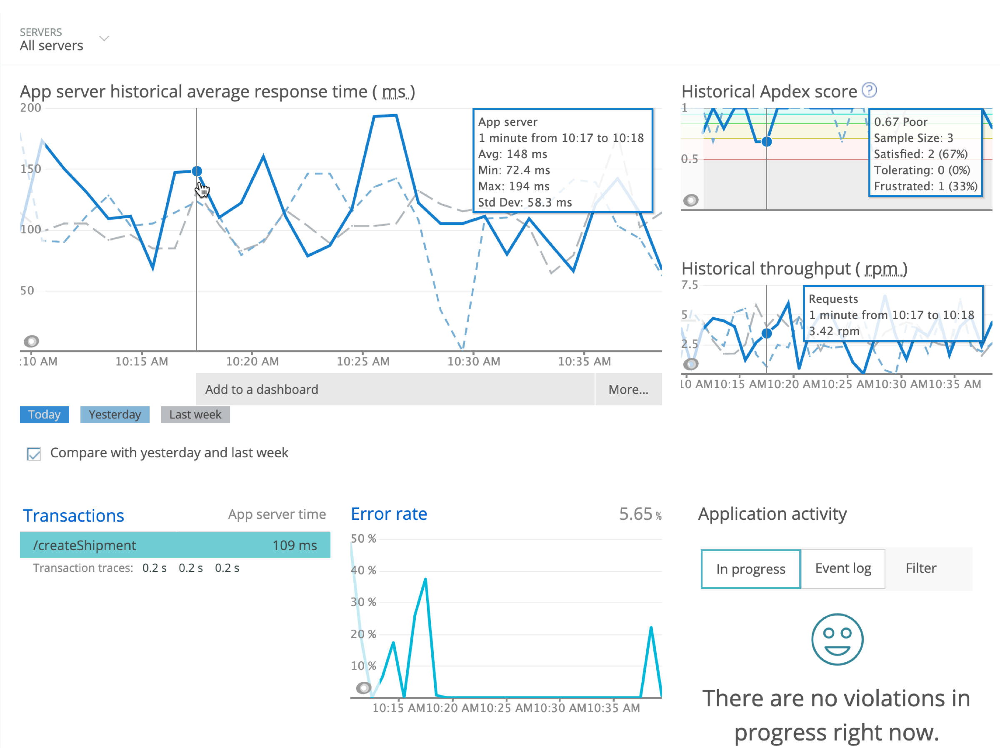

<LandingPageHero>
  <HeroContent>
    # C SDK

    汎用プログラミング言語であるCが、広範にわたるアプリケーションをインストゥルメントする機会を提供します。アプリケーションが[他のNew Relic APMエージェント言語](/docs/using-new-relic/welcome-new-relic/getting-started/glossary#agent)を使用しない場合は、C SDKを使用してNew Relicのモニタリング機能と特性を活用できます。以下が可能です：

    * パフォーマンス問題の特定と解決。
    * 顧客体験の向上とデータに基づくビジネス上の意思決定。
    * [APM](/docs/apm/new-relic-apm/getting-started/introduction-new-relic-apm)、[Infrastructure](/docs/infrastructure/new-relic-infrastructure/getting-started/introduction-new-relic-infrastructure)、[Alerts](/docs/alerts/new-relic-alerts/getting-started/introduction-new-relic-alerts)その他にある詳細なダッシュボードからのデータをモニター。
    * [Insights](/docs/insights/using-insights-ui/getting-started/introduction-new-relic-insights)を使用し、チャートおよびダッシュボードによるデータのクエリ、可視化、共有。
  </HeroContent>

  

  <figcaption>
    **[one.newrelic.com/apm](https://one.newrelic.com/apm) > APM > （アプリケーションを選択）:** これは、トランザクション、外部サービス、データストア、任意のコード、SQL、その他に関する詳細データを調査できるNew Relicのダッシュボードの1つに過ぎません。
  </figcaption>
</LandingPageHero>

<LandingPageTileGrid>
  <LandingPageTile
    title="始めてみましょう。"
    icon="fe-terminal"
  >
     [C機能](/docs/introduction-c-sdk)と立ち上げの方法を参照してください。さらに、[GitHubにあるNew RelicのC SDKドキュメント](https://newrelic.github.io/c-sdk/index.html)を参照できます。
  </LandingPageTile>

  <LandingPageTile
    title="コードをコンパイルおよびリンクする。"
    icon="fe-list"
  >
     Linux環境において、アプリケーションに[互換性があり要件](/docs/agents/c-sdk/get-started/c-sdk-compatibility-requirements)を満たすことを確認してから、[C SDKをインストールする手順](/docs/install-c-sdk-compile-link-your-code)に従ってください。
  </LandingPageTile>

  <LandingPageTile
    title="エージェントを設定する。"
    icon="fe-settings"
  >
     [デフォルトの構成設定](/docs/agents/c-sdk/install-configure/c-sdk-configuration)と[ログオプション](/docs/install-c-sdk-compile-link-your-code#logging)を使用します。データ収集をビジネスにとって最も重要な形に微調整するには[API ガイド](/docs/agents/c-sdk/instrumentation/guide-using-c-sdk-api)を参照してください。
  </LandingPageTile>

  <LandingPageTile
    title="インストゥルメンテーションを拡張する。"
    icon="fe-tool"
  >
     Cアプリケーションのために[トランザクション、セグメント、エラーレポート](/docs/agents/c-sdk/instrumentation/instrument-your-app-c-sdk)をカスタマイズします。さらに細かくカスタマイズするには、[デフォルトまたはカスタマイズされた属性](/docs/agents/c-sdk/instrumentation/use-default-or-custom-attributes-c-sdk)を使用します。
  </LandingPageTile>

  <LandingPageTile
    title="新機能を確認する。"
    icon="fe-database"
  >
     New Relicの最新機能を活用するには、[リリースノート](/docs/release-notes/agent-release-notes/c-sdk-release-notes)のためのRSSフィードを入手し、必要に応じて[C SDK ライブラリ](/docs/agents/c-sdk/install-configure/update-your-c-sdk-library)を更新します。
  </LandingPageTile>

  <LandingPageTile
    title="問題のトラブルシューティング。"
    icon="fe-life-buoy"
  >
     New Relicのダッシュボードに[データが表示されない](/docs/agents/c-sdk/troubleshooting/no-data-appears-c)、[トラブルシューティングのログ](/docs/generate-logs-troubleshooting-c-sdk)が必要などの場合には、ヘルプを求めてください。New Relicの[エクスプローラーハブ](https://discuss.newrelic.com/tags/cagent)で、質問や提案をC SDKコミュニティと共有してください。
  </LandingPageTile>
</LandingPageTileGrid>

<ButtonLink
  to="/docs/agents/c-sdk/table-of-contents"
  variant="primary"
>
  すべてのC SDKドキュメントを表示する
</ButtonLink>
