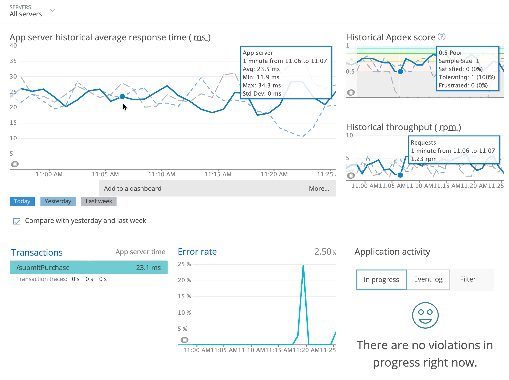

<LandingPageHero>
  <HeroContent>
    New RelicのJavaエージェントを使用すると、コード内のパフォーマンスの問題から小さなエラーまですべてを追跡できます。New RelicのJavaエージェントはJavaアプリを監視し、JVMの動作を可視化します。インストールが完了したら、トランザクションを迅速に監視し、エラーの詳細調査などを実行できるようになります。

    エージェントを最新の状態に保ち、最新機能へのアクセスを確保するために、[Javaエージェントのリリースノート](/docs/release-notes/agent-release-notes/java-release-notes)を参照ください。

    <ButtonGroup>
      <ButtonLink
        role="button"
        to="https://newrelic.com/signup"
        variant="primary"
      >
        無料サインアップ
      </ButtonLink>
    </ButtonGroup>

    クレジットカードは不要です。すでにアカウントをお持ちの場合[ログイン](http://one.newrelic.com/)。
  </HeroContent>

  

  <figcaption>
    **[one.newrelic.com](https://one.newrelic.com) > APM >（アプリケーションを選択）> Overview**：Javaエージェントをインストール後、アプリケーションのパフォーマンスを表示してください。
  </figcaption>
</LandingPageHero>

<LandingPageTileGrid>
  <LandingPageTile
    title="始めてみましょう。"
    icon="fe-terminal"
  >
    Javaエージェントで実現できることや[スタート](/docs/agents/java-agent/getting-started/introduction-new-relic-java)の方法をご覧ください。
  </LandingPageTile>

  <LandingPageTile
    title="Javaエージェントをインストール。"
    icon="fe-list"
  >
    サポートされているアプリケーションサーバーとフレームワークに[Javaエージェントをインストール](/docs/agents/java-agent/installation/install-java-agent)する方法をご覧ください。
  </LandingPageTile>

  <LandingPageTile
    title="エージェントを設定。"
    icon="fe-settings"
  >
    [設定オプション](/docs/agents/java-agent/configuration/java-agent-configuration-config-file)を使用し、インストレーションをさらにカスタマイズして微調整します。[ディストリビューティッド（分散）トレーシング](/docs/apm/distributed-tracing/getting-started/introduction-distributed-tracing)を有効にします。
  </LandingPageTile>

  <LandingPageTile
    title="モニタリングをカスタマイズ。"
    icon="fe-tool"
  >
    [JavaエージェントAPI](/docs/agents/java-agent/custom-instrumentation/java-agent-api)を使用するか、[カスタムインストゥルメンテーション](/docs/agents/java-agent/custom-instrumentation/java-custom-instrumentation)を実装して機能を拡張します。
  </LandingPageTile>

  <LandingPageTile
    title="互換性と要件を確認。"
    icon="fe-database"
  >
    サポートされているアプリケーションサーバーとWebサーバー、フレームワーク、JDBCドライバー、JVMなどに対する[互換性と要件](/docs/agents/java-agent/getting-started/compatibility-requirements-java-agent)をチェックします。
  </LandingPageTile>

  <LandingPageTile
    title="一般的な問題をトラブルシューティング。"
    icon="fe-life-buoy"
  >
    一般的な問題のサポートについては、[Javaのトラブルシューティングドキュメント](/docs/agents/java-agent/troubleshooting)を参照ください。
  </LandingPageTile>
</LandingPageTileGrid>

<ButtonLink
  to="/docs/agents/java-agent/table-of-contents"
  variant="primary"
>
  すべてのJavaエージェントドキュメントを表示
</ButtonLink>